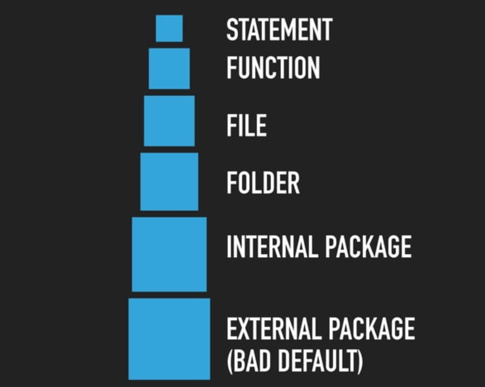

# JavaScript (Cheat Sheet)

> [!NOTE]  
> This is a cheat sheet on JavaScript (mostly notes-to-self). They are incomplete by default.

## Basics (from [exercism.org](https://exercism.org/tracks/javascript))

Source: [exercism.org](https://exercism.org/tracks/javascript/concepts/basics)

> [!TIP]  
> Most of the concepts and text below are taken from the JavaScript track on
> [exercism.org](https://exercism.org/tracks/javascript). The material is licensed under a MIT
> license, which is included in this repository as well.

### (Re-)Assignment

There are a few primary ways to assign values to names in JavaScript - using variables or constants.
Typically, variables are written
in [camelCase](https://en.wikipedia.org/wiki/Camel_case "https://en.wikipedia.org/wiki/Camel_case");
constants are written
in [SCREAMING_SNAKE_CASE](https://en.wikipedia.org/wiki/Snake_case "https://en.wikipedia.org/wiki/Snake_case").

Variables in JavaScript can be defined using
the [`const`](https://developer.mozilla.org/en-US/docs/Web/JavaScript/Reference/Statements/const), [`let`](https://developer.mozilla.org/en-US/docs/Web/JavaScript/Reference/Statements/let) or [`var`](https://developer.mozilla.org/en-US/docs/Web/JavaScript/Reference/Statements/var) keyword.

A variable can reference different values over its lifetime when using `let` or `var`.

For example, `myFirstVariable` can be defined and redefined many times using the assignment
operator `=`:

```js
let myFirstVariable = 1;
myFirstVariable = "Some string";
myFirstVariable = new SomeComplexClass();
```

In contrast, variables that are defined with `const` can only be assigned once. This is used to
define constants in JavaScript.

```js
const MY_FIRST_CONSTANT = 10;

// Can not be re-assigned.
MY_FIRST_CONSTANT = 20;
// => TypeError: Assignment to constant variable.
```

#### Constant Assignment

The `const` keyword is mentioned *both* for variables and constants. Another concept often mentioned
around constants is [(im)-mutability](https://en.wikipedia.org/wiki/Immutable_object).

The `const` keyword only makes the *binding* immutable, that is, you can only assign a value to
a `const` variable once. In JavaScript,
only [primitive](https://developer.mozilla.org/en-US/docs/Glossary/Primitive) values are immutable.
However, [non-primitive](https://developer.mozilla.org/en-US/docs/Glossary/Primitive) values can
still be mutated.

```js
const MY_MUTABLE_VALUE_CONSTANT = { food: "apple" };

// This is possible
MY_MUTABLE_VALUE_CONSTANT.food = "pear";

MY_MUTABLE_VALUE_CONSTANT;
// => { food: "pear" }
```

#### Constant Value (Immutability)

As a rule, on Exercism, and many other organizations and project style guides, don't mutate values
that look like `const SCREAMING_SNAKE_CASE`. Technically the values *can* be changed, but for
clarity and expectation management on Exercism this is discouraged. When this *must* be enforced,
use [`Object.freeze(value)`](https://developer.mozilla.org/en-US/docs/Web/JavaScript/Reference/Global_Objects/Object/freeze).

```js
const MY_VALUE_CONSTANT = Object.freeze({ food: "apple" });

// This silently fails
MY_VALUE_CONSTANT.food = "pear";

MY_VALUE_CONSTANT;
// => { food: "apple" }
```

In the wild, it's unlikely to see `Object.freeze` all over a code base, but the rule to not mutate
a `SCREAMING_SNAKE_CASE` value ever, is a good rule; often enforced using automated analysis such as
a linter.

### Function Declarations

In JavaScript, units of functionality are encapsulated in *functions*, usually grouping functions
together in the same file if they belong together. These functions can take parameters (arguments),
and can *return* a value using the `return` keyword. Functions are invoked using `()` syntax.

```js
function add(num1, num2) {
  return num1 + num2;
}

add(1, 3);
// => 4
```

> 💡 In JavaScript there are *many* different ways to declare a function. These other ways look
> different than using the `function` keyword. The track tries to gradually introduce them

### Export and Import

The `export` and `import` keywords are powerful tools that turn a regular JavaScript file into
a [JavaScript module](https://developer.mozilla.org/en-US/docs/Web/JavaScript/Guide/Modules). Apart
from allowing code to selectively expose components, such as functions, classes, variables and
constants, it also enables a whole range of other features, such as:

- [Renaming exports and imports](https://developer.mozilla.org/en-US/docs/Web/JavaScript/Guide/Modules#Renaming_imports_and_exports),
  which allows you to avoid naming conflicts,
- [Dynamic Imports](https://developer.mozilla.org/en-US/docs/Web/JavaScript/Reference/Statements/import#Dynamic_Imports),
  which loads code on demand,
- [Tree shaking](https://bitsofco.de/what-is-tree-shaking/), which reduces the size of the final
  code by eliminating side-effect free modules and even contents of modules *that are not used*,
- Exporting [_live bindings_](https://2ality.com/2015/07/es6-module-exports.html#es6-modules-export-immutable-bindings),
  which allows you to export a value that mutates everywhere it's imported if the original value
  mutates.

A concrete example is how the tests work on Exercism's JavaScript Track. Each exercise has at least
one implementation file, for example `lasagna.js`, and each exercise has at least one test file, for
example `lasagna.spec.js`. The implementation file uses `export` to expose the public API and the
test file uses `import` to access these, which is how it can test the implementation's outcomes.

```js
// file.js
export const MY_VALUE = 10;

export function add(num1, num2) {
  return num1 + num2;
}

// file.spec.js
import { MY_VALUE, add } from "./file";

add(MY_VALUE, 5);
// => 15
```

## Numbers (from [exercism.org](https://exercism.org/tracks/javascript))

Source: [exercism.org](https://exercism.org/tracks/javascript/concepts/numbers)

> [!TIP]  
> Most of the concepts and text below are taken from the JavaScript track on
> [exercism.org](https://exercism.org/tracks/javascript). The material is licensed under a MIT
> license, which is included in this repository as well.

### About numbers

There are two different kinds of numbers in JavaScript - numbers and "bigints"

Numbers are the most used, and represent numeric data type in the double-precision 64-bit
floating-point format.

- `number`: a numeric data type in the double-precision 64-bit floating-point format (IEEE 754).
  Examples
  are `-6`, `-2.4`, `0`, `0.1`, `1`, `3.14`, `16.984025`, `25`, `976`, `1024.0` and `500000`.
- `bigint`: a numeric data type that can represent *integers* in the arbitrary precision format.
  Examples are `-12n`, `0n`, `4n`, and `9007199254740991n`.

```js
let numericValue = 42;
// => 42
```

A number literal like `42` in JavaScript code is a floating-point value, not an integer. There is no
separate integer type in common everyday use. The `bigint` type is not designed to replace
the `number` type for everyday uses. `42` is still a `Number`, not a `BigInt`.

Numbers may also be expressed in literal forms like `0b101`, `0o13`, `0x0A`. Learn more on numeric
lexical
grammar [here](https://developer.mozilla.org/en-US/docs/Web/JavaScript/Reference/Lexical_grammar#numeric_literals).

### Special Notations

#### Exponential Notation

The E-notation indicates a number that should be multiplied by 10 raised to a given power. The
format of E-notation is to have a number, followed by `e` or `E`, than by the power of 10 to
multiply by.

```js
const num = 3.125e7;
// => 31250000
// The notation essentially says, "Take 3.125 and multiply it by 10^7".
```

E-notation can also be used to represent very small numbers:

```js
const num = 325987e-6; // Equals to 0. 325987
// The notation essentially says, "Take 325987 and multiply it by 10^-6.
```

#### Underscore Notation

Underscores can be used to make large numbers easier to read for the user. The compiler will
completely ignore the underscores.

```
const num = 1_000_000; // You can read this as 1,000,000
console.log(num);
// => 1000000
```

### Built-in Object

There are two built-in objects that are useful when dealing with numbers:

- [`Number`](https://developer.mozilla.org/en-US/docs/Web/JavaScript/Reference/Global_Objects/Number):
  static properties for common / useful values, static methods
  for [type-checking](https://exercism.org/tracks/javascript/concepts/type-checking) and [type-conversion](https://exercism.org/tracks/javascript/concepts/type-conversion),
  instance methods
  for [type-conversion](https://exercism.org/tracks/javascript/concepts/type-conversion) and [formatting numbers as strings](https://exercism.org/tracks/javascript/concepts/string-formatting).
- [`Math`](https://developer.mozilla.org/en-US/docs/Web/JavaScript/Reference/Global_Objects/Math):
  properties and methods for mathematical constants and functions, does **not** work with `BigInt`.

`Math` also includes methods for rounding numbers. You can read more about the available rounding
options in this [javascript.info article on rounding](https://javascript.info/number#rounding).

```js
Math.floor(234.34); // => 234
Math.ceil(234.34); // => 235
```

The `Number` built-in global `object` is *also* a global `function` that can be used to
convert *almost anything* number-like to a `number`. It is less forgiving
than *parsing* a `string` to a `number`.

```js
const date = new Date("December 17, 1995 03:24:00");
const unix = Number(date);

unix;
// => 819199440000
```

There are three types of maximum (and minimum / maximum negative) values for numbers in JavaScript:

- `VALUE`: given by `Number.MAX_VALUE` and `Number.MIN_VALUE`
- `INFINITY`: given by `Number.POSITIVE_INFINITY` and `Number.NEGATIVE_INFINITY`
- `SAFE_INTEGER`: given by `Number.MAX_SAFE_INTEGER` and `Number.MIN_SAFE_INTEGER`

Because of how numbers in JavaScript are implemented, **not** every number
between `Number.MIN_VALUE` and `Number.MAX_VALUE` can be represented. However, *every* number
between `Number.MIN_SAFE_INTEGER - 1` and `Number.MAX_SAFE_INTEGER + 1` **can** be represented.

### Special Numbers Values

JavaScript has several special number values:

- Two error values, `NaN` and `Infinity`.
- Two values for zero, `+0` and `-0`.

#### NaN - Not a Number

The error value `NaN`(aka "Not a Number") is produced in the following cases.

- A number could not be parsed:

  ```js
  Number("123"); // => 123
  Number("Hello, World!"); // => NaN
  ```

- An operation failed:

  ```js
  Math.sqrt(-64); // => NaN
  ```

- One of the operands is NaN:
  ```js
  NaN + 69; // => NaN
  ```

`NaN` is the only value that is not equal to itself:

```js
NaN === NaN; // => false
```

If you want to check whether a value is `NaN`, you have to use the global function `isNaN()`:

```js
isNaN(NaN); // => true
isNaN(123); // => false
```

#### Infinity

`Infinity` is an error value indicating one of two problems:

- A number can't be represented because its magnitude is too large.

  ```js
  Math.pow(2, 1024); // => Infinity
  ```

- A division by zero has happened.
  ```js
  6 / 0; // => Infinity
  -6 / 0; // => -Infinity
  ```

`Infinity` is larger than any other number (except `NaN`). Similarly, `-Infinity` is smaller than
any other number (except `NaN`)

The global function `isFinite()` allows you to check whether a value is an actual number (neither
infinite nor `NaN`):

```js
isFinite(80085); // => true
isFinite(Infinity); // => false
isFinite(NaN); // => false
```

#### The Two Zeros

`+0` or `-0` are distinct numbers in JavaScript. They can be produced if you represented a number,
that is so small that it is indistinguishable from 0. The signed zero allows you to record "from
which direction" you approached zero; that is, what sign the number had before it was considered
zero. It is best practise to pretend there's only one zero.

### Comparison

Numbers are considered equal if they have the same value.

```js
1 == 1.0;
// => true

1 === 1.0;
// => true
// Remember, all numbers are floating-points, so this is
// different syntax for the exact same value.

1 === 1n;
// => false
// Strictly checking a number against a bigint will always result
// in false.
```

See [comparison](https://exercism.org/tracks/javascript/concepts/comparison) for more information on
comparisons in general and comparing numeric values in JavaScript.

### Pitfalls

Because numbers in JavaScript are floating-point numbers, all math using these values is
floating-point math. Therefore, in JavaScript:

```js
0.1 + 0.2 === 0.3;
// => false
```

See [0.30000000000000004.com](https://0.30000000000000004.com/) for a brief explanation
and [Appendix D](https://docs.oracle.com/cd/E19957-01/806-3568/ncg_goldberg.html) of Oracle's
Numerical Computation Guide "What Every Computer Scientist Should Know About Floating-Point
Arithmetic" for an in-depth explanation.

## Arithmetic Operators (from [exercism.org](https://exercism.org/tracks/javascript))

Source: [exercism.org](https://exercism.org/tracks/javascript/concepts/arithmetic-operators)

> [!TIP]  
> Most of the concepts and text below are taken from the JavaScript track on
> [exercism.org](https://exercism.org/tracks/javascript). The material is licensed under a MIT
> license, which is included in this repository as well.

### About Arithmetic Operators

JavaScript provides 6 different operators to perform basic arithmetic operations on numbers.

- `+`: The addition operator is used to find the sum of numbers.

  ```js
  1 + 2; // => 3
  2.5 + 3.9; // => 6.5
  ```

- `-`: The subtraction operator is used to find the difference between two numbers

  ```js
  19 - 2; // => 17
  7.4 - 1.2; // => 6.2
  ```

- `*`: The multiplication operator is used to find the product of two numbers

  ```js
  7 * 5; // => 35
  9.2 * 6.3; // => 57.959999999999994
  ```

- `/`: The division operator is used to divide two numbers. Since JavaScript numbers are always
  floating-point numbers, there is no integer division.

  ```js
  8 / 2; // => 4
  25 / 3; // => 8.333333333333334
  ```

- `%`: The remainder operator is used to find the remainder of a division performed.

  ```js
  40 % 4; // => 0
  11 % 4; // => 3
  -11 % 4; // => -3
  ```

- `**`: The exponentiation operator is used to raise a number to a power. It is the equivalent of
  using [`Math.pow()`](https://developer.mozilla.org/en-US/docs/Web/JavaScript/Reference/Global_Objects/Math/pow)

  ```js
  4 ** 3; // => 64
  4 ** 1 / 2; // => 2
  ```

### Order of Operations

When using multiple operators in a line, JavaScript follows an order of precedence as shown
in [this precedence table](https://developer.mozilla.org/en-US/docs/Web/JavaScript/Reference/Operators/Operator_Precedence#table).
To simplify it to our context, JavaScript uses the PEDMAS (Parentheses, Exponents,
Division/Multiplication, Addition/Subtraction) rule we've learnt in elementary math classes.

```js
const result = 3 ** 3 + (9 * 4) / (3 - 1);
// => 3 ** 3 + 9 * 4/2
// => 27 + 9 * 4/2
// => 27 + 18
// => 45
```

### Shorthand Assignment Operators

Shorthand assignment operators are a shorter way of writing code conducting arithmetic operations on
a variable, and assigning the new value to the same variable. For example, consider two
variables `x` and `y`. Then, `x += y` is same as `x = x + y`. Often, this is used with a number
instead of a variable `y`. The 5 other operations can also be conducted in a similar style.

```js
let x = 5;
x += 25; // x is now 30

let y = 31;
y %= 3; // y is now 1
```

## Strings (from [exercism.org](https://exercism.org/tracks/javascript))

Source: [exercism.org](https://exercism.org/tracks/javascript/concepts/strings)

> [!TIP]  
> Most of the concepts and text below are taken from the JavaScript track on
> [exercism.org](https://exercism.org/tracks/javascript). The material is licensed under a MIT
> license, which is included in this repository as well.

### About Strings

A *string* is the JavaScript data type to store text data. There is no separate data type for an
individual character.

### Creating a String

You create a
string [literal](https://developer.mozilla.org/en-US/docs/Web/JavaScript/Guide/Grammar_and_types#literals) by
wrapping the text in single quotes or double quotes. On Exercism, single quotes are used.

```js
"Hello, World!";
"Hello, World!";
```

Some special characters of the text need to be prefixed with a backslash `\`,
see [escape sequences on MDN](https://developer.mozilla.org/en-US/docs/Web/JavaScript/Reference/Global_Objects/String#escape_sequences).

```js
const text = "I'm having fun.\nWhat about you?";
console.log(text);
// => I'm having fun.
// => What about you?
```

Besides single and double quotes, you can also create a string by wrapping the text in backticks.
This syntax allows to include single or double quotes and even new lines without the need to escape
them. It also allows to embed expressions,
see [Template Strings](https://developer.mozilla.org/en-US/docs/Web/JavaScript/Reference/Template_literals) for
more details.

```js
`A multi-line string
with 'single quotes'
and "double quotes"`;
```

### Strings as Lists of Characters

A string can be treated as a list of characters where the first character has index `0`. You can
access an individual character of the string using square brackets and the index of the letter you
want to retrieve. Alternatively, there is also the `charAt` method.

```js
"cat"[1];
// => 'a'

"cat".charAt(2);
// => 't'
```

You can determine the number of characters in a string by accessing the `length` property.

```js
"cat".length;
// => 3
```

### Concatenation and Methods

The simplest way to concatenate strings is to use the addition operator `+`.

```js
"I like" + " " + "cats.";
// => "I like cats."
```

Strings provide a lot of helper methods,
see [MDN Docs on String Methods](https://developer.mozilla.org/en-US/docs/Web/JavaScript/Reference/Global_Objects/String#Instance_methods) for
a full list. The following list shows some commonly used helpers.

- [`toUpperCase`](https://developer.mozilla.org/en-US/docs/Web/JavaScript/Reference/Global_Objects/String/toUpperCase) and [`toLowerCase`](https://developer.mozilla.org/en-US/docs/Web/JavaScript/Reference/Global_Objects/String/toLowerCase) \-
  change the case of all characters
- [`trim`](https://developer.mozilla.org/en-US/docs/Web/JavaScript/Reference/Global_Objects/String/Trim) \-
  remove whitespace at the beginning and end
- [`includes`](https://developer.mozilla.org/en-US/docs/Web/JavaScript/Reference/Global_Objects/String/includes), [`startsWith`](https://developer.mozilla.org/en-US/docs/Web/JavaScript/Reference/Global_Objects/String/startsWith) and [`endsWith`](https://developer.mozilla.org/en-US/docs/Web/JavaScript/Reference/Global_Objects/String/endsWith) \-
  determine whether another string is part of the given string
- [`slice`](https://developer.mozilla.org/en-US/docs/Web/JavaScript/Reference/Global_Objects/String/slice) \-
  extract a section of the string

### Strings are Immutable

Applying the methods above will never change the original string. Instead a new string will be
created and returned. Strings (and other primitive data types) are immutable in JavaScript. That
also means you cannot assign a different character at some index using the bracket syntax shown
above (like you would in arrays).

```js
const str = "cat";
str[1] = "u"; // fails silently
console.log(str);
// => 'cat'
```

## Booleans (from [exercism.org](https://exercism.org/tracks/javascript))

Source: [exercism.org](https://exercism.org/tracks/javascript/concepts/booleans)

> [!TIP]  
> Most of the concepts and text below are taken from the JavaScript track on
> [exercism.org](https://exercism.org/tracks/javascript). The material is licensed under a MIT
> license, which is included in this repository as well.

JavaScript uses `true` and `false` to represent the two truth values of logic.

In JavaScript, for each of the three logical operations (AND, OR and NOT) there is a corresponding
operator: `&&`, `||` and `!`. In general, there are rules regarding the order of the operations and,
in this case, `!` (negation) is applied first, and then `&&` (conjunction) and
then `||` (disjunction).

The order of operations between the operators can be overcome by using an operator with higher
precedence: `( )`, named the 'Grouping operator' or simply said 'parentheses'. As a matter of fact,
the `( )` operator has the highest precedence of all JavaScript operators. More information about
operators precedence is
found [here](https://developer.mozilla.org/en-US/docs/Web/JavaScript/Reference/Operators/Operator_Precedence).

## Arrays (from [exercism.org](https://exercism.org/tracks/javascript))

Source: [exercism.org](https://exercism.org/tracks/javascript/concepts/arrays)

> [!TIP]  
> Most of the concepts and text below are taken from the JavaScript track on
> [exercism.org](https://exercism.org/tracks/javascript). The material is licensed under a MIT
> license, which is included in this repository as well.

### About Arrays

In JavaScript, an array is a list-like structure with no fixed length which can hold any type of
primitives or objects, even mixed types. It includes the `length` property and also lots
of [useful methods](https://developer.mozilla.org/en-US/docs/Web/JavaScript/Reference/Global_Objects/Array#Instance_methods) for
traversing and mutating the array.

To create an array, add elements between square brackets `[]`. To read from the array, put the index
in square brackets `[]` after the identifier. The indices of an array start at zero.

For example:

```js
const names = ["Jack", "Laura", "Paul", "Megan"];
names[1];
// => Laura
```

Arrays can also be created using the constructor syntax, but for most uses, the array literal syntax
is recommended.

```js
const names = new Array();
names.push("Jack", "Laura", "Paul", "Megan");

names[1];
// => Laura
```

Arrays cannot use `strings` as element indexes but must use integers
([`number`](https://exercism.org/tracks/javascript/concepts/numbers)). Setting or accessing via
non-integers using bracket notation (or dot notation) will not set or retrieve an element from the
array list itself, but will set or access a variable associated with that array's object property
collection. The array's object properties and list of array elements are separate, and the array's
traversal and mutation operations cannot be applied to these named properties.

```js
const names = ["Jack", "Laura", "Paul", "Megan"];
names.length;
// => 4

// Properties can be set on arrays using bracket ['property'] or
// dot .property notation, and this will affect the length, as
// shown below.

names.magician = "Elyse";
names.length;
// => 4

// The property shows up when logging the array, making it seem
// that the property is somehow incorporated in the array.

names;
// => ["Jack", "Laura", "Paul", "Megan", magician: "Elyse"]

// However, be aware. Properties added via non-numeric keys are
// NOT part of the array's internal list, and are not traversed
// or mutated when using one of the traversal or mutation
// operations.

names.forEach((name) => console.log(name));
// => Jack
// => Laura
// => Paul
// => Megan
```

### Deleting items from an array

Arrays in JavaScript are regular `objects`, and items can be deleted using the `delete` keyword.
However, this does not change the *length* of the array and leaves a hole of `empty`. In other
languages, this is similar to a sparse array. The `empty` holes are skipped when using traversal or
mutation operations.

```
const names = ['Jack', 'Laura', 'Paul', 'Megan'];
delete names[1];

names;
// =>  ["Jack", empty, "Paul", "Megan"]

names.length;
// => 4

names.forEach((name) => console.log(name));
// => Jack
// => Paul
// => Megan

```

If there should be no holes, and if the `length` should reflect the number of items that will be
traversed or mutated, use `splice` instead.

> The `splice()` method changes the contents of an array by removing or replacing existing elements
> and/or adding new elements in place.

Source:
[MDN](https://developer.mozilla.org/en-US/docs/Web/JavaScript/Reference/Global_Objects/Array/splice)

For example:

```js
const names = ["Jack", "Laura", "Paul", "Megan"];
names.splice(1, 1);

names;
// =>  ["Jack", "Paul", "Megan"]

names.length;
// => 3

names.forEach((name) => console.log(name));
// => Jack
// => Paul
// => Megan
```

### Array length can be mutated

The `length` property of an array is connected to the list of items the array holds. It can be
mutated. When the length is increased, it creates `empty` holes, that are not considered when
traversing or mutating the array. When the length is decreased, it *removes* the elements at the end
of the array.

```js
const names = ["Jack", "Laura", "Paul", "Megan"];
names.length = 6;

names;
// => ["Jack", "Laura", "Paul", "Megan", empty × 2]

names.length = 2;
// =>  ["Jack", "Laura"]
```

### Checking if something is an Array

Because arrays are `objects`, `typeof names` gives `"object"`. To check if something is an Array,
use `Array.isArray`:

```js
const names = ["Jack", "Laura", "Paul", "Megan"];

typeof names;
// => "object"

Array.isArray(names);
// => true

const object = {};
Array.isArray(object);
// => false
```

You might be tempted to use `names instanceof Array`, and that can work, but not under all
circumstances. Read [this article](https://web.mit.edu/jwalden/www/isArray.html) for more
information.

### Array Methods

Some of
the [methods](https://developer.mozilla.org/en-US/docs/Web/JavaScript/Reference/Global_Objects/Array) that
are available on every Array object can be used to add or remove from the array. Here are a few of
them:

#### push

> The `push()` method adds one or more elements to the end of an array and returns the new length of
> the array.

Source:
[MDN](https://developer.mozilla.org/en-US/docs/Web/JavaScript/Reference/Global_Objects/Array/push)

```js
const names = ["Jack", "Laura", "Paul", "Megan"];
names.push("Jill"); // => 5
names;
// => ['Jack', 'Laura', 'Paul', 'Megan', 'Jill']
```

#### pop

> The `pop()` method removes the last element from an array and returns that element. This method
> changes the length of the array.

Source:
[MDN](https://developer.mozilla.org/en-US/docs/Web/JavaScript/Reference/Global_Objects/Array/pop)

```js
const names = ["Jack", "Laura", "Paul", "Megan"];
names.pop(); // => 'Megan'
names;
// => ['Jack', 'Laura', 'Paul']
```

#### shift

> The `shift()` method removes the first element from an array and returns that removed element.
> This method changes the length of the array.

Source:
[MDN](https://developer.mozilla.org/en-US/docs/Web/JavaScript/Reference/Global_Objects/Array/shift)

```js
const names = ["Jack", "Laura", "Paul", "Megan"];
names.shift(); // => 'Jack'
names;
// => ['Laura', 'Paul', 'Megan']
```

#### unshift

> The unshift() method adds one or more elements to the beginning of an array and returns the new
> length of the array.

Source:
[MDN](https://developer.mozilla.org/en-US/docs/Web/JavaScript/Reference/Global_Objects/Array/unshift)

```js
const names = ["Jack", "Laura", "Paul", "Megan"];
names.unshift("Jill"); // => 5
names;
// => ['Jill', 'Jack', 'Laura', 'Paul', 'Megan']
```

#### splice

> The splice() method changes the contents of an array by removing or replacing existing elements
> and/or adding new elements in place. This method returns an array containing the deleted elements.

Source:
[MDN](https://developer.mozilla.org/en-US/docs/Web/JavaScript/Reference/Global_Objects/Array/splice)

```js
const names = ["Jack", "Laura", "Paul", "Megan"];
names.splice(2, 1, "Jill"); // => ['Paul']
names;
// => ['Jack', 'Laura', 'Jill', 'Megan']
```

## Conditionals (from [exercism.org](https://exercism.org/tracks/javascript))

Source: [exercism.org](https://exercism.org/tracks/javascript/concepts/conditionals)

> [!TIP]  
> Most of the concepts and text below are taken from the JavaScript track on
> [exercism.org](https://exercism.org/tracks/javascript). The material is licensed under a MIT
> license, which is included in this repository as well.

### General Syntax

A common way to conditionally execute logic in JavaScript is the if-statement. It consists of
the `if` keyword, a condition wrapped in round brackets and a code block wrapped in curly brackets.
The code block will only be executed if the condition evaluates to `true`.

```js
if (condition) {
  // code that is executed if "condition" is true
}
```

It can be used stand-alone or combined with the `else` keyword.

```js
if (condition) {
  // code that is executed if "condition" is true
} else {
  // code that is executed otherwise
}
```

### Nested If-Statements

To nest another condition into the `else` statement you can use `else if`. Note that there is
no `elseif` keyword in JavaScript. Instead, write `else` followed by another `if` statement.

```js
if (condition1) {
  // code that is executed if "condition1" is true
} else if (condition2) {
  // code that is executed if "condition2" is true
  // but "condition1" was false
} else {
  // code that is executed otherwise
}
```

Theoretically, you can nest as many additional conditions as you want. In practice you would use
a [`switch` statement](https://exercism.org/tracks/javascript/concepts/conditionals-switch) instead
in these cases.

```js
if (condition1) {
  // ...
} else if (condition2) {
  // ...
} else if (condition3) {
  // ...
} else if (condition4) {
  // ...
} else {
  // ...
}
```

### Condition

When constructing complex conditions, refer to
the [operator precedence table](https://developer.mozilla.org/en-US/docs/Web/JavaScript/Reference/Operators/Operator_Precedence#table) to
avoid unnecessary brackets.

```js
if (num >= 0 && num < 1) {
  // ...
}

// The inner brackets are obsolete because relational operators
// have higher precedence than logical operators.
<!-- prettier-ignore-start -->

if ((num >= 0) && (num < 1)) {
  // ...
}
<!-- prettier-ignore-end -->
```

Also, consider using additional variables to make the code more readable.

```js
const isPositive = num >= 0;
const isSmall = num < 1;
if (isPositive && isSmall) {
  // ...
}
```

In JavaScript, the condition does not have to be of type boolean. If any other type than boolean is
provided in a boolean context like the if-statement, JavaScript will implicitly convert the value to
boolean. Refer to
the [type conversion concept](https://exercism.org/tracks/javascript/concepts/type-conversion) for
details on which values are *truthy* and *falsy*, respectively.

```js
const num = 4;
if (num) {
  // this code block will be executed because 4 is truthy
}
```

### Short-Hand Notations

If you only want to execute one statement in the code block for `if` or `else`, it is possible in
JavaScript to omit the curly brackets.

```js
if (condition) doSomething();

// or

if (condition) doSomething();
```

This is sometimes used when checking for an error condition for example. In general, it is not
recommended because it is easy to forget to add the brackets back in when adding a second statement
that should depend on the same condition.

When writing functions, it is a common pattern to omit the `else` block and use an early `return` in
the `if` block instead. In many cases, this reduces *nesting* and makes the code more readable and
easier to follow.

```js
function checkNumber(num) {
  let message = "";

  if (num === 0) {
    message = "You passed 0, please provide another number.";
  } else {
    message = "Thanks for passing such a nice number.";
  }

  return message;
}

// Can also be written as ...
function checkNumber(num) {
  if (num === 0) {
    return "You passed 0, please provide another number.";
  }

  return "Thanks for passing such a nice number.";
}
```

## Comparison (from [exercism.org](https://exercism.org/tracks/javascript))

Source: [exercism.org](https://exercism.org/tracks/javascript/concepts/comparison)

> [!TIP]  
> Most of the concepts and text below are taken from the JavaScript track on
> [exercism.org](https://exercism.org/tracks/javascript). The material is licensed under a MIT
> license, which is included in this repository as well.

### Comparing Numbers

In JavaScript numbers can be compared using the following relational and equality operators.

| Comparison             | Operator  |
| ---------------------- | --------- |
| Greater than           | `a > b`   |
| Greater than or equals | `a >= b`  |
| Less than              | `a < b`   |
| Less than or equals    | `a <= b`  |
| (Strict) Equals        | `a === b` |
| Not (strict) equals    | `a !== b` |

The result of the comparison is always a boolean value, so either `true` or `false`.

```js
1 < 3;
// => true

2 !== 2;
// => false

1 === 1.0;
// => true
// All numbers are floating-points, so this is different syntax
// for the exact same value.
```

### Comparing Strings

In JavaScript, the comparison operators above can also be used to compare strings. In that case, a
dictionary (lexicographical) order is applied. You can find a list of the exact order of all the
characters [here](https://www.fileformat.info/info/charset/UTF-16/list.htm).

```js
"Apple" > "Pear";
// => false

"a" < "above";
// => true

"a" === "A";
// => false
```

You need to be careful when you compare two variables that appear to contain numeric values but are
of type string. Due to the dictionary order, the result will not be the same as comparing values of
type `Number`.

```js
10 < 2;
// => false

"10" < "2";
// => true (because "1" comes before "2")
```

Another way to compare strings is
the [localeCompare](https://developer.mozilla.org/en-US/docs/Web/JavaScript/Reference/Global_Objects/String/localeCompare) method.
It allows setting a variety
of [options](https://developer.mozilla.org/en-US/docs/Web/JavaScript/Reference/Global_Objects/Intl/Collator/Collator#parameters) to
adjust the way strings are compared.

### Strict Equality

You might wonder about the three equal signs for checking equality in JavaScript. `===` represents
the check for *strict equality* which means that no type conversion is performed and values of
different types are always unequal.

```js
"3" === 3;
// => false
// The value on the left has type string, the value on the right
// has type number.

1 === 1n;
// => false
// The value on the left has type number, the value on the right
// has type bigint.
```

Using `===` and `!==` is the recommended way of checking equality in JavaScript.

### Avoiding Implicit Type Conversion

There is also `==` and `!=` which represents checking for *loose equality*. You should avoid it
because it will apply implicit type conversion before performing the comparison. The outcomes in
these cases are hard to predict and sometimes not what you would expect. You can read more about
it [here](https://developer.mozilla.org/en-US/docs/Web/JavaScript/Reference/Operators/Equality).

```js
0 == false;
// => true
```

In theory, you can also compare values of different types (e.g., `"1" < 2`). Then the values will be
implicitly converted to determine whether the result is true or false. Just as checking for loose
equality, this is also not recommended for the same reason as mentioned above.

What should you do instead? You can
apply [explicit type conversion](https://exercism.org/tracks/javascript/concepts/type-conversion).
With that, you can then ensure values have the correct type before performing the comparison. Then
your code will be easier to understand and less error-prone.

## Increment/Decrement (from [exercism.org](https://exercism.org/tracks/javascript))

Source: [exercism.org](https://exercism.org/tracks/javascript/concepts/increment-decrement)

> [!TIP]  
> Most of the concepts and text below are taken from the JavaScript track on
> [exercism.org](https://exercism.org/tracks/javascript). The material is licensed under a MIT
> license, which is included in this repository as well.

JavaScript has an increment and a decrement operator. They modify a variable in place. `++` adds one
to a number, `--` subtracts one from a number.

```js
let i = 3;
i++;
// i is now 4

let j = 0;
j--;
// j is now -1
```

The example above shows the postfix increment/decrement operator. In this case the operator is
placed after the variable and the return value of the expression is the value of the
variable *before* the increase/decrease.

```js
let a = 3;
let b = a++;
// a = 4
// b = 3
```

There is also the prefix variant where the operator is placed before the variable. Then the return
value is the value of the variable *after* the increase/decrease.

```js
let a = 3;
let b = ++a;
// a = 4
// b = 4
```

## For Loops (from [exercism.org](https://exercism.org/tracks/javascript))

Source: [exercism.org](https://exercism.org/tracks/javascript/concepts/for-loops)

> [!TIP]  
> Most of the concepts and text below are taken from the JavaScript track on
> [exercism.org](https://exercism.org/tracks/javascript). The material is licensed under a MIT
> license, which is included in this repository as well.

### General Syntax

The for loop is one of the most commonly used statements to repeatedly execute some logic. In
JavaScript, it consists of the `for` keyword, a *header* wrapped in round brackets and a code block
that contains the *body* of the loop wrapped in curly brackets.

```js
for (initialization; condition; step) {
  // code that is executed repeatedly as long as the condition is
  // true
}
```

### Header

The initialization usually sets up a counter variable, the condition checks whether the loop should
be continued or stopped and the step increments the counter at the end of each repetition. The
individual parts of the header are separated by semicolons.

```js
const list = ["a", "b", "c"];
for (let i = 0; i < list.length; i++) {
  // code that should be executed for each item in the array
}
```

All three parts of the header are optional. This is rarely utilized in practice. You can read more
about this in
the [MDN documentation](https://developer.mozilla.org/en-US/docs/Web/JavaScript/Reference/Statements/for#optional_for_expressions).

### Nested For Loops

For loops can be nested, for example to iterate over nested
(multi-dimensional) [arrays](https://exercism.org/tracks/javascript/concepts/arrays). Make sure to
set up a different counter variable for each loop.

```js
const coords = [
  [1, 2],
  [4, 7],
  [10, -3],
];

for (let i = 0; i < coords.length; i++) {
  for (let j = 0; j < coords[i].length; j++) {
    // do something with coords[i][j]
  }
}
```

### Break, Continue and Labels

Inside a loop body, you can use the `break` keyword to stop the execution of the loop entirely. In
contrast, the keyword `continue` only stops the execution of the current iteration and continues
with the next one.

When working with nested loops, `break` and `continue` always apply to the innermost loop by
default. You can use labels to change that behavior. A label is an identifier name followed by a
colon. It is placed in front of (or above) the loop. Such a label can then be combined
with `break` or `continue` to define to which loop the statement should apply.

```js
outer: for (let i = 0; i < 10; i++) {
  for (let j = 0; j < 10; j++) {
    // ...
    if (j > 5) {
      continue outer;
    }
    // ...
  }
}
```

### Loop Counter and Asynchronous Code

You need to be careful to correctly declare your counter variable when dealing
with [asynchronous code](https://developer.mozilla.org/en-US/docs/Learn/JavaScript/Asynchronous/Concepts).
Let us look at an example where we sum up the counter variable asynchronously
with `setTimeout` after waiting for 1s. When declaring the counter with `var` or with `let` but
outside the header, the code does not yield the expected result.

```js
let sum = 0;
for (var i = 1; i < 4; i++) {
  setTimeout(function () {
    sum += i;
  }, 1000);
}
// eventually sum will be 12 instead of 6 (1+2+3)
```

```js
let sum = 0;
let i;
for (i = 1; i < 4; i++) {
  setTimeout(function () {
    sum += i;
  }, 1000);
}
// same here, eventually sum will be 12 instead of 6 (1+2+3)
```

In these two cases `i` is not scoped to one specific loop iteration. By the time the sum is
calculated, `i` already reached its final value `4` which leads to the sum being `4 + 4 + 4 = 12`.

This problem can be avoided by declaring the counter with `let` inside the header. This has the
special effect that each iteration gets its very own variable `let i` that is scoped to exactly that
one execution of the loop body. So when the sum is calculated later,
each [callback](https://exercism.org/tracks/javascript/concepts/callbacks) function refers to their
own variable `i` that still holds the correct value.

```js
let sum = 0;
for (let i = 1; i < 4; i++) {
  setTimeout(function () {
    sum += i;
  }, 1000);
}
// eventually sum will be 6 (1+2+3) as expected
```

### `for...of` Looping over iterables (arrays, strings, maps, sets)

Source:
[MDN docs](https://developer.mozilla.org/en-US/docs/Web/JavaScript/Reference/Statements/for...of)

Heuristic:
- `in` gives you indexes (not '**i**'terables)
- `of` gives you values (not '**o**'bjects)

The **`for...of`** statement executes a loop that operates on a sequence of values sourced from
an [iterable object](https://developer.mozilla.org/en-US/docs/Web/JavaScript/Reference/Iteration_protocols#the_iterable_protocol).
Iterable objects include instances of built-ins such
as [`Array`](https://developer.mozilla.org/en-US/docs/Web/JavaScript/Reference/Global_Objects/Array), [`String`](https://developer.mozilla.org/en-US/docs/Web/JavaScript/Reference/Global_Objects/String), [`TypedArray`](https://developer.mozilla.org/en-US/docs/Web/JavaScript/Reference/Global_Objects/TypedArray), [`Map`](https://developer.mozilla.org/en-US/docs/Web/JavaScript/Reference/Global_Objects/Map), [`Set`](https://developer.mozilla.org/en-US/docs/Web/JavaScript/Reference/Global_Objects/Set),
and others.

Arrays:

```js
const numbers = [1, 2, 3, 4, 5];

for (const number of numbers) {
  console.log(number);
}
// => 1
// => 2
// => 3
// => 4
// => 5
```

Strings:

```js
const str = "hello";

for (const char of str) {
  console.log(char);
}
// => h
// => e
// => l
// => l
// => o
```

Maps:

```js
const map = new Map([
  ["name", "Alice"],
  ["age", 30],
]);

for (const [key, value] of map) {
  console.log(key, value);
}
// => name Alice
// => age 30
```

Sets:

```js
const set = new Set([1, 2, 3, 4, 5]);

for (const number of set) {
  console.log(number);
}
// => 1
// => 2
// => 3
// => 4
// => 5
```

### `for...in` Looping over enumerables (object keys, indexes)

Source: [MDN docs](https://developer.mozilla.org/en-US/docs/Web/JavaScript/Reference/Statements/for...in)

The **`for...in`** statement iterates over all [enumerable string properties](https://developer.mozilla.org/en-US/docs/Web/JavaScript/Enumerability_and_ownership_of_properties) of an object (ignoring properties keyed by [symbols](https://developer.mozilla.org/en-US/docs/Web/JavaScript/Reference/Global_Objects/Symbol)), including inherited enumerable properties.

Objects:

```js
const object = { a: 1, b: 2, c: 3 };

for (const property in object) {
  console.log(`${property}: ${object[property]}`);
}
// Expected output:
// "a: 1"
// "b: 2"
// "c: 3"
```

Arrays:

```js
const array = ["a", "b", "c"];

for (const index in array) {
  console.log(`${index}: ${array[index]}`);
}
// Expected output:
// "0: a"
// "1: b"
// "2: c"
```

## While Loops (from [exercism.org](https://exercism.org/tracks/javascript))

Source: [exercism.org](https://exercism.org/tracks/javascript/concepts/while-loops)

> [!TIP]  
> Most of the concepts and text below are taken from the JavaScript track on
> [exercism.org](https://exercism.org/tracks/javascript). The material is licensed under a MIT
> license, which is included in this repository as well.

### General Syntax

With a while loop, you can execute code repeatably as long as a certain condition is fulfilled.

It is written with the `while` keyword followed by a condition wrapped in round brackets and a code
block that contains the *body* of the loop wrapped in curly brackets.

```js
while (condition) {
  // code that is executed repeatedly as long as the condition is
  // true
}
```

JavaScript also has a do-while loop. Here the condition is checked after the loop body was executed.
This is useful when the condition depends on evaluations done in the body.

```js
do {
  // The code here will always be executed once and then
  // repeatedly while the condition is true.
} while (condition);
```

### Break

Inside a loop body, you can use the `break` keyword to stop the execution of the loop entirely. This
is often used in combination with `true` as the condition. With that, you can control when the loop
should stop from any place inside the loop body.

```js
const winningNumber = 7;

while (true) {
  const num = readUserGuess();
  if (num === winningNumber) {
    break;
  }
}
```

The `break` keyword cannot be used inside a function that is nested in the loop, see
the [MDN documentation](https://developer.mozilla.org/en-US/docs/Web/JavaScript/Reference/Statements/break#break_within_functions) for
an example.

### Continue

In contrast to `break`, the keyword `continue` only stops the execution of the current iteration and
continues with the next one. With `continue` you can often avoid wrapping big parts of the loop body
in an if-statement.

```js
let i = 0;

while (i < 100) {
  i = i + 2;

  if (i % 3 === 0) {
    continue;
  }

  // The code here will only be executed when i was not divisible
  // by 3 in the check above.
}
```

### Infinite Loops

A loop that is (theoretically) repeated forever is created when the loop condition is always
fulfilled and no break or return statement is reached in the loop body. The execution has to be
terminated from the outside. Depending on the environment in which such code runs, this will be done
automatically or needs manual intervention.

```js
let i = 0;

while (i < 100) {
  if (i % 3 === 0) {
    continue;
  }

  i = i + 2;
}

// This loop runs forever since the variable i does not change
// anymore after it is divisible by 3 the first time.
```

Spotting infinite loops might seem trivial in this toy example, but is not always that easy with
more complex code. It is good practice to thoroughly think about whether your condition eventually
becomes false or whether your break or return statement is reached.

## Switch Statement (from [exercism.org](https://exercism.org/tracks/javascript))

Source: [exercism.org](https://exercism.org/tracks/javascript/concepts/conditionals-switch)

> [!TIP]  
> Most of the concepts and text below are taken from the JavaScript track on
> [exercism.org](https://exercism.org/tracks/javascript). The material is licensed under a MIT
> license, which is included in this repository as well.

### General Syntax

Besides the if-statement, JavaScript also has a switch-statement to conditionally execute logic. It
is used when a single variable needs to be compared to multiple variants. The comparison is done by
checking for strict equality (`===`),
see [concept comparison](https://exercism.org/tracks/javascript/concepts/comparison). For some
variable `x`, the switch statement in JavaScript has the following syntax.

```js
switch (x) {
  case option1:
    // code that is executed when "x === option1" is true
    break;
  case option2:
    // code that is executed when "x === option2" is true
    break;
  default:
  // code that is executed when x does not equal any of the
  // options
}
```

The `default` case is optional and used in case you want to execute some code if none of the other
options match the variable.

### Fallthrough by Default

The `break` statements above are needed because by default all cases are "fallthrough" in
JavaScript. That means without any `break` statement all the code in the cases below the first
matching option would be executed even though `x` did not match those options. This "fallthrough by
default" behavior is a common pitfall when using `switch` in JavaScript. Inside a
function, `return` can also be used instead of `break` to avoid this problem.

You can use the fallthrough behavior to your advantage when you want to apply the same code for
multiple cases. You can find an example of this in
the [MDN documentation](https://developer.mozilla.org/en-US/docs/Web/JavaScript/Reference/Statements/switch#methods_for_multi-criteria_case).

### Scope

By default, the variables in the different `case` statements share the same scope. This can lead to
unexpected behavior. For example, due to copying and pasting a case, you could end up with
a `let message` declaration in two cases which results in an error,
see [MDN documentation](https://developer.mozilla.org/en-US/docs/Web/JavaScript/Reference/Statements/switch#block-scope_variables_within_switch_statements).
To avoid problems due to the shared scope, you can create a separate scope for each case statement
by adding code blocks with curly brackets for each case.

```js
switch (x) {
  case option1: {
    // Variables declared here are contained to this case.
    break;
  }
  case option2: {
    // ...
    break;
  }
  default: {
    // ...
  }
}
```

### Using Expressions

Instead of a variable `x`, you can also use an expression. That expression is evaluated once at the
beginning of the switch statement and the result is compared against the cases. A common use of this
is a "type switch" that executes different code depending on the type of a variable.

```js
switch (typeof x) {
  case "string":
    // code that is executed when x is a string
    break;
  case "number":
    // code that is executed when x is a number
    break;
  default:
  // code that is executed when x has some other type
}
```

The options can be expressions as well.

## Objects (from [exercism.org](https://exercism.org/tracks/javascript))

Source: [exercism.org](https://exercism.org/tracks/javascript/concepts/objects)

> [!TIP]  
> Most of the concepts and text below are taken from the JavaScript track on
> [exercism.org](https://exercism.org/tracks/javascript). The material is licensed under a MIT
> license, which is included in this repository as well.

### Explanation

Besides primitive data types like `number` and `string`, there is another important data type in
JavaScript called `object`. Objects are collections of key-value pairs. As such, they can be used as
what is often referred to as maps or dictionaries in other languages.

In other languages, all values in a map often need to have the same data type. In JavaScript, only
the type of the key is restricted: it has to be a string. The values inside one object can have
different types. They can be primitive types like numbers but also arrays, other objects or even
functions. This makes objects very versatile so that they are also key entities
for [object-oriented programming](https://developer.mozilla.org/en-US/docs/Learn/JavaScript/Objects/Object-oriented_JS) (OOP)
in JavaScript.

In the following, we will focus on objects as collections or maps. Other use cases of objects will
be covered in other concepts, see
e.g., [Classes](https://developer.mozilla.org/en-US/docs/Web/JavaScript/Reference/Classes).

### Creating an Object

You create an
object [literal](https://developer.mozilla.org/en-US/docs/Web/JavaScript/Guide/Grammar_and_types#literals) using
curly brackets. You can also directly include some entries (key-value pairs). For that, state the
key first, followed by a colon and the value.

```js
const emptyObject = {};

const obj = {
  favoriteNumber: 42,
  greeting: "Hello World",
  useGreeting: true,
  address: {
    street: "Trincomalee Highway",
    city: "Batticaloa",
  },
  fruits: ["melon", "papaya"],
  addNumbers: function (a, b) {
    return a + b;
  },
};
```

The trailing comma after the last entry is optional in JavaScript. You can read about the advantages
of using
it [here](https://developer.mozilla.org/en-US/docs/Web/JavaScript/Reference/Trailing_commas).

You might wonder why the keys are not wrapped in quotation marks although they are supposed to be
strings. This is a short-hand notation. If the key follows the naming rules for a
JavaScript [identifier](https://developer.mozilla.org/en-US/docs/Glossary/Identifier), you can omit
the quotation marks. For keys with special characters in the name, you need to apply the usual
string notation.

```js
const obj = {
  "1keyStartsWithNumber": "...",
  "key/with/slashes": "...",
  "key-with-dashes": "...",
  "key with spaces": "...",
  "#&()[]{}èä樹keyWithSpecialChars": "...",
};
```

Often you will want to add existing variables when declaring an object. This would often lead to
key-value pairs like `name: name`. JavaScript has a short-hand notation that allows just
writing `name` instead. There is also a short-hand notation for defining a function in an object.
There you can omit the colon and the `function` keyword.

```js
const x = 1;
const y = 2;

const obj = {
  x: x,
  y: y,
  calcSum: function (a, b) {
    return a + b;
  },
};

// Can be shortened to ...
const obj = {
  x,
  y,
  calcSum(a, b) {
    return a + b;
  },
};
```

If you want to create an object literal with a key name that is stored in a variable or derived via
an expression, you need to wrap the variable or expression in square brackets.

```js
const key = "greeting";

const obj = {
  [key]: "hello world",
};
console.log(obj);
// => { greeting: 'hello world' }
```

### Retrieving a Value

There are two ways to retrieve the value for a given key, dot notation and bracket notation.

```js
const obj = { greeting: "hello world" };

obj.greeting;
// => hello world

obj["greeting"];
// => hello world

// Bracket notation also works with variables.
const key = "greeting";
obj[key];
// => hello world
```

Using the dot notation as a shorthand has the same restriction as omitting the quotation marks. It
only works if the key follows the identifier naming rules.

If you try to retrieve a key that does not exist in the object, JavaScript returns `undefined`.
See [Null and Undefined](https://exercism.org/tracks/javascript/concepts/null-undefined) for more
details on this.

You can chain the keys if you want to retrieve a value from a nested object.

```js
const obj = {
  address: {
    street: "Trincomalee Highway",
    city: "Batticaloa",
  },
};

obj.address.city;
// => 'Batticaloa'

obj["address"]["city"];
// => 'Batticaloa'

// Notations can also be mixed.
obj.address["city"];
// => 'Batticaloa'
```

### Adding or Changing a Value

You can add or change a value using the assignment operator `=`. Again, there are dot and bracket
notations available.

```js
const obj = { greeting: "hello world" };

obj.greeting = "Hi there!";
obj["greeting"] = "Welcome.";

obj.newKey1 = "new value 1";
obj["new key 2"] = "new value 2";

const key = "new key 3";
obj[key] = "new value 3";
```

### Deleting an Entry

You can delete a key-value pair from an object using the `delete` keyword.

```js
const obj = {
  key1: "value1",
  key2: "value2",
};

delete obj.key1;
delete obj["key2"];
```

Note that although `undefined` is returned for non-existing keys, setting a key to `undefined` does
not remove the entry. Always use `delete` instead.

### Checking Whether a Key Exists

You can check whether a certain key exists in an object with the `hasOwnProperty` method.

```js
const obj = { greeting: "hello world" };

obj.hasOwnProperty("greeting");
// => true

obj.hasOwnProperty("age");
// => false
```

`hasOwnProperty` returns `false` for [inherited keys](https://exercism.org/tracks/javascript/concepts/inheritance).
This is usually the desired behavior. If you want to include inherited keys in the existence check
you can use
the [`in` operator](https://developer.mozilla.org/en-US/docs/Web/JavaScript/Reference/Operators/in) instead.

### Looping Through an Object

There is a special `for...in` loop to iterate over all keys of an object.

```js
const obj = {
  name: "Ali",
  age: 65,
};

for (let key in obj) {
  console.log(key, obj[key]);
}
// name Ali
// age 65
```

It might seem like `for...in` always visits the keys in the order in which they appear or were added
to the object (insertion order). Nevertheless, you should not rely on this because there are special
cases where the order will differ from the insertion order. Always write your code as if the order
would be arbitrary. If you need a reliable order, use
a [`Map`](https://javascript.info/map-set#map) or a nested \[array\]\[concept-arrays\] instead of an
object.

The `for...in` loop has a pitfall in case the object
has [inherited keys](https://exercism.org/tracks/javascript/concepts/inheritance). Those will also
be visited by the `for...in` loop. You usually want to avoid this so you need to skip over them like
shown below.

```js
for (let key in obj) {
  if (!obj.hasOwnProperty(key)) {
    continue;
  }
  // ...
}
```

JavaScript also has a `for...of` loop, for example to iterate over arrays. It is important to note
that `for...in` and `for...of` are not interchangeable,
see [MDN documentation](https://developer.mozilla.org/en-US/docs/Web/JavaScript/Reference/Statements/for...of#difference_between_for...of_and_for...in) for
details on this.

### Keys, Values and Entries

The built-in object `Object` provides helper methods to retrieve all the keys, values or entries of
a given object as arrays.

```js
const obj = {
  name: "Ali",
  age: 65,
};

Object.keys(obj);
// => [ 'name', 'age' ]

Object.values(obj);
// => [ 'Ali', 65 ]

Object.entries(obj);
// => [ [ 'name', 'Ali' ], [ 'age', 65 ] ]
```

### Truly Empty Object

You might have noticed that an empty object in JavaScript is not completely empty. For example, it
contains the `hasOwnProperty` method and other methods like `toString`. Usually, that does not cause
any problems but if you ever need to create a truly empty object use
a [null object](https://developer.mozilla.org/en-US/docs/Web/JavaScript/Reference/Global_Objects/Object/create#custom_and_null_objects) that
can be created via `Object.create(null)`.

## Null and Undefined (from [exercism.org](https://exercism.org/tracks/javascript))

Source: [exercism.org](https://exercism.org/tracks/javascript/concepts/null-undefined)

> [!TIP]  
> Most of the concepts and text below are taken from the JavaScript track on
> [exercism.org](https://exercism.org/tracks/javascript). The material is licensed under a MIT
> license, which is included in this repository as well.

### About Null and Undefined

In contrast to many other languages, there are two different entities in JavaScript that represent
the absence of a (meaningful) value. There is `null` and `undefined`.

### Null

The primitive value `null` is used as an intentional "empty value" for a variable. In other
languages, a similar construct might be used only for (missing) objects or pointer types. In
JavaScript `null` generally represents an empty value for any type.

```js
let name = null;
// name is intentionally set to "empty" because it is not
// available
```

You can check whether a variable is null by using
the [strict equality operator](https://developer.mozilla.org/en-US/docs/Web/JavaScript/Reference/Operators/Strict_equality) `===`.
Although `null` is a primitive value,
the [`typeof` operator](https://developer.mozilla.org/en-US/docs/Web/JavaScript/Reference/Operators/typeof) "wrongly"
returns `object` for [historic reasons](https://developer.mozilla.org/en-US/docs/Web/JavaScript/Reference/Operators/typeof#typeof_null).
That means it cannot be used by itself to check whether a variable is null.

```js
let name = null;

name === null;
// => true

// Pitfall:
typeof name;
// => 'object'
```

### Undefined

> A variable that has not been assigned a value is of type `undefined`.

Source:
[MDN](https://developer.mozilla.org/en-US/docs/Web/JavaScript/Reference/Global_Objects/undefined)

That means while `null` represents an empty value (but still a value), `undefined` represents the
total absence of a value. 🤯

`undefined` appears in different contexts.

- If a variable is declared without a value (initialization), it is `undefined`.
- If you try to access a value for a non-existing key in an object, you get `undefined`.
- If a function does not return a value, the result is `undefined`.
- If an argument is not passed to a function, it is `undefined`, unless that argument has a default
  value.

```js
let name;
console.log(name);
// => undefined

let obj = { greeting: "hello world" };
console.log(obj.missingKey);
// => undefined

function returnNothing() {
  return;
}
console.log(returnNothing());
// => undefined
```

You can check whether a variable is undefined using the strict equality operator `===` or
the `typeof` operator.

```js
let name;

name === undefined;
// => true

typeof name === "undefined";
// => true
```

It is not recommended to manually assign `undefined` to a variable, always use `null` instead to
make it clear you set an empty value intentionally.

### Optional Chaining

As mentioned above, accessing a non-existent key in an object returns `undefined` in JavaScript.
However, if you try to retrieve a nested value and the parent key does not exist, the evaluation of
the nested key is performed on `undefined` and leads
to `TypeError: Cannot read property ... of undefined`. Theoretically, you would always need to check
the parent key exists before you can try to retrieve the nested key. This was often done with the
AND operator `&&` but for deeply nested values this leads to very lengthy expressions.

```js
obj.level1 && obj.level1.level2 && obj.level1.level2.level3;
```

To solve this
problem, [optional chaining](https://developer.mozilla.org/en-US/docs/Web/JavaScript/Reference/Operators/Optional_chaining) was
added to the language specification in 2020. With the optional chaining operator `?.` you can ensure
that JavaScript only tries to access the nested key if the parent was not `null` or `undefined`.
Otherwise `undefined` is returned.

```js
const obj = {
  address: {
    street: "Trincomalee Highway",
    city: "Batticaloa",
  },
};

obj.residence;
// => undefined

obj.address.zipCode;
// => undefined

obj.residence.street;
// => TypeError: Cannot read property 'street' of undefined

obj.residence?.street;
// => undefined

obj.residence?.street?.number;
// => undefined
```

### Nullish Coalescing

There are situations where you want to apply a default value in case a variable is null or
undefined. In the past this was often done with a ternary operator `?` or by utilizing lazy
evaluation of the OR operator `||`. This has the disadvantage that the default value is applied in
all cases where the variable
is [falsy](https://developer.mozilla.org/en-US/docs/Glossary/Falsy) (e.g. `''` or `0`), not only
when it is null or undefined. This can easily cause unexpected outcomes.

```js
let amount = null;
amount = amount || 1;
// => 1

amount = 0;
amount = amount || 1;
// => 1

amount = 0;
amount ? amount : 1;
// => 1
```

To address this,
the [nullish coalescing operator](https://developer.mozilla.org/en-US/docs/Web/JavaScript/Reference/Operators/Nullish_coalescing_operator) `??` was
introduced. Just like optional chaining, it was added to the language specification in 2020. The
nullish coalescing operator `??` returns the right-hand side operand only when the left-hand side
operand is `null` or `undefined`. Otherwise, the left-hand side operand is returned. With that, a
default value can now be applied more specifically.

```js
let amount = null;
amount = amount ?? 1;
// => 1

amount = 0;
amount = amount ?? 1;
// => 0
```

## Type Conversion (from [exercism.org](https://exercism.org/tracks/javascript))

Source: [exercism.org](https://exercism.org/tracks/javascript/concepts/type-conversion)

> [!TIP]  
> Most of the concepts and text below are taken from the JavaScript track on
> [exercism.org](https://exercism.org/tracks/javascript). The material is licensed under a MIT
> license, which is included in this repository as well.

### About Type Conversion

In JavaScript, values may be of different types. Changing the type of a variable can be done by
explicit *type conversion*. Besides that, JavaScript also performs *type coercion* (implicit type
conversion) when the context requires it.

### Type Conversion

JavaScript does not have a construct to cast into a (different) type like many other languages but
some built-in helpers can be used instead. Most notably, `Boolean`, `Number` and `String` can be
used as functions to convert a value to the respective type.

#### Converting to a Boolean (Truthy/Falsy Values)

With `Boolean(value)` you can convert any value to a boolean. There is a fixed set of values, so
called *falsy* values, that convert to `false`. Most importantly, `false`, `0`, empty
string, `null`, `undefined` and `NaN` are falsy.

For all other values, `Boolean` returns `true`. These values are called *truthy*.

```
Boolean(-1);
// => true

Boolean(0);
// => false

Boolean(' ');
// => true

Boolean('');
// => false

```

Note that because of the described rules, `'0'`, `'false'`, `[]` and `{}` are **truthy** in
JavaScript.

#### Converting to a Number

`Number(value)` can be used to convert a value to a number. Whitespaces at the beginning and the end
of a string are ignored and an empty string is converted to `0`. If you try to convert a
non-primitive value or a string that does not represent a number, the result
is `NaN` ([Not-A-Number](https://developer.mozilla.org/en-US/docs/Web/JavaScript/Reference/Global_Objects/NaN)).

```
Number('  -12.34  ');
// => -12.34

Number('1,2');
// => NaN

Number('');
// => 0

Number({ num: 123 });
// => NaN

```

#### Converting to a String

With `String(value)` you can convert a value to a string. The result is what you would expect it to
be for primitive values.

```
String(12.34);
// => '12.34'

String(false);
// => 'false'

String(null);
// => 'null'

String(undefined);
// => 'undefined'

```

For arrays, the `String` function will apply the string conversion for each element and join the
results with a comma. You can also apply
the [`join` method](https://developer.mozilla.org/en-US/docs/Web/JavaScript/Reference/Global_Objects/Array/join) yourself,
e.g. to customize the separator. Note that in these cases `null` and `undefined` will be converted
to an empty string.

```
String([42, null, true, 'abc']);
// => '42,,true,abc'

```

For objects, by default `String` returns an unhelpful text.

```
String({ key: 'value' });
// => '[object Object]'

```

### Type Coercion

In certain contexts, JavaScript will automatically convert a value to another data type before it
evaluates some statement. This implicit conversion is called *type coercion*.

#### Boolean Context

When a non-boolean value is used in a boolean context, JavaScript will apply the same rules as
the `Boolean` function to implicitly convert the value.

Coercion to boolean commonly occurs for

- the condition of an [if statement](https://exercism.org/tracks/javascript/concepts/conditionals)
- the first operand of
  the [ternary operator](https://developer.mozilla.org/en-US/docs/Web/JavaScript/Reference/Operators/Conditional_Operator) `?`
- the operand of the logical NOT operator `!`
- the operands of the logical AND `&&` and OR `||` operators (the result of the expression is one of
  the operands, not necessarily a boolean)

```
const num = 0;
if (num) {
  // this block is NOT executed because 0 is falsy
}

```

#### String Context

If the addition operator `+` is used for primitive values and one operand is a string, the other one
will be coerced into a string as well. The conversion logic is the same as when using
the `String` function. Afterwards, the two strings are concatenated.

```
let name;
'hello ' + name;
// => 'hello undefined'

```

#### Numeric Context

Many operators coerce the operands into numbers (if necessary) according to the logic of
the `Number` function explained above.

- Arithmetic operators: `+` (if no string is involved), `-`, `*`, `/`, `%`, `**`
- Unary plus and unary negation operators: `+`, `-`
- Relational operators (for non-string operands): `>`, `>=`, `<`, `<=`
- Bitwise operators: `|`, `&`, `^`, `~`

Refer to
the [MDN list of operators](https://developer.mozilla.org/en-US/docs/Web/JavaScript/Reference/Operators) for
more details about any of those operators.

To avoid mistakes, it is good practice to always call `Number` explicitly before applying those
operators.

## Functions (from [exercism.org](https://exercism.org/tracks/javascript))

Source: [exercism.org](https://exercism.org/tracks/javascript/concepts/functions)

> [!TIP]  
> Most of the concepts and text below are taken from the JavaScript track on
> [exercism.org](https://exercism.org/tracks/javascript). The material is licensed under a MIT
> license, which is included in this repository as well.

### About Functions

A function is a block of organized, reusable code that is used to perform some action. There are
multiple ways to define functions in JavaScript. Here we will look at *function
declarations* and *function expressions*. Other possibilities
like [arrow functions](https://exercism.org/tracks/javascript/concepts/arrow-functions) will be
covered in other concepts.

### Function Declaration

The standard way of defining a function in JavaScript is a *function declaration*, also
called *function definition* or *function statement*.

It consists of the `function` keyword, the name of the function, and a comma-separated list of
parameters in round brackets. This is followed by the function body (collection of statements that
defines what a function does) wrapped in curly brackets.

```js
function someName(param1, param2, param3) {
  // ...
}
```

In JavaScript, a function is invoked (called) by stating the function name followed by parentheses
that contain the arguments.

```js
someName(arg1, arg2, arg3);
```

### Parameters

When working with parameters inside the function body, be aware of possible side effects.

- Values
  of [primitive data types](https://developer.mozilla.org/en-US/docs/Glossary/Primitive) are *immutable*.
  The original value is never affected by what happens to the argument in the function body.
- For all other values (objects, arrays, functions), a reassignment will not affect the original
  value. However, if you modify such an argument (e.g. add a key to an object), that also modifies
  the original value that was passed in.

By default, all parameters defined in the function declaration are optional in JavaScript. If you
provide fewer arguments than there are parameters, the missing arguments will be `undefined` inside
the function,
see [Null and Undefined](https://exercism.org/tracks/javascript/concepts/null-undefined). In many
cases, it makes sense to assign a more appropriate default value than `undefined`. This can be done
by specifying default parameters directly in the function definition.

```js
function someName(param1 = defaultValue1, param2 = defaultValue2) {
  // ...
}
```

### Return Statement

A `return` statement ends the function execution and specifies a value to be returned to the
function caller. A function can have multiple `return` statements.

```js
function checkNumber(num) {
  if (num === 0) {
    return "You passed 0, please provide another number.";
  }

  return "Thanks for passing such a nice number.";
}
```

The result of a function that `return`s no value or does not have a `return` statement
is `undefined`. There are no implicit `return`s in JavaScript.

```js
function nakedReturn(a) {
  a * 2;
  return;
}

nakedReturn(1);
// => undefined

function noReturn(a) {
  a * 2;
}

noReturn(1);
// => undefined
```

In JavaScript, you can only return exactly one value. If you want to pass more information, you need
to combine it into one entity first, usually into
an [object](https://exercism.org/tracks/javascript/concepts/objects), or
an [array](https://exercism.org/tracks/javascript/concepts/arrays).

```js
function divide(a, b) {
  return {
    quotient: Math.floor(a / b),
    remainder: a % b,
  };
}
```

### Function Expression

A function declaration is a standalone statement. But sometimes it is helpful to define a function
as part of another expression, e.g., in an assignment, as a function parameter
([callback](https://exercism.org/tracks/javascript/concepts/callbacks)) or as value in
an [object](https://exercism.org/tracks/javascript/concepts/objects). This can be done with a
function expression. It has the same syntax as a function declaration, only that the function name
can be omitted to create an *anonymous function*.

```js
const someFunction = function (param) {
  // ...
};

someOtherFunction(function (param) {
  // ...
});

const obj = {
  someFunction: function (param) {
    // ...
  },
};
```

## Other notes

### References (variables)

Source: [Airbnb style guide](/airbnb.md#references).

Use `const` for all of your references; avoid using `var`.

> Why? This ensures that you can’t reassign your references, which can lead to bugs and difficult to
> comprehend code.

```js
// bad
var a = 1;
var b = 2;

// good
const a = 1;
const b = 2;
```

If you must reassign references, use `let` instead of `var`.

> Why? `let` is block-scoped rather than function-scoped like `var`.

```js
// bad
var count = 1;
if (true) {
  count += 1;
}

// good, use the let.
let count = 1;
if (true) {
  count += 1;
}
```

Both `let` and `const` are _block-scoped_, whereas `var` is _function-scoped_.

```js
// const and let only exist in the blocks they are defined in.
{
  let a = 1;
  const b = 1;
  var c = 1;
}
console.log(a); // ReferenceError
console.log(b); // ReferenceError
console.log(c); // Prints 1
```

You can see that referencing `a` and `b` will produce a ReferenceError, while `c` contains the
number. This is because `a` and `b` are block scoped, while `c` is scoped to the containing
function.

### Objects

- JavaScript objects

  - are key-value pairs that can contain strings, numbers, arrays, functions, booleans, and other
    objects

  ```js
  // JavaScript Object
  const jsObj = {
    name: "Alice",
    age: 30,
  };
  ```

- JSON objects

  - are text-only (that means both keys and values are `strings`)

    ```js
    // JSON Object
    const jsonObj = {
      name: "Alice",
      age: "30",
    };
    ```

  - you can validate JSON objects using [jsonlint.com](https://jsonlint.com/)

Source: [other notes](other.md#json-object-v-javascript-object).

Use the literal syntax for object creation.

```javascript
// bad
const item = new Object();

// good
const item = {};
```

Use computed property names when creating objects with dynamic property names.

> Why? They allow you to define all the properties of an object in one place.

```javascript
function getKey(k) {
  return `a key named ${k}`;
}

// bad
const obj = {
  id: 5,
  name: "San Francisco",
};
obj[getKey("enabled")] = true;

// good
const obj = {
  id: 5,
  name: "San Francisco",
  [getKey("enabled")]: true,
};
```

Group your shorthand properties at the beginning of your object declaration.

> Why? It’s easier to tell which properties are using the shorthand.

```javascript
const anakinSkywalker = "Anakin Skywalker";
const lukeSkywalker = "Luke Skywalker";

// bad
const obj = {
  episodeOne: 1,
  twoJediWalkIntoACantina: 2,
  lukeSkywalker,
  episodeThree: 3,
  mayTheFourth: 4,
  anakinSkywalker,
};

// good
const obj = {
  lukeSkywalker,
  anakinSkywalker,
  episodeOne: 1,
  twoJediWalkIntoACantina: 2,
  episodeThree: 3,
  mayTheFourth: 4,
};
```

Only quote properties that are invalid identifiers.

> Why? In general we consider it subjectively easier to read. It improves syntax highlighting, and
> is also more easily optimized by many JS engines.

```javascript
// bad
const bad = {
  foo: 3,
  bar: 4,
  "data-blah": 5,
};

// good
const good = {
  foo: 3,
  bar: 4,
  "data-blah": 5,
};
```

Source: [Airbnb style guide](/airbnb.md#objects).

### Spread syntax (`...`)

Source: [developer.mozilla.org][1]

The **spread (`...`)** syntax allows an iterable, such as an array or string, to be expanded in
places where zero or more arguments (for function calls) or elements (for array literals) are
expected. In an object literal, the spread syntax enumerates the properties of an object and adds
the key-value pairs to the object being created.

Spread syntax looks exactly like rest syntax. In a way, spread syntax is the opposite of rest
syntax. Spread syntax "expands" an array into its elements, while rest syntax collects multiple
elements and "condenses" them into a single element. See [rest parameters][2] and [rest
property][3].

Spread syntax can be used when all elements from an object or array need to be included in a new
array or object, or should be applied one-by-one in a function call's arguments list. There are
three distinct places that accept the spread syntax:

- [Function arguments][4] list (`myFunction(a, ...iterableObj, b)`)
- [Array literals][5] (`[1, ...iterableObj, '4', 'five', 6]`)
- [Object literals][6] (`{ ...obj, key: 'value' }`)

Although the syntax looks the same, they come with slightly different semantics.

Only [iterable][7] values, like [`Array`][8] and [`String`][10] can be spread in  [array
literals][9] and argument lists. Many objects are not iterable, including all  [plain
objects][11] that lack a [`Symbol.iterator`][12] method:

```js
const obj = { key1: "value1" };
const array = [...obj]; // TypeError: obj is not iterable
```

[1]: https://developer.mozilla.org/en-US/docs/Web/JavaScript/Reference/Operators/Spread_syntax
[2]: https://developer.mozilla.org/en-US/docs/Web/JavaScript/Reference/Functions/rest_parameters
[3]:
  https://developer.mozilla.org/en-US/docs/Web/JavaScript/Reference/Operators/Destructuring_assignment#rest_property
[4]:
  https://developer.mozilla.org/en-US/docs/Web/JavaScript/Reference/Operators/Spread_syntax#spread_in_function_calls
[5]:
  https://developer.mozilla.org/en-US/docs/Web/JavaScript/Reference/Operators/Spread_syntax#spread_in_array_literals
[6]:
  https://developer.mozilla.org/en-US/docs/Web/JavaScript/Reference/Operators/Spread_syntax#spread_in_object_literals
[7]: https://developer.mozilla.org/en-US/docs/Web/JavaScript/Reference/Iteration_protocols
[8]: https://developer.mozilla.org/en-US/docs/Web/JavaScript/Reference/Global_Objects/Array
[9]: https://developer.mozilla.org/en-US/docs/Web/JavaScript/Guide/Grammar_and_types#array_literals
[10]: https://developer.mozilla.org/en-US/docs/Web/JavaScript/Reference/Global_Objects/String
[11]: https://developer.mozilla.org/en-US/docs/Web/JavaScript/Reference/Global_Objects/Object
[12]:
  https://developer.mozilla.org/en-US/docs/Web/JavaScript/Reference/Global_Objects/Symbol/iterator

Example:

```js
function sum(x, y, z) {
  return x + y + z;
}

const numbers = [1, 2, 3];

console.log(sum(...numbers));
// Expected output: 6
```

Syntax:

```js
myFunction(a, ...iterableObj, b)
[1, ...iterableObj, '4', 'five', 6]
{ ...obj, key: 'value' }
```

### Rest parameters (`...theArgs`)

Source: [developer.mozilla.org][13]

The **rest parameter** syntax allows a function to accept an indefinite number of arguments as an
array, providing a way to represent [variadic functions][14] in JavaScript.

For example:

```js
function sum(...theArgs) {
  let total = 0;
  for (const arg of theArgs) {
    total += arg;
  }
  return total;
}

console.log(sum(1, 2, 3));
// Expected output: 6
```

Syntax:

```js
function f(a, b, ...theArgs) {
  // …
}
```

A function definition's last parameter can be prefixed with `...`, which will cause all remaining
(user supplied) parameters to be placed within an [`Array`][8] object.

```js
function myFun(a, b, ...manyMoreArgs) {
  console.log("a", a);
  console.log("b", b);
  console.log("manyMoreArgs", manyMoreArgs);
}

myFun("one", "two", "three", "four", "five", "six");

// Console Output:
// a, one
// b, two
// manyMoreArgs, ["three", "four", "five", "six"]
```

A function definition can only have one rest parameter, and the rest parameter must be the last
parameter in the function definition.

```js
function wrong1(...one, ...wrong) {}
function wrong2(...wrong, arg2, arg3) {}
```

The rest parameter is not counted towards the function's [`length`][15] property.

[13]: https://developer.mozilla.org/en-US/docs/Web/JavaScript/Reference/Functions/rest_parameters
[14]: https://en.wikipedia.org/wiki/Variadic_function
[15]:
  https://developer.mozilla.org/en-US/docs/Web/JavaScript/Reference/Global_Objects/Function/length

### Rest property in destructuring assignments

Source: [developer.mozilla.org][16]

You can end a destructuring pattern with a rest property `...rest`. This pattern will store all
remaining properties of the object or array into a new object or array.

```js
const { a, ...others } = { a: 1, b: 2, c: 3 };
console.log(others); // { b: 2, c: 3 }

const [first, ...others2] = [1, 2, 3];
console.log(others2); // [2, 3]
```

The rest property must be the last in the pattern, and must not have a trailing comma.

```js
const [a, ...b] = [1, 2, 3];

// SyntaxError: rest element may not have a trailing comma
// Always consider using rest operator as the last element
```

[16]:
  https://developer.mozilla.org/en-US/docs/Web/JavaScript/Reference/Operators/Destructuring_assignment#rest_property

## Package managers (npm)

Source: [devhints.io](https://devhints.io/npm)

### Package management

| Command                           | Description                                               |
| --------------------------------- | --------------------------------------------------------- |
| `npm i`                           | Alias for `npm install`                                   |
| `npm install`                     | Install everything in package.json                        |
| `npm install --production`        | Install everything in package.json, except devDependecies |
| ---                               | ---                                                       |
| `npm install lodash`              | Install a package                                         |
| `npm install --save-dev lodash`   | Install as devDependency                                  |
| `npm install --save-exact lodash` | Install with exact                                        |
| ---                               | ---                                                       |
| `npm version 1.2.3`               | Bump the package version to 1.2.3                         |
| `npm version major`               | Bump the major package version by 1 (1.2.3 → 2.0.0)       |
| `npm version minor`               | Bump the minor package version by 1 (1.2.3 → 1.3.0)       |
| `npm version patch`               | Bump the patch package version by 1 (1.2.3 → 1.2.4)       |

`-D` flag is a shorthand for `--save-dev` that saves the package as a dev-dependency.

`--save` is the default as of npm@5. Previously, using `npm install` without `--save` doesn't update
package.json.

### Install names

| Command                              | Description             |
| ------------------------------------ | ----------------------- |
| `npm i sax`                          | NPM package             |
| `npm i sax@latest`                   | Specify tag `latest`    |
| `npm i sax@3.0.0`                    | Specify version `3.0.0` |
| `npm i sax@">=1 <2.0"`               | Specify version range   |
| ---                                  | ---                     |
| `npm i @org/sax`                     | Scoped NPM package      |
| ---                                  | ---                     |
| `npm i user/repo`                    | GitHub                  |
| `npm i user/repo#master`             | GitHub                  |
| `npm i github:user/repo`             | GitHub                  |
| `npm i gitlab:user/repo`             | GitLab                  |
| ---                                  | ---                     |
| `npm i /path/to/repo`                | Absolute path           |
| `npm i ./archive.tgz`                | Tarball                 |
| `npm i https://site.com/archive.tgz` | Tarball via HTTP        |

### Listing

| Command                 | Description                                                       |
| ----------------------- | ----------------------------------------------------------------- |
| `npm list`              | Lists the installed versions of all dependencies in this software |
| `npm list -g --depth 0` | Lists the installed versions of all globally installed packages   |
| `npm view`              | Lists the latest versions of all dependencies in this software    |
| `npm outdated`          | Lists only the dependencies in this software which are outdated   |

### Updating

| Command             | Description                |
| ------------------- | -------------------------- |
| `npm update`        | Update production packages |
| `npm update --dev`  | Update dev packages        |
| `npm update -g`     | Update global packages     |
| ---                 | ---                        |
| `npm update lodash` | Update a package           |

### Removing

| Command         | Description                        |
| --------------- | ---------------------------------- |
| `npm rm lodash` | Remove package production packages |

### Misc features

```bash
# Add someone as an owner
npm owner add USERNAME PACKAGENAME
```

```bash
# list packages
npm ls
```

```bash
# Adds warning to those that install a package of old versions
npm deprecate PACKAGE@"< 0.2.0" "critical bug fixed in v0.2.0"
```

```bash
# update all packages, or selected packages
npm update [-g] PACKAGE
```

```bash
# Check for outdated packages
npm outdated [PACKAGE]
```

## Runtime environment (Node.js)

### How to start a simple Node project

1. Create a repository on Github
2. Clone the repo
3. Add `.gitignore` (example below)

```gitignore
node_modules/
.env
.vscode
```

4. Run `npm init` (takes you through mini questionnaire in CLI and creates file)
5. Run `npm install <your_required_package_name>` to install and add dependencies to the
   `package.json` file

### Package.json

To make package.json files from from scratch:

- run `npm init` (takes you through mini questionnaire in CLI and creates file)
- run `npm install <package>` (automatically adds to dependency in the package.json file)

### NVM (node version manager)

> [Node Version Manager is a tool that helps us manage Node versions](https://github.com/nvm-sh/nvm)
> and is a convenient way to install Node. Think of it as npm or Yarn that helps manage Node
> packages, but instead of packages, NVM manages Node versions.

Source: [logrocket](https://blog.logrocket.com/how-switch-node-js-versions-nvm/)

### Displaying a list of Node.js versions

> We can now view all the versions we downloaded so far; currently, we have three Node versions
> installed using NVM.
>
> To see the full list, run the following command:
>
> ```bash
> nvm ls
> ```
>
> The list then appears:

```bash
->     v12.22.5
       v14.19.0
        v18.3.0
         system
default -> 12 (-> v12.22.5)
iojs -> N/A (default)
unstable -> N/A (default)
node -> stable (-> v18.3.0) (default)
stable -> 18.3 (-> v18.3.0) (default)
lts/* -> lts/gallium (-> N/A)
lts/argon -> v4.9.1 (-> N/A)
lts/boron -> v6.17.1 (-> N/A)
lts/carbon -> v8.17.0 (-> N/A)
lts/dubnium -> v10.24.1 (-> N/A)
lts/erbium -> v12.22.12 (-> N/A)
lts/fermium -> v14.19.3 (-> N/A)
lts/gallium -> v16.15.1 (-> N/A)
```

Source: [logrocket](https://blog.logrocket.com/how-switch-node-js-versions-nvm/)

### Switching among Node.js Version

> The best feature about NVM is the ability to easily switch between different Node versions.

```bash
nvm use 18.3.0
```

Source: [logrocket](https://blog.logrocket.com/how-switch-node-js-versions-nvm/)

### Removing a Node.js version

> To remove a version, just run the following command:

```bash
nvm uninstall <the version number>
```

Source: [logrocket](https://blog.logrocket.com/how-switch-node-js-versions-nvm/)

## React.js

Resources:

- React docs > Learn React (beta) > [Quick Start](https://beta.reactjs.org/learn)
- React docs > [Hello world](https://reactjs.org/docs/hello-world.html)

### React Elements

React elements are written just like regular HTML elements. You can write any valid HTML element in
React:

```js
<h1>My Header</h1>
<p>My paragraph>
<button>My button</button>
```

Source:
[freeCodeCamp - React cheat sheet for 2022](https://www.freecodecamp.org/news/the-react-cheatsheet/)

Styling: Inline styles are not written as plain strings, but as properties on objects:

```js
<h1 style={{ fontSize: 24, margin: "0 auto", textAlign: "center" }}>My header</h1>
```

### React Components

> We can organize groups of elements into React components.

Here is the basic syntax of a React function component:

1. Component names **must start with a capital letter** (that is, MyComponent, instead of
   myComponent)
2. Components, unlike JavaScript functions, **must return JSX**.

```js
function App() {
  return <div>Hello world!</div>;
}
```

Source:
[freeCodeCamp - React cheat sheet for 2022](https://www.freecodecamp.org/news/the-react-cheatsheet/)

### React Props

React components can accept data passed to them in **objects** called `props`. Props are passed from
the parent component to a child component.

Here we are passing a prop `name` from App to the User component.

```js
function App() {
  return <User name="John Doe" />;
}

function User(props) {
  return <h1>Hello, {props.name}</h1>; // Hello, John Doe!
}
```

Or simpler (if only one attribute):

```js
function App() {
  return <User name="John Doe" />;
}

function User({ name }) {
  return <h1>Hello, {name}!</h1>; // Hello, John Doe!
}
```

Source:
[freeCodeCamp - React cheat sheet for 2022](https://www.freecodecamp.org/news/the-react-cheatsheet/)

### React conditionals

If statement:

```js
function App() {
  const isAuthUser = useAuth();

  if (isAuthUser) {
    // if our user is authenticated, let them use the app
    return <AuthApp />;
  }

  // if user is not authenticated, show a different screen
  return <UnAuthApp />;
}
```

Source:
[freeCodeCamp - React cheat sheet for 2022](https://www.freecodecamp.org/news/the-react-cheatsheet/)

Ternary list:

```js
function App() {
  const isAuthUser = useAuth();

  return (
    <>
      <h1>My App</h1>
      {isAuthUser ? <AuthApp /> : <UnAuthApp />}
    </>
  );
}
```

Source:
[freeCodeCamp - React cheat sheet for 2022](https://www.freecodecamp.org/news/the-react-cheatsheet/)

### React Lists

Lists of React components can be output using the `.map()` function.

`.map()` allows us to loop over arrays of data and output JSX.

```js
function SoccerPlayers() {
  const players = ["Messi", "Ronaldo", "Laspada"];

  return (
    <div>
      {players.map((playerName) => (
        <SoccerPlayer key={playerName} name={playerName} />
      ))}
    </div>
  );
}
```

Source:
[freeCodeCamp - React cheat sheet for 2022](https://www.freecodecamp.org/news/the-react-cheatsheet/)

## EthersJS

These are noob notes for the [EthersJS](https://github.com/ethers-io/ethers.js) web3 library (mostly
notes-to-self). They are incomplete by default.

### Provider (read-only)

Syntax:

```js
new ethers.Contract(address, abi, signerOrProvider);
```

_Source:
[EthersJS > Contract > Creating instances](https://docs.ethers.org/v5/api/contract/contract/#Contract--creating)_

Creates instance of Provider:

```js
const { ethers } = require("ethers");

// Instantiate: Provider
const rpcUrl = "https://forno.celo.org";
const chainId = "42220";
const provider = new ethers.providers.JsonRpcProvider(rpcUrl, chainId);
```

Temporary bug: Some
[issue](https://stackoverflow.com/questions/75385248/typeerror-cannot-read-properties-of-undefined-reading-jsonrpcprovider)
in ethers v6 with `jsonRpcProvider`.

### Signer (read and write)

```js
const { ethers, Wallet } = require("ethers");

// Instantiate: Provider
const rpcUrl = "https://forno.celo.org";
const chainId = "42220";
const provider = new ethers.providers.JsonRpcProvider(rpcUrl, chainId);

// .env file
const dotenv = require("dotenv");
dotenv.config(); // to use .env file

// Instantiate: Signer
const privateKey = process.env.WALLET_PRIVATE_KEY;
const signer = new Wallet(privateKey, provider);
```

### Contract

### Contract functions

Syntax: You can add specific human-readable ABI (simply copy function signature from smart
contract):

```js
const abi = ["function getCurrentReleasedTotalAmount() public view returns (uint256)"];
```

E.g. this smart contract function:

```java
/**
* @dev Calculates the total amount that has already released up to now.
* @return The already released amount up to the point of call.
* @dev The returned amount may vary over time due to locked gold rewards.
*/
function getCurrentReleasedTotalAmount() public view returns (uint256)
```

Example:

```js
// Instantiate: Contract
const contractAddress = process.env.SMART_CONTRACT_ADDRESS;
const abi = ["function getCurrentReleasedTotalAmount() public view returns (uint256)"];
let contract = new ethers.Contract(contractAddress, abi, signer);
```

### Contract variables

To query public variables via ethers, you can simply add getter function in your ABI with
parentheses.

> The compiler automatically creates getter functions for all **public** state variables. For the
> contract given below, the compiler will generate a function called `data` that does not take any
> arguments and returns a `uint`, the value of the state variable `data`.

Source:
[Solidity docs > Getter Functions](https://docs.soliditylang.org/en/v0.8.4/contracts.html#getter-functions),
originally found via [Stack Overflow](https://ethereum.stackexchange.com/a/99587)

E.g.

```js
const abi = ["function totalWithdrawn() public view returns (uint256)"];
// ...
const releaseSchedule = await releaseGoldContract.totalWithdrawn();
// ...
```

For the following public variable:

```java
// Indicates how much of the released amount has been withdrawn so far.
uint256 public totalWithdrawn;
```

Source:
[Celo Monorepo > ReleaseGold.sol](https://github.com/celo-org/celo-monorepo/blob/75c223a1b5296ac0fecdb54fb29c52432cf3fece/packages/protocol/contracts/governance/ReleaseGold.sol#L63-L64)

### Contract structs

Human-readable structs are not currently supported in ethers, but the following workaround makes
them work:

> While struct syntax is not supported, this works for me
>
> ```ts
> const User = "(address user, string email)";
> const abi = [
>   `event registered(${User} user)`,
>   `function getId(${User} user) view returns (uint id)`,
>   `function getUser(uint id) view returns (${User} user)`,
>   `function addUser(${User} user)`,
> ];
> const Relationship = `(${User} a, ${User} b, string relationship)`;
> ```

Source:
[Github > ethers-io > Issues](https://github.com/ethers-io/ethers.js/issues/315#issuecomment-1035675960)

Example:

```js
// Define struct-like variable
const ReleaseSchedule =
  "(uint256 releaseStartTime, uint256 releaseCliff, uint256 numReleasePeriods, uint256 releasePeriod, uint256 amountReleasedPerPeriod)";
// Reference struct-like variable in ABI
const abi = [`function releaseSchedule() public view returns (${ReleaseSchedule})`];
// Query struct
const releaseSchedule = await releaseGoldContract.releaseSchedule();
console.log(releaseSchedule.toString());
```

For the

```java
struct ReleaseSchedule {
    // Timestamp (in UNIX time) that releasing begins.
    uint256 releaseStartTime;
    // Timestamp (in UNIX time) of the releasing cliff.
    uint256 releaseCliff;
    // Number of release periods.
    uint256 numReleasePeriods;
    // Duration (in seconds) of one period.
    uint256 releasePeriod;
    // Amount that is to be released per period.
    uint256 amountReleasedPerPeriod;
}

// Public struct housing params pertaining to releasing gold.
ReleaseSchedule public releaseSchedule;
```

Source:
[Celo Monorepo > ReleaseGold.sol](https://github.com/celo-org/celo-monorepo/blob/75c223a1b5296ac0fecdb54fb29c52432cf3fece/packages/protocol/contracts/governance/ReleaseGold.sol#L21-L32)

### Read-only methods

Querying a contract:

```js
const { ethers } = require("ethers");

// Instantiate: Provider
const rpcUrl = "https://forno.celo.org";
const chainId = "42220";
const provider = new ethers.providers.JsonRpcProvider(rpcUrl, chainId);

// Instantiate: Contract
const contractAddress = process.env.SMART_CONTRACT_ADDRESS;
const abi = ["function getCurrentReleasedTotalAmount() public view returns (uint256)"];
let contract = new ethers.Contract(contractAddress, abi, signer);

// Query function in ReleaseGold.sol contract
const getReleasedAmountReceipt = await releaseGoldContract.getCurrentReleasedTotalAmount();

// Visualize response
console.log(ethers.utils.formatEther(getReleasedAmountReceipt.toString()));
```

Things to learn:

- [ ] State changing methods
- [ ] Listening to events
- [ ] Query historic events
- [ ] Signing Messages

# Other Notes

## JavaScript for pythonistas

|                    | Python                   | JavaScript                    |
| ------------------ | ------------------------ | ----------------------------- |
| Code Editor / IDE  | PyCharm, VS Code         | Atom, VS Code, WebStorm       |
| Code Formatter     | black                    | Prettier                      |
| Dependency Manager | Pipenv, poetry           | bower (deprecated), npm, yarn |
| Documentation Tool | Sphinx                   | JSDoc, sphinx-js              |
| Interpreter        | bpython, ipython, python | node                          |
| Library            | requests, dateutil       | axios, moment                 |
| Linter             | flake8, pyflakes, pylint | eslint, tslint                |
| Package Manager    | pip, twine               | bower (deprecated), npm, yarn |
| Package Registry   | PyPI                     | npm                           |
| Package Runner     | pipx                     | npx                           |
| Runtime Manager    | pyenv                    | nvm                           |
| Scaffolding Tool   | cookiecutter             | cookiecutter, Yeoman          |
| Test Framework     | doctest, nose, pytest    | Jasmine, Jest, Mocha          |
| Web Framework      | Django, Flask, Tornado   | Angular, React, Vue.js        |

<!-- Hyperlinks -->

[realpython javascript vs python]: https://realpython.com/python-vs-javascript/#ecosystem

## Lama Dev - Simple JS projects

Github: 0xarthurxyz/[vanilla-js-css-html][lama dev 3 projects github]

Source: Youtube - [3 Javascript Projects Every Beginner Should Build][lama dev 3 projects]

[](https://www.youtube.com/watch?v=uDeb2iwZMkA)

```css
display: flex;
```

> In the flex layout model, the children of a flex container can be laid out in any direction, and
> can "flex" their sizes, either growing to fill unused space or shrinking to avoid overflowing the
> parent. Both horizontal and vertical alignment of the children can be easily manipulated.

Source: [MDN docs][mdn display flex]

<!-- Hyperlinks -->

[lama dev 3 projects github]: https://github.com/0xarthurxyz/vanilla-js-css-html
[lama dev 3 projects]: https://www.youtube.com/watch?v=uDeb2iwZMkA&t=1620s
[mdn display flex]: https://developer.mozilla.org/en-US/docs/Web/CSS/CSS_Flexible_Box_Layout

## Dynamic table libraries

> - [React-data-grid][React-data-grid] (very impressive)
> - [Rsuite-table][Rsuite-table] (very impressive)
> - [react-table][react-table]
> - [Material-ui-table][Material-ui-table]
> - [React-bootstrap-table][React-bootstrap-table]
> - [ka-table][ka-table]
> - [tanStack table][tanStack table]

Source: [copycat.dev - react table][copycat dev]

## `react-data-grid` (npm package)

Demo: https://adazzle.github.io/react-data-grid/#/common-features

Code examples:

- All features: https://github.com/adazzle/react-data-grid/blob/main/website/demos/AllFeatures.tsx
- Common features:
  https://github.com/adazzle/react-data-grid/blob/main/website/demos/CommonFeatures.tsx

<!-- Hyperlinks -->

[copycat dev]: https://www.copycat.dev/blog/react-table/
[React-data-grid]: https://adazzle.github.io/react-data-grid/#/common-features
[react-table]: https://react-table-v7.tanstack.com/docs/installation
[Material-ui-table]: https://material-table.com/#/docs/get-started
[Rsuite-table]: https://rsuitejs.com/components/table/
[React-bootstrap-table]: https://react-bootstrap-table.github.io/react-bootstrap-table2/
[ka-table]: https://ka-table.com/
[tanStack table]: https://tanstack.com/table/v8/docs/guide/introduction

## CSS Dot Notation Naming Convention

Source: [Stack Overflow][stack overflow css dot notation]

A dot in css is for what is called a class.

They can be called almost anything, for example in your CSS you would create a class and add style
for it (in this case, I'm making the background black);

```css
.my-first-class {
  background-color: #000;
  ...;
}
```

and to apply this class to an HTML element, you would do the following

```html
<body class="my-first-class">
  ...
</body>
```

this would mean the body of the page would become black.

Now, you can create classes for CSS style or you can reference HTML elements directly, for example
(CSS again);

```css
body {
  background-color: #000;
}
```

would directly reference the `<body>` element on the page and do the same again.

The main difference between the two is that CSS classes are reusable. By comparison, referencing the
HTML tag directly will affect all tags on the page (that are the same), for example (CSS again);

```css
body {
  background-color: #000;
}

.my-first-class {
  background-color: #fff;
}
```

and now for some HTML;

```html
<body>
  <p class="my-first-class">This is the first line</p>
  <p class="my-first-class">This is the second line</p>
</body>
x
```

<!-- Hyperlinks -->

[stack overflow css dot notation]: https://stackoverflow.com/a/25174773

## Learning Functional Programming with JavaScript - JSUnconf

Source: [Learning Functional Programming with JavaScript][jsconf functional programming] - Anjana
Vakil - JSUnconf

[](https://www.youtube.com/watch?v=e-5obm1G_FY)

Slides:

Avoid imperative style (for, while, if, else, etc.), use functions instead (input -> output)

Not functional:

```js
var name = "Anjana";
var greeting = "Hi, I’m ";
console.log(greeting + name);
// => “Hi, I’m Anjana”
```

Functional:

```js
function greet(name) {
  return "Hi, I’m ” + name";
}
greet("Anjana");
// => “Hi, I’m Anjana”
```

Avoid side effects, use pure functions.

Not pure:

```js
var name = "Anjana";
function greet() {
  console.log("Hi, I’m " + name);
}
```

Pure:

```js
function greet(name) {
  return "Hi, I’m " + name;
}
```

Use higher-order functions (functions that take functions as arguments or return functions)

```js
function makeAdjectifier(adjective) {
    return function (string) {
        return adjective + “ ” + string;
    };
}

var coolifier = makeAdjectifier(“cool”);

coolifier(“conference”);
// => “cool conference”
```

Avoid loops, use map, filter, reduce

Avoid mutability (changing objects in place), use immutable data

Mutable:

```js
var rooms = [“H1”, “H2”, “H3”];

rooms[2] = “H4”;

rooms;
// => ["H1", "H2", "H4"]
```

Immutable:

```js
var rooms = [“H1”, “H2”, “H3”];
var newRooms = rooms.map(function (rm) {
    if (rm === “H3”) {
        return “H4”;
    }  else {
        return rm;
    }
});

newRooms;
// => ["H1", "H2", "H4"]
rooms;
// => ["H1", "H2", "H3"]
```

Consider using persistent data structures for efficient immutability to avoid copying immutable data
all the time.

For example, ideal hash trees use nodes to share data between versions. [Ideal Hash
Trees][ideal hash trees paper] were invented by Phil Bagwell around 2001.


Some libraries for functional programming in JS:

- [Mori][mori library]
- [Immutable.js][immutable js library]
- [Underscore][underscore library]
- [Lodash][lodash library]
- [Ramda][ramda library]

<!-- Hyperlinks -->

[ideal hash trees paper]: https://lampwww.epfl.ch/papers/idealhashtrees.pdf
[jsconf functional programming]: https://www.youtube.com/watch?v=e-5obm1G_FY
[mori library]: http://swannodette.github.io/mori
[immutable js library]: https://facebook.github.io/immutable-js/
[underscore library]: http://underscorejs.org
[lodash library]: https://lodash.com
[ramda library]: http://ramdajs.com

## What the heck is the event loop anyway? | Philip Roberts | JSConf EU

Source: [What the heck is the event loop anyway?][jsconf event loop]

[](https://www.youtube.com/watch?v=8aGhZQkoFbQ)

- Transcript: [What the heck is the event loop anyway?][jsconf event loop transcript]
- LinkedIn: [Philip Roberts][philip roberts linkedin]

(Reminder) You always put things on top of the stack and pop them of the top of the stack.

With JS, function calls are added to the stack and removed from the stack after they `return`.

Callbacks sitting in the callback queue only get back on the call stack when the call stack is
empty.

JS runtime isn't only the engine (V8), it also has a heap (for memory), a call stack, external
WebAPIs you can call (or Node APIs in C++ for backend apps), a callback queue, and an event loop.


`setTimeout` is not guaranteed to run after the specified time, it is guaranteed to run at least
after the time specified if the call stack is empty ("it's a minimum delay not maximum delay").
Example with `setTimeout(..., 0)` that only executes when the call stack is empty again and not
after 0ms (immediately).

<!-- Hyperlinks -->

[jsconf event loop]: https://www.youtube.com/watch?v=8aGhZQkoFbQ
[jsconf event loop transcript]:
  https://2014.jsconf.eu/speakers/philip-roberts-what-the-heck-is-the-event-loop-anyway.html
[philip roberts linkedin]: https://www.linkedin.com/in/--philip-roberts--/?originalSubdomain=uk

## Franziska Hinkelmann: JavaScript engines - how do they even? | JSConf EU

- Article: [Medium - Understanding V8’s Bytecode][v8 bytecode article]
- Slides (`.key`): [Presentations/JSConfEU2017.key][jsconf v8 slides]
- Slides (`.pdf`): [JavaScript Engines - how do they even?][jsconf v8 pdf slides]
- Video: [JavaScript engines - how do they even? | JSConf EU][jsconf v8 video]

[](https://www.youtube.com/watch?v=p-iiEDtpy6I)

JS is just in time compiled (JIT) which means the code is not first compiled and then run, but
compiled step by step as the execution happens.


Because JS is dynamically typed, the compiler can't know the types of variables ahead of time, which
is typically required to optimise the code for execution. So instead, JS engines optimise code that
is run often ("hot code") and deoptimise code that is run rarely.


Essentially JS code is (1) parsed, (2) turned into an [abstract syntax tree (AST)][AST wikipedia],
(3) compiled into ("average") assembly machine code (baseline compiler), and (4) optimised into more
performant machine code (optimising compiler) when the code is run often.


Because of this, changing types often makes it harder for the compiler to optimise code. So the
"optimizing compiler uses previously seen type information - don’t change types!". To get the best
performance out code, consider writing code that looks like statically typed.

Computed names in object literal definitions

- ES5

  ```js
  function foo() {
    let o = {};
    o[x] = 1;
    return o;
  }
  ```

- ES6

  ```js
  function foo() {
    return { [x]: 1 };
  }
  ```

Inspect compiler code with Node.js or Chrome:

- `—print-opt-code`: code generated by optimizing compiler
- `—print-bytecode`: bytecode generated by interpreter
- `—trace-ic`: different object types a call sites encounters
- `—trace-opt` and `—trace-deopt`: which functions are (de)optimized

<!-- Hyperlinks -->

[AST wikipedia]: https://en.wikipedia.org/wiki/Abstract_syntax_tree
[v8 bytecode article]: https://medium.com/dailyjs/understanding-v8s-bytecode-317d46c94775
[jsconf v8 slides]: https://github.com/fhinkel/Presentations/blob/main/JSConfEU2017.key
[jsconf v8 pdf slides]: /assets/pdf/JSConfEU2017-v8-fhinkel.pdf
[jsconf v8 video]: https://www.youtube.com/watch?v=p-iiEDtpy6I\

## Adopting Typescript at Scale - Brie Bunge | JSConf Hawaii 2019

- YouTube: [Adopting Typescript at Scale][jsconf adopting typescript video]

[](https://www.youtube.com/watch?v=P-J9Eg7hJwE)

Parameter types:

```js
function greet(name) {
  return `Hello, ${name}!`;
}
```

```ts
function greet(name: string) {
  return `Hello, ${name}!`;
}

greeter("JSConf Hawaii"); // compiles fine
greeter(["JSConf", "Hawaii"]); // compile error
```

Types of other objects:

```ts
interface Person {
  firstName: string;
  lastName: string;
}

function greet(person: Person) {
  return `Hello, ${person.firstName} ${person.lastName}!`;
}
```

Great editor integrations with autocompletion and typechecking.

At Airbnb they have 2m+ lines of JS code and 100+ internal npm packages. 1300+ engineers of which
200+ are frontend engineers.

Reasons they were interested in TS:

- Fewer bugs (which stand in the way of helping users)
- Better developer experience
- end-to-end type safety (from backend API to frontend app)

Type script declaration files (`.d.ts`) are used to describe the shape of JS code. This helped
Airbnb circumvent the circular dependency problem between JS and TS code, e.g. the repo depending on
npm packages that are written in JS (i.e. without type safety).

```ts
// .d.ts file
export default function greeter(name: string): string;
```

```js
// .js file
export default function greeter(name) {
  return `Hello, ${name}!`;
}
```

Declaration files are handy because they can be shared across multiple repos. This is how types for
React (`@types/react`) and others (`@types/*`) come about. They are maintained by a community on
Github [`DefinitelyTyped/DefinitelyTyped`][types repo github].


This works well for public npm packages, for internal npm packages they mirrored the DefinitelyTyped
pattern and saved all internal types at `@airbnb-types/*` (see GitHub repo:
[brieb/types-starter][types starter github repo]).

Brie read tons of postmortems to see if JavaScript related problems could have been prevented with
TypeScript. Examples:

- Missing parameters in function calls can be prevented with "Expected 1 argument, but got 0"
- Strict null-checking
  - "Object is possibly 'null' or 'undefined'"
  - "Cannot invoke an object which is possibly 'null' or 'undefined'"
- Type mismatches "Type '...' is not assignable to type '...'"

Brie found that 38% of Airbnb bugs were preventable with TypeScript according to postmortems.

[ASTExplorer.net][AST explorer js to ts] for exploring ASTs of JS and TS code.

Some tips on large migrations:

- gather evidence and support
- gradually introduce change
- provide a migration path

<!-- Hyperlinks -->

[AST explorer js to ts]: https://astexplorer.net/
[types starter github repo]: https://github.com/brieb/types-starter
[types repo github]: https://github.com/DefinitelyTyped/DefinitelyTyped
[jsconf adopting typescript video]: https://www.youtube.com/watch?v=P-J9Eg7hJwE

## Some things to learn

Must have:

- Basic Jest testing framework
- Basic JS programming patterns (e.g. closures, promises, async/await)
- TypeScript typing function parameters and return types
- Basic Express.js
- Basic MongoDB (mongoose)

Nice to have:

- New programming patterns (differences between ES5 vs ES6)
- Understand what event loop looks like and how it works (browser and node)
- Basic React

## How I Learned To Stop Worrying And Trust The Compiler - Felix Rieseberg - Node Summit

- YouTube: [How I Learned To Stop Worrying And Trust The Compiler][TS Node Sumit Felix Slack]

[](https://www.youtube.com/watch?v=mgTenYbX2Kw)

`tsc -init` to initialise a typescript project. This simply creates a `tsconfig.json` file.


`tsc -w` to watch for changes and compile TS to JS automatically (so you can see changes as you go).


Example used in the talk:

```ts
// demo.ts
interface Person {
    name: string;
    age: number;
}

class PersonManager {
    hello: string;

    constructor() {
        this.hello = 'foo';
    }
}

function sortPeople(input = Person[] = []) {
    const result = input.slice(0);

    result.sort((a, b) => {
        return a.name.localeCompare(b.name);
    });

    return result;
}

sortPeople(5); // Error: Argument of type '5' is not assignable to parameter of type 'any []'
```

TypeScript has a very neat built-in definition feature ("peek definition") for vanilla JS functions
so you don't have to look up the JS documentation in the browser.


<!-- Hyperlinks -->

[TS Node Sumit Felix Slack]: https://www.youtube.com/watch?v=mgTenYbX2Kw

## Airbnb JavaScript Style Guide

Source: [Github `airbnb/javascript`][airbnb javascript style guide]

Below is a selection of stylistic rules to highlight.

### References

<a name="references--prefer-const"></a><a name="2.1"></a>

- [2.1](#references--prefer-const) Use `const` for all of your references; avoid using `var`.
  eslint: [`prefer-const`](https://eslint.org/docs/rules/prefer-const),
  [`no-const-assign`](https://eslint.org/docs/rules/no-const-assign)

  > Why? This ensures that you can’t reassign your references, which can lead to bugs and difficult
  > to comprehend code.

  ```javascript
  // bad
  var a = 1;
  var b = 2;

  // good
  const a = 1;
  const b = 2;
  ```

<a name="references--disallow-var"></a><a name="2.2"></a>

- [2.2](#references--disallow-var) If you must reassign references, use `let` instead of `var`.
  eslint: [`no-var`](https://eslint.org/docs/rules/no-var)

  > Why? `let` is block-scoped rather than function-scoped like `var`.

  ```javascript
  // bad
  var count = 1;
  if (true) {
    count += 1;
  }

  // good, use the let.
  let count = 1;
  if (true) {
    count += 1;
  }
  ```

<a name="references--block-scope"></a><a name="2.3"></a>

- [2.3](#references--block-scope) Note that both `let` and `const` are block-scoped, whereas `var`
  is function-scoped.

  ```javascript
  // const and let only exist in the blocks they are defined in.
  {
    let a = 1;
    const b = 1;
    var c = 1;
  }
  console.log(a); // ReferenceError
  console.log(b); // ReferenceError
  console.log(c); // Prints 1
  ```

  In the above code, you can see that referencing `a` and `b` will produce a ReferenceError, while
  `c` contains the number. This is because `a` and `b` are block scoped, while `c` is scoped to the
  containing function.

### Objects

<a name="objects--no-new"></a><a name="3.1"></a>

- [3.1](#objects--no-new) Use the literal syntax for object creation. eslint:
  [`no-new-object`](https://eslint.org/docs/rules/no-new-object)

  ```javascript
  // bad
  const item = new Object();

  // good
  const item = {};
  ```

  <a name="es6-computed-properties"></a><a name="3.4"></a>

- [3.2](#es6-computed-properties) Use computed property names when creating objects with dynamic
  property names.

  > Why? They allow you to define all the properties of an object in one place.

  ```javascript
  function getKey(k) {
    return `a key named ${k}`;
  }

  // bad
  const obj = {
    id: 5,
    name: "San Francisco",
  };
  obj[getKey("enabled")] = true;

  // good
  const obj = {
    id: 5,
    name: "San Francisco",
    [getKey("enabled")]: true,
  };
  ```

  <a name="es6-object-concise"></a><a name="3.6"></a>

- [3.4](#es6-object-concise) Use property value shorthand. eslint:
  [`object-shorthand`](https://eslint.org/docs/rules/object-shorthand)

  > Why? It is shorter and descriptive.

  ```javascript
  const lukeSkywalker = "Luke Skywalker";

  // bad
  const obj = {
    lukeSkywalker: lukeSkywalker,
  };

  // good
  const obj = {
    lukeSkywalker,
  };
  ```

  <a name="objects--grouped-shorthand"></a><a name="3.7"></a>

- [3.5](#objects--grouped-shorthand) Group your shorthand properties at the beginning of your object
  declaration.

  > Why? It’s easier to tell which properties are using the shorthand.

  ```javascript
  const anakinSkywalker = "Anakin Skywalker";
  const lukeSkywalker = "Luke Skywalker";

  // bad
  const obj = {
    episodeOne: 1,
    twoJediWalkIntoACantina: 2,
    lukeSkywalker,
    episodeThree: 3,
    mayTheFourth: 4,
    anakinSkywalker,
  };

  // good
  const obj = {
    lukeSkywalker,
    anakinSkywalker,
    episodeOne: 1,
    twoJediWalkIntoACantina: 2,
    episodeThree: 3,
    mayTheFourth: 4,
  };
  ```

  <a name="objects--quoted-props"></a><a name="3.8"></a>

- [3.6](#objects--quoted-props) Only quote properties that are invalid identifiers. eslint:
  [`quote-props`](https://eslint.org/docs/rules/quote-props)

  > Why? In general we consider it subjectively easier to read. It improves syntax highlighting, and
  > is also more easily optimized by many JS engines.

  ```javascript
  // bad
  const bad = {
    foo: 3,
    bar: 4,
    "data-blah": 5,
  };

  // good
  const good = {
    foo: 3,
    bar: 4,
    "data-blah": 5,
  };
  ```

### Arrays

<a name="arrays--literals"></a><a name="4.1"></a>

- [4.1](#arrays--literals) Use the literal syntax for array creation. eslint:
  [`no-array-constructor`](https://eslint.org/docs/rules/no-array-constructor)

  ```javascript
  // bad
  const items = new Array();

  // good
  const items = [];
  ```

<a name="arrays--push"></a><a name="4.2"></a>

- [4.2](#arrays--push) Use
  [Array#push](https://developer.mozilla.org/en/docs/Web/JavaScript/Reference/Global_Objects/Array/push)
  instead of direct assignment to add items to an array.

  ```javascript
  const someStack = [];

  // bad
  someStack[someStack.length] = "abracadabra";

  // good
  someStack.push("abracadabra");
  ```

<a name="es6-array-spreads"></a><a name="4.3"></a>

- [4.3](#es6-array-spreads) Use array spreads `...` to copy arrays.

  ```javascript
  // bad
  const len = items.length;
  const itemsCopy = [];
  let i;

  for (i = 0; i < len; i += 1) {
    itemsCopy[i] = items[i];
  }

  // good
  const itemsCopy = [...items];
  ```

  <a name="arrays--callback-return"></a><a name="4.5"></a>

- [4.7](#arrays--callback-return) Use return statements in array method callbacks. It’s ok to omit
  the return if the function body consists of a single statement returning an expression without
  side effects, following [8.2](#arrows--implicit-return). eslint:
  [`array-callback-return`](https://eslint.org/docs/rules/array-callback-return)

  ```javascript
  // good
  [1, 2, 3].map((x) => {
    const y = x + 1;
    return x * y;
  });

  // good
  [1, 2, 3].map((x) => x + 1);

  // bad - no returned value means `acc` becomes undefined after the first iteration
  [
    [0, 1],
    [2, 3],
    [4, 5],
  ].reduce((acc, item, index) => {
    const flatten = acc.concat(item);
  });

  // good
  [
    [0, 1],
    [2, 3],
    [4, 5],
  ].reduce((acc, item, index) => {
    const flatten = acc.concat(item);
    return flatten;
  });

  // bad
  inbox.filter((msg) => {
    const { subject, author } = msg;
    if (subject === "Mockingbird") {
      return author === "Harper Lee";
    } else {
      return false;
    }
  });

  // good
  inbox.filter((msg) => {
    const { subject, author } = msg;
    if (subject === "Mockingbird") {
      return author === "Harper Lee";
    }

    return false;
  });
  ```

<a name="arrays--bracket-newline"></a>

- [4.8](#arrays--bracket-newline) Use line breaks after opening array brackets and before closing
  array brackets, if an array has multiple lines

  ```javascript
  // bad
  const arr = [
    [0, 1],
    [2, 3],
    [4, 5],
  ];

  const objectInArray = [
    {
      id: 1,
    },
    {
      id: 2,
    },
  ];

  const numberInArray = [1, 2];

  // good
  const arr = [
    [0, 1],
    [2, 3],
    [4, 5],
  ];

  const objectInArray = [
    {
      id: 1,
    },
    {
      id: 2,
    },
  ];

  const numberInArray = [1, 2];
  ```

### Strings

<a name="strings--quotes"></a><a name="6.1"></a>

- [6.1](#strings--quotes) Use single quotes `''` for strings. eslint:
  [`quotes`](https://eslint.org/docs/rules/quotes)

  ```javascript
  // bad
  const name = "Capt. Janeway";

  // bad - template literals should contain interpolation or newlines
  const name = `Capt. Janeway`;

  // good
  const name = "Capt. Janeway";
  ```

<a name="es6-template-literals"></a><a name="6.4"></a>

- [6.3](#es6-template-literals) When programmatically building up strings, use template strings
  instead of concatenation. eslint:
  [`prefer-template`](https://eslint.org/docs/rules/prefer-template)
  [`template-curly-spacing`](https://eslint.org/docs/rules/template-curly-spacing)

  > Why? Template strings give you a readable, concise syntax with proper newlines and string
  > interpolation features.

  ```javascript
  // bad
  function sayHi(name) {
    return "How are you, " + name + "?";
  }

  // bad
  function sayHi(name) {
    return ["How are you, ", name, "?"].join();
  }

  // bad
  function sayHi(name) {
    return `How are you, ${name}?`;
  }

  // good
  function sayHi(name) {
    return `How are you, ${name}?`;
  }
  ```

### Functions

<a name="functions--declarations"></a><a name="7.1"></a>

- [7.1](#functions--declarations) Use named function expressions instead of function declarations.
  eslint: [`func-style`](https://eslint.org/docs/rules/func-style),
  [`func-names`](https://eslint.org/docs/latest/rules/func-names)

  > Why? Function declarations are hoisted, which means that it’s easy - too easy - to reference the
  > function before it is defined in the file. This harms readability and maintainability. If you
  > find that a function’s definition is large or complex enough that it is interfering with
  > understanding the rest of the file, then perhaps it’s time to extract it to its own module!
  > Don’t forget to explicitly name the expression, regardless of whether or not the name is
  > inferred from the containing variable (which is often the case in modern browsers or when using
  > compilers such as Babel). This eliminates any assumptions made about the Error’s call stack.
  > ([Discussion](https://github.com/airbnb/javascript/issues/794))

  ```javascript
  // bad
  function foo() {
    // ...
  }

  // bad
  const foo = function () {
    // ...
  };

  // good
  // lexical name distinguished from the variable-referenced invocation(s)
  const short = function longUniqueMoreDescriptiveLexicalFoo() {
    // ...
  };
  ```

  <a name="es6-default-parameters"></a><a name="7.7"></a>

- [7.7](#es6-default-parameters) Use default parameter syntax rather than mutating function
  arguments.

  ```javascript
  // really bad
  function handleThings(opts) {
    // No! We shouldn’t mutate function arguments.
    // Double bad: if opts is falsy it'll be set to an object which may
    // be what you want but it can introduce subtle bugs.
    opts = opts || {};
    // ...
  }

  // still bad
  function handleThings(opts) {
    if (opts === void 0) {
      opts = {};
    }
    // ...
  }

  // good
  function handleThings(opts = {}) {
    // ...
  }
  ```

<a name="functions--default-side-effects"></a><a name="7.8"></a>

- [7.8](#functions--default-side-effects) Avoid side effects with default parameters.

  > Why? They are confusing to reason about.

  ```javascript
  let b = 1;
  // bad
  function count(a = b++) {
    console.log(a);
  }
  count(); // 1
  count(); // 2
  count(3); // 3
  count(); // 3
  ```

<a name="functions--defaults-last"></a><a name="7.9"></a>

- [7.9](#functions--defaults-last) Always put default parameters last. eslint:
  [`default-param-last`](https://eslint.org/docs/rules/default-param-last)

  ```javascript
  // bad
  function handleThings(opts = {}, name) {
    // ...
  }

  // good
  function handleThings(name, opts = {}) {
    // ...
  }
  ```

  <a name="functions--signature-spacing"></a><a name="7.11"></a>

- [7.11](#functions--signature-spacing) Spacing in a function signature. eslint:
  [`space-before-function-paren`](https://eslint.org/docs/rules/space-before-function-paren)
  [`space-before-blocks`](https://eslint.org/docs/rules/space-before-blocks)

  > Why? Consistency is good, and you shouldn’t have to add or remove a space when adding or
  > removing a name.

  ```javascript
  // bad
  const f = function () {};
  const g = function () {};
  const h = function () {};

  // good
  const x = function () {};
  const y = function a() {};
  ```

  <a name="functions--mutate-params"></a><a name="7.12"></a>

- [7.12](#functions--mutate-params) Never mutate parameters. eslint:
  [`no-param-reassign`](https://eslint.org/docs/rules/no-param-reassign)

  > Why? Manipulating objects passed in as parameters can cause unwanted variable side effects in
  > the original caller.

  ```javascript
  // bad
  function f1(obj) {
    obj.key = 1;
  }

  // good
  function f2(obj) {
    const key = Object.prototype.hasOwnProperty.call(obj, "key") ? obj.key : 1;
  }
  ```

  <a name="functions--signature-invocation-indentation"></a>

- [7.15](#functions--signature-invocation-indentation) Functions with multiline signatures, or
  invocations, should be indented just like every other multiline list in this guide: with each item
  on a line by itself, with a trailing comma on the last item. eslint:
  [`function-paren-newline`](https://eslint.org/docs/rules/function-paren-newline)

  ```javascript
  // bad
  function foo(bar, baz, quux) {
    // ...
  }

  // good
  function foo(bar, baz, quux) {
    // ...
  }

  // bad
  console.log(foo, bar, baz);

  // good
  console.log(foo, bar, baz);
  ```

### Arrow Functions

<a name="arrows--use-them"></a><a name="8.1"></a>

- [8.1](#arrows--use-them) When you must use an anonymous function (as when passing an inline
  callback), use arrow function notation. eslint:
  [`prefer-arrow-callback`](https://eslint.org/docs/rules/prefer-arrow-callback),
  [`arrow-spacing`](https://eslint.org/docs/rules/arrow-spacing)

  > Why? It creates a version of the function that executes in the context of `this`, which is
  > usually what you want, and is a more concise syntax.

  > Why not? If you have a fairly complicated function, you might move that logic out into its own
  > named function expression.

  ```javascript
  // bad
  [1, 2, 3].map(function (x) {
    const y = x + 1;
    return x * y;
  });

  // good
  [1, 2, 3].map((x) => {
    const y = x + 1;
    return x * y;
  });
  ```

  <a name="arrows--one-arg-parens"></a><a name="8.4"></a>

- [8.4](#arrows--one-arg-parens) Always include parentheses around arguments for clarity and
  consistency. eslint: [`arrow-parens`](https://eslint.org/docs/rules/arrow-parens)

  > Why? Minimizes diff churn when adding or removing arguments.

  ```javascript
  // bad
  [1, 2, 3].map((x) => x * x);

  // good
  [1, 2, 3].map((x) => x * x);

  // bad
  [1, 2, 3].map(
    (number) =>
      `A long string with the ${number}. It’s so long that we don’t want it to take up space on the .map line!`
  );

  // good
  [1, 2, 3].map(
    (number) =>
      `A long string with the ${number}. It’s so long that we don’t want it to take up space on the .map line!`
  );

  // bad
  [1, 2, 3].map((x) => {
    const y = x + 1;
    return x * y;
  });

  // good
  [1, 2, 3].map((x) => {
    const y = x + 1;
    return x * y;
  });
  ```

### Classes & Constructors

<a name="constructors--use-class"></a><a name="9.1"></a>

- [9.1](#constructors--use-class) Always use `class`. Avoid manipulating `prototype` directly.

  > Why? `class` syntax is more concise and easier to reason about.

  ```javascript
  // bad
  function Queue(contents = []) {
    this.queue = [...contents];
  }
  Queue.prototype.pop = function () {
    const value = this.queue[0];
    this.queue.splice(0, 1);
    return value;
  };

  // good
  class Queue {
    constructor(contents = []) {
      this.queue = [...contents];
    }
    pop() {
      const value = this.queue[0];
      this.queue.splice(0, 1);
      return value;
    }
  }
  ```

<a name="constructors--extends"></a><a name="9.2"></a>

- [9.2](#constructors--extends) Use `extends` for inheritance.

  > Why? It is a built-in way to inherit prototype functionality without breaking `instanceof`.

  ```javascript
  // bad
  const inherits = require("inherits");
  function PeekableQueue(contents) {
    Queue.apply(this, contents);
  }
  inherits(PeekableQueue, Queue);
  PeekableQueue.prototype.peek = function () {
    return this.queue[0];
  };

  // good
  class PeekableQueue extends Queue {
    peek() {
      return this.queue[0];
    }
  }
  ```

  <a name="constructors--no-useless"></a><a name="9.5"></a>

- [9.5](#constructors--no-useless) Classes have a default constructor if one is not specified. An
  empty constructor function or one that just delegates to a parent class is unnecessary. eslint:
  [`no-useless-constructor`](https://eslint.org/docs/rules/no-useless-constructor)

  ```javascript
  // bad
  class Jedi {
    constructor() {}

    getName() {
      return this.name;
    }
  }

  // bad
  class Rey extends Jedi {
    constructor(...args) {
      super(...args);
    }
  }

  // good
  class Rey extends Jedi {
    constructor(...args) {
      super(...args);
      this.name = "Rey";
    }
  }
  ```

  <a name="classes--methods-use-this"></a>

- [9.7](#classes--methods-use-this) Class methods should use `this` or be made into a static method
  unless an external library or framework requires using specific non-static methods. Being an
  instance method should indicate that it behaves differently based on properties of the receiver.
  eslint: [`class-methods-use-this`](https://eslint.org/docs/rules/class-methods-use-this)

  ```javascript
  // bad
  class Foo {
    bar() {
      console.log("bar");
    }
  }

  // good - this is used
  class Foo {
    bar() {
      console.log(this.bar);
    }
  }

  // good - constructor is exempt
  class Foo {
    constructor() {
      // ...
    }
  }

  // good - static methods aren't expected to use this
  class Foo {
    static bar() {
      console.log("bar");
    }
  }
  ```

### Modules

<a name="modules--use-them"></a><a name="10.1"></a>

- [10.1](#modules--use-them) Always use modules (`import`/`export`) over a non-standard module
  system. You can always transpile to your preferred module system.

  > Why? Modules are the future, let’s start using the future now.

  ```javascript
  // bad
  const AirbnbStyleGuide = require('./AirbnbStyleGuide');
  module.exports = AirbnbStyleGuide.es6;

  // ok
  import AirbnbStyleGuide from './AirbnbStyleGuide';
  export default AirbnbStyleGuide.es6;

  // best
  import { es6 } from './AirbnbStyleGuide';
  export default es6;
  ```

<a name="modules--no-wildcard"></a><a name="10.2"></a>

- [10.2](#modules--no-wildcard) Do not use wildcard imports.

  > Why? This makes sure you have a single default export.

  ```javascript
  // bad
  import * as AirbnbStyleGuide from "./AirbnbStyleGuide";

  // good
  import AirbnbStyleGuide from "./AirbnbStyleGuide";
  ```

<a name="modules--no-export-from-import"></a><a name="10.3"></a>

- [10.3](#modules--no-export-from-import) And do not export directly from an import.

  > Why? Although the one-liner is concise, having one clear way to import and one clear way to
  > export makes things consistent.

  ```javascript
  // bad
  // filename es6.js
  export { es6 as default } from './AirbnbStyleGuide';

  // good
  // filename es6.js
  import { es6 } from './AirbnbStyleGuide';
  export default es6;
  ```

<a name="modules--no-duplicate-imports"></a>

- [10.4](#modules--no-duplicate-imports) Only import from a path in one place. eslint:
  [`no-duplicate-imports`](https://eslint.org/docs/rules/no-duplicate-imports)

  > Why? Having multiple lines that import from the same path can make code harder to maintain.

  ```javascript
  // bad
  import foo from "foo";
  // … some other imports … //
  import { named1, named2 } from "foo";

  // good
  import foo, { named1, named2 } from "foo";

  // good
  import foo, { named1, named2 } from "foo";
  ```

  <a name="modules--multiline-imports-over-newlines"></a>

- [10.8](#modules--multiline-imports-over-newlines) Multiline imports should be indented just like
  multiline array and object literals. eslint:
  [`object-curly-newline`](https://eslint.org/docs/rules/object-curly-newline)

  > Why? The curly braces follow the same indentation rules as every other curly brace block in the
  > style guide, as do the trailing commas.

  ```javascript
  // bad
  import { longNameA, longNameB, longNameC, longNameD, longNameE } from "path";

  // good
  import { longNameA, longNameB, longNameC, longNameD, longNameE } from "path";
  ```

  <a name="modules--import-extensions"></a>

- [10.10](#modules--import-extensions) Do not include JavaScript filename extensions eslint:
  [`import/extensions`](https://github.com/import-js/eslint-plugin-import/blob/master/docs/rules/extensions.md)

  > Why? Including extensions inhibits refactoring, and inappropriately hardcodes implementation
  > details of the module you're importing in every consumer.

  ```javascript
  // bad
  import foo from "./foo.js";
  import bar from "./bar.jsx";
  import baz from "./baz/index.jsx";

  // good
  import foo from "./foo";
  import bar from "./bar";
  import baz from "./baz";
  ```

### Iterators

<a name="iterators--nope"></a><a name="11.1"></a>

- [11.1](#iterators--nope) Don’t use iterators. Prefer JavaScript’s higher-order functions instead
  of loops like `for-in` or `for-of`. eslint:
  [`no-iterator`](https://eslint.org/docs/rules/no-iterator)
  [`no-restricted-syntax`](https://eslint.org/docs/rules/no-restricted-syntax)

  > Why? This enforces our immutable rule. Dealing with pure functions that return values is easier
  > to reason about than side effects.

  > Use `map()` / `every()` / `filter()` / `find()` / `findIndex()` / `reduce()` / `some()` / ... to
  > iterate over arrays, and `Object.keys()` / `Object.values()` / `Object.entries()` to produce
  > arrays so you can iterate over objects.

  ```javascript
  const numbers = [1, 2, 3, 4, 5];

  // bad
  let sum = 0;
  for (let num of numbers) {
    sum += num;
  }
  sum === 15;

  // good
  let sum = 0;
  numbers.forEach((num) => {
    sum += num;
  });
  sum === 15;

  // best (use the functional force)
  const sum = numbers.reduce((total, num) => total + num, 0);
  sum === 15;

  // bad
  const increasedByOne = [];
  for (let i = 0; i < numbers.length; i++) {
    increasedByOne.push(numbers[i] + 1);
  }

  // good
  const increasedByOne = [];
  numbers.forEach((num) => {
    increasedByOne.push(num + 1);
  });

  // best (keeping it functional)
  const increasedByOne = numbers.map((num) => num + 1);
  ```

### Properties

<a name="properties--dot"></a><a name="12.1"></a>

- [12.1](#properties--dot) Use dot notation when accessing properties. eslint:
  [`dot-notation`](https://eslint.org/docs/rules/dot-notation)

  ```javascript
  const luke = {
    jedi: true,
    age: 28,
  };

  // bad
  const isJedi = luke["jedi"];

  // good
  const isJedi = luke.jedi;
  ```

<a name="properties--bracket"></a><a name="12.2"></a>

- [12.2](#properties--bracket) Use bracket notation `[]` when accessing properties with a variable.

  ```javascript
  const luke = {
    jedi: true,
    age: 28,
  };

  function getProp(prop) {
    return luke[prop];
  }

  const isJedi = getProp("jedi");
  ```

## Variables

<a name="variables--const"></a><a name="13.1"></a>

- [13.1](#variables--const) Always use `const` or `let` to declare variables. Not doing so will
  result in global variables. We want to avoid polluting the global namespace. Captain Planet warned
  us of that. eslint: [`no-undef`](https://eslint.org/docs/rules/no-undef)
  [`prefer-const`](https://eslint.org/docs/rules/prefer-const)

  ```javascript
  // bad
  superPower = new SuperPower();

  // good
  const superPower = new SuperPower();
  ```

<a name="variables--one-const"></a><a name="13.2"></a>

- [13.2](#variables--one-const) Use one `const` or `let` declaration per variable or assignment.
  eslint: [`one-var`](https://eslint.org/docs/rules/one-var)

  > Why? It’s easier to add new variable declarations this way, and you never have to worry about
  > swapping out a `;` for a `,` or introducing punctuation-only diffs. You can also step through
  > each declaration with the debugger, instead of jumping through all of them at once.

  ```javascript
  // bad
  const items = getItems(),
    goSportsTeam = true,
    dragonball = "z";

  // bad
  // (compare to above, and try to spot the mistake)
  const items = getItems(),
    goSportsTeam = true;
  dragonball = "z";

  // good
  const items = getItems();
  const goSportsTeam = true;
  const dragonball = "z";
  ```

<a name="variables--const-let-group"></a><a name="13.3"></a>

- [13.3](#variables--const-let-group) Group all your `const`s and then group all your `let`s.

  > Why? This is helpful when later on you might need to assign a variable depending on one of the
  > previously assigned variables.

  ```javascript
  // bad
  let i,
    len,
    dragonball,
    items = getItems(),
    goSportsTeam = true;

  // bad
  let i;
  const items = getItems();
  let dragonball;
  const goSportsTeam = true;
  let len;

  // good
  const goSportsTeam = true;
  const items = getItems();
  let dragonball;
  let i;
  let length;
  ```

<a name="variables--define-where-used"></a><a name="13.4"></a>

- [13.4](#variables--define-where-used) Assign variables where you need them, but place them in a
  reasonable place.

  > Why? `let` and `const` are block scoped and not function scoped.

  ```javascript
  // bad - unnecessary function call
  function checkName(hasName) {
    const name = getName();

    if (hasName === "test") {
      return false;
    }

    if (name === "test") {
      this.setName("");
      return false;
    }

    return name;
  }

  // good
  function checkName(hasName) {
    if (hasName === "test") {
      return false;
    }

    const name = getName();

    if (name === "test") {
      this.setName("");
      return false;
    }

    return name;
  }
  ```

<a name="variables--no-chain-assignment"></a><a name="13.5"></a>

- [13.5](#variables--no-chain-assignment) Don’t chain variable assignments. eslint:
  [`no-multi-assign`](https://eslint.org/docs/rules/no-multi-assign)

  > Why? Chaining variable assignments creates implicit global variables.

  ```javascript
  // bad
  (function example() {
    // JavaScript interprets this as
    // let a = ( b = ( c = 1 ) );
    // The let keyword only applies to variable a; variables b and c become
    // global variables.
    let a = (b = c = 1);
  })();

  console.log(a); // throws ReferenceError
  console.log(b); // 1
  console.log(c); // 1

  // good
  (function example() {
    let a = 1;
    let b = a;
    let c = a;
  })();

  console.log(a); // throws ReferenceError
  console.log(b); // throws ReferenceError
  console.log(c); // throws ReferenceError

  // the same applies for `const`
  ```

<a name="variables--unary-increment-decrement"></a><a name="13.6"></a>

- [13.6](#variables--unary-increment-decrement) Avoid using unary increments and decrements (`++`,
  `--`). eslint [`no-plusplus`](https://eslint.org/docs/rules/no-plusplus)

  > Why? Per the eslint documentation, unary increment and decrement statements are subject to
  > automatic semicolon insertion and can cause silent errors with incrementing or decrementing
  > values within an application. It is also more expressive to mutate your values with statements
  > like `num += 1` instead of `num++` or `num ++`. Disallowing unary increment and decrement
  > statements also prevents you from pre-incrementing/pre-decrementing values unintentionally which
  > can also cause unexpected behavior in your programs.

  ```javascript
  // bad

  const array = [1, 2, 3];
  let num = 1;
  num++;
  --num;

  let sum = 0;
  let truthyCount = 0;
  for (let i = 0; i < array.length; i++) {
    let value = array[i];
    sum += value;
    if (value) {
      truthyCount++;
    }
  }

  // good

  const array = [1, 2, 3];
  let num = 1;
  num += 1;
  num -= 1;

  const sum = array.reduce((a, b) => a + b, 0);
  const truthyCount = array.filter(Boolean).length;
  ```

<a name="variables--linebreak"></a>

- [13.7](#variables--linebreak) Avoid linebreaks before or after `=` in an assignment. If your
  assignment violates [`max-len`](https://eslint.org/docs/rules/max-len), surround the value in
  parens. eslint [`operator-linebreak`](https://eslint.org/docs/rules/operator-linebreak).

  > Why? Linebreaks surrounding `=` can obfuscate the value of an assignment.

  ```javascript
  // bad
  const foo = superLongLongLongLongLongLongLongLongFunctionName();

  // bad
  const foo = "superLongLongLongLongLongLongLongLongString";

  // good
  const foo = superLongLongLongLongLongLongLongLongFunctionName();

  // good
  const foo = "superLongLongLongLongLongLongLongLongString";
  ```

Testing: [30.2](https://github.com/airbnb/javascript#testing--for-real)

Whenever you fix a bug, write a regression test. A bug fixed without a regression test is almost
certainly going to break again in the future.

<!-- Hyperlinks -->

[airbnb javascript style guide]: https://github.com/airbnb/javascript

## TypeScript for Java/C# Programmers

Source:
[typescriptlang.org](https://www.typescriptlang.org/docs/handbook/typescript-in-5-minutes-oop.html)

TLDR:

- In Java:

  - everything belongs to a class or interface

  - it's meaningful to think of a one-to-one correspondence between runtime types and their
    compile-time declarations

  - types are related to their declarations, not their structures.

  - the type system is (reified) _nominal_.

    > A [type system](https://en.wikipedia.org/wiki/Type_system) is **nominal,** 
    > **nominative,** or **name-based** if compatibility and equivalence of 
    > [data types](https://en.wikipedia.org/wiki/Data_type) is determined by explicit declarations
    > and/or the name of the types. Nominal systems are used to determine if types are equivalent,
    > as well as if a type is a subtype of another.
    >
    > Nominal type systems contrast with 
    > [structural systems](https://en.wikipedia.org/wiki/Structural_type_system), where comparisons
    > are based on the structure of the types in question and do not require explicit declarations.

    Source: [wikipedia.org](https://en.wikipedia.org/wiki/Nominal_type_system)

- In TypeScript:

  - _free functions_ (those not associated with a class) working over data without an implied OOP
    hierarchy are the preferred model for writing programs (in JavaScript more broadly)
  - types are _sets_ (a particular value can belong to *many* sets or types at the same time)
  - classes and many common patterns such as interfaces, inheritance, and static methods are
    supported

> We recommend learning a little bit of JavaScript without types first to understand JavaScript’s
> runtime behaviors. [...] TypeScript uses the same runtime as JavaScript, so any resources about
> how to accomplish specific runtime behavior (converting a string to a number, displaying an alert,
> writing a file to disk, etc.) will always apply equally well to TypeScript programs.

### Rethinking the Class

> C# and Java are what we might call *mandatory OOP* languages. In these languages, the *class* is
> the basic unit of code organization, and also the basic container of all data *and* behavior at
> runtime. Forcing all functionality and data to be held in classes can be a good domain model for
> some problems, but not every domain *needs* to be represented this way.

#### Free Functions and Data

> In JavaScript, functions can live anywhere, and data can be passed around freely without being
> inside a pre-defined `class` or `struct`. This flexibility is extremely powerful. "Free" functions
> (those not associated with a class) working over data without an implied OOP hierarchy tends to be
> the preferred model for writing programs in JavaScript.

#### Static Classes

> Additionally, certain constructs from C# and Java such as singletons and static classes are
> unnecessary in TypeScript.

### OOP in TypeScript

> That said, you can still use classes if you like! Some problems are well-suited to being solved by
> a traditional OOP hierarchy, and TypeScript's support for JavaScript classes will make these
> models even more powerful. TypeScript supports many common patterns such as implementing
> interfaces, inheritance, and static methods.
>
> We'll cover classes later in this guide.

### Rethinking Types

> TypeScript's understanding of a *type* is actually quite different from C# or Java's. Let's
> explore some differences.

#### Nominal Reified Type Systems

> In C# or Java, any given value or object has one exact type - either `null`, a primitive, or a
> known class type. We can call methods like `value.GetType()` or `value.getClass()` to query the
> exact type at runtime. The definition of this type will reside in a class somewhere with some
> name, and we can't use two classes with similar shapes in lieu of each other unless there's an
> explicit inheritance relationship or commonly-implemented interface.
>
> These aspects describe a *reified, nominal* type system. The types we wrote in the code are
> present at runtime, and the types are related via their declarations, not their structures.

#### Types as Sets

> In C# or Java, it's meaningful to think of a one-to-one correspondence between runtime types and
> their compile-time declarations.
>
> In TypeScript, it's better to think of a type as a *set of values* that share something in common.
> Because types are just sets, a particular value can belong to *many* sets at the same time.
>
> Once you start thinking of types as sets, certain operations become very natural. For example, in
> C#, it's awkward to pass around a value that is *either* a `string` or `int`, because there isn't
> a single type that represents this sort of value.
>
> In TypeScript, this becomes very natural once you realize that every type is just a set. How do
> you describe a value that either belongs in the `string` set or the `number` set? It simply
> belongs to the *union* of those sets: `string | number`.
>
> TypeScript provides a number of mechanisms to work with types in a set-theoretic way, and you'll
> find them more intuitive if you think of types as sets.

#### Erased Structural Types

> In TypeScript, objects are *not* of a single exact type. For example, if we construct an object
> that satisfies an interface, we can use that object where that interface is expected even though
> there was no declarative relationship between the two.

```js
// Example
interface Pointlike {
  x: number;
  y: number;
}
interface Named {
  name: string;
}

function logPoint(point: Pointlike) {
  console.log("x = " + point.x + ", y = " + point.y);
}

function logName(x: Named) {
  console.log("Hello, " + x.name);
}

const obj = {
  x: 0,
  y: 0,
  name: "Origin",
};

logPoint(obj);
logName(obj);
```

#### Surpises with TS: Empty types

> We can see that { k: 10 } has all of the properties that Empty does, because Empty has no
> properties. Therefore, this is a valid call

```js
class Empty {}

function fn(arg: Empty) {
  // do something?
}

// No error, but this isn't an 'Empty' ?
fn({ k: 10 });
```

## How to Convert a Unix Timestamp to Time in JavaScript

Source:
[tutorialrepublic.com](https://www.tutorialrepublic.com/faq/how-to-convert-a-unix-timestamp-to-time-in-javascript.php)

> Simply multiply Unix timestamp by 1000 to convert it to a JavaScript time, because Unix timestamp
> measures time as a number of seconds, whereas in JavaScript time is fundamentally specified as the
> number of milliseconds (elapsed since January 1, 1970 at 00:00:00 UTC).

```js
// Timestamp in seconds
var unixTimestamp = 1651822834;

/* Create a new JavaScript Date object based on Unix timestamp.
Multiplied it by 1000 to convert it into milliseconds */
var date = new Date(unixTimestamp * 1000);

// Generate date string
console.log(date.toLocaleDateString("en-US")); // Prints: 5/6/2022
console.log(date.toLocaleDateString("en-GB")); // Prints: 06/05/2022
console.log(date.toLocaleDateString("default")); // Prints: 5/6/2022

// Generate time string
console.log(date.toLocaleTimeString("en-US")); // Prints: 1:10:34 PM
console.log(date.toLocaleTimeString("it-IT")); // Prints: 13:10:34
console.log(date.toLocaleTimeString("default")); // Prints: 1:10:34 PM
```

## Mozilla - `Date.prototype.toLocaleDateString()`

Source:
[developer.mozilla.org](https://developer.mozilla.org/en-US/docs/Web/JavaScript/Reference/Global_Objects/Date/toLocaleDateString#using_options)

Syntax:

```js
toLocaleDateString();
toLocaleDateString(locales);
toLocaleDateString(locales, options); // prints: "Thursday, December 20, 2012, UTC"
```

`locale`:

```js
// US English uses month-day-year order
console.log(date.toLocaleDateString("en-US"));
// "12/20/2012"

// British English uses day-month-year order
console.log(date.toLocaleDateString("en-GB"));
// "20/12/2012"

// Korean uses year-month-day order
console.log(date.toLocaleDateString("ko-KR"));
// "2012. 12. 20."
```

`options`:

```js
const options = {
  weekday: "long",
  year: "numeric",
  month: "long",
  day: "numeric",
};
```

Example:

```js
const date = new Date(Date.UTC(2012, 11, 20, 3, 0, 0));

// request a weekday along with a long date
const options = {
  weekday: "long",
  year: "numeric",
  month: "long",
  day: "numeric",
};
console.log(date.toLocaleDateString("de-DE", options));
// "Donnerstag, 20. Dezember 2012"

// an application may want to use UTC and make that visible
options.timeZone = "UTC";
options.timeZoneName = "short";
console.log(date.toLocaleDateString("en-US", options));
// "Thursday, December 20, 2012, UTC"
```

## JSON Object v. JavaScript Object

Source: [medium.com](https://medium.com/geekculture/json-object-v-javascript-object-f00ae788cc1f)

TLDR:

- JavaScript objects

  - are key-value pairs that can contain strings, numbers, arrays, functions, booleans, and other
    objects

  ```js
  // JavaScript Object
  const jsObj = {
    name: "Alice",
    age: 30,
  };
  ```

- JSON objects

  - are text-only (that means both keys and values are `strings`)

    ```js
    // JSON Object
    const jsonObj = {
      name: "Alice",
      age: "30",
    };
    ```

  - you can validate JSON objects using [jsonlint.com](https://jsonlint.com/)

What is JSON?

> **J**ava**S**cript **O**bject **N**otation. JSON syntax is derived from Javascript objects, but
> the JSON format is *text only*, meaning a JSON object is quite literally just a string.

When do we use a JSON object?

> JSON is used to read data from a web server and then display that data onto a webpage. When we
> exchange data between a browser and a server it can only be text, hence we can use JSON for this.

> We want to read a JSON object (essentially our string of data) and convert it into a JavaScript
> Object.

Methods to convert JSON:

- Receiving Data

  > The best way to do this is to use this built-in JavaScript function `JSON.parse()`.
  > `JSON.parse()` will convert text into a JavaScript object.

- Sending Data

  > `JSON.stringify()` will convert a JavaScript object into a JSON object that can then be sent to
  > a web server.

What is a JavaScript Object?

> A Javascript object has a similar syntax to JSON, it uses curly braces and key/value pairs. The
> main difference in syntax is that in a JSON object the keys must be a string written with double
> quotes. In JavaScript, a key can be `strings`, `numbers`, or identifier names, and the strings can
> be written in single or double quotes.

```js
// JavaScript Object
const jsObj = {
  name: "Alice",
  age: 30,
};

// JSON Object
const jsonObj = {
  name: "Alice",
  age: "30",
};
```

You validate JSON objects using [jsonlint.com](https://jsonlint.com/).

## The JavaScript language > Objects: the basics

Source: [javascript.info](https://javascript.info/object)

- [ ] Read more details about JavaScript objects.

## Require vs. Import in JavaScript

Source: [stackdiary.com](https://stackdiary.com/require-vs-import-in-javascript/)

One of the main differences between `require` and `import` is that

- `require` can only be used to import modules, whereas
- `import` can be used to import both modules and individual exports from those modules.

In general, `import` is preferred over require because it is a more modern and flexible syntax, and
it will eventually replace `require` in the language.

For example, if you have a module named `myModule`, you can use `require` to import the entire
module like this:

```js
const myModule = require("myModule");
```

To import a specific export from the module, you would need to use the `.` notation like this:

```js
const myFunction = require("myModule").myFunction;
```

Using `import`, you can import the entire module and all of its exports like this:

```js
import * as myModule from "myModule";
```

Or you can import a specific export like this:

```js
import { myFunction } from "myModule";
```

## TypeScript - Integrating with Build Tool

Source:
[typescriptlang.org](https://www.typescriptlang.org/docs/handbook/integrating-with-build-tools.html)

### Babel

#### Install

```bash
npm install @babel/cli @babel/core @babel/preset-typescript --save-dev
```

#### `.babelrc`

```json
{
  "presets": ["@babel/preset-typescript"]
}
```

#### Using Command Line Interface

```bash
./node_modules/.bin/babel --out-file bundle.js src/index.ts
```

### `package.json`

```json
{
  "scripts": {
    "build": "babel --out-file bundle.js main.ts"
  }
}
```

#### Execute Babel from the command line

```bash
npm run build
```

## Setting up eslint, prettier, airbnb-base and typescript

Source:
[medium.com](https://medium.com/@ErikKyleNielsen/setting-up-eslint-prettier-airbnb-base-and-typescript-27b3f9538f0d)

Create Config Files

[tsconfig.json](https://github.com/nielse63/eslint-airbnb-base-prettier-typescript-example/blob/main/tsconfig.json)

```json
{
  "compilerOptions": {
    "target": "es2016",
    "module": "commonjs",
    "baseUrl": "./",
    "paths": {
      "*": ["./src/*"]
    },
    "outDir": "./dist",
    "esModuleInterop": true,
    "forceConsistentCasingInFileNames": true,
    "strict": true,
    "skipLibCheck": true
  },
  "include": ["src"],
  "exclude": ["node_modules", "dist"]
}
```

## TypeScript - Type Declarations

Source: [typescriptlang.org](https://www.typescriptlang.org/docs/handbook/2/type-declarations.html)

> Throughout the sections you've read so far, we've been demonstrating basic TypeScript concepts
> using the built-in functions present in all JavaScript runtimes. However, almost all JavaScript
> today includes many libraries to accomplish common tasks. Having types for the parts of your
> application that *aren't* your code will greatly improve your TypeScript experience. Where do
> these types come from?

### What Do Type Declarations Look Like?

Let's say you write some code like this:

```ts
const k = Math.max(5, 6);
const j = Math.mix(7, 8);
// Property 'mix' does not exist on type 'Math'.Property 'mix' does not exist on type 'Math'.
```

> How did TypeScript know that `max` was present but not `mix`, even though `Math`'s implementation
> wasn't part of your code?

> The answer is that there are *declaration files* describing these built-in objects. A declaration
> file provides a way to *declare* the existence of some types or values without actually providing
> implementations for those values.

### `.d.ts`files

> TypeScript has two main kinds of files. `.ts` files are *implementation* files that contain types
> and executable code. These are the files that produce `.js` outputs, and are where you'd normally
> write your code.

> `.d.ts` files are *declaration* files that contain *only* type information. These files don't
> produce `.js` outputs; they are only used for typechecking. We'll learn more about how to write
> our own declaration files later.

### Built-in Type Definitions

> TypeScript includes declaration files for all of the standardized built-in APIs available in
> JavaScript runtimes. This includes things like methods and properties of built-in types like 
> `string` or `function`, top-level names like `Math` and `Object`, and their associated types. By
> default, TypeScript also includes types for things available when running inside the browser, such
> as `window` and `document`; these are collectively referred to as the DOM APIs.

> TypeScript names these declaration files with the pattern `lib.[something].d.ts`. If you navigate
> into a file with that name, you can know that you're dealing with some built-in part of the
> platform, not user code.

### External Definitions

> For non-built-in APIs, there are a variety of ways you can get declaration files. How you do this
> depends on exactly which library you're getting types for.

#### Bundled Types

> If a library you're using is published as an npm package, it may include type declaration files as
> part of its distribution already. You can read the project's documentation to find out, or simply
> try importing the package and see if TypeScript is able to automatically resolve the types for
> you.

> If you're a package author considering bundling type definitions with your package, you can read
> our guide on 
> [bundling type definitions](https://www.typescriptlang.org/docs/handbook/declaration-files/publishing.html#including-declarations-in-your-npm-package).

#### DefinitelyTyped /`@types`

> The [DefinitelyTyped repository](https://github.com/DefinitelyTyped/DefinitelyTyped/) is a
> centralized repo storing declaration files for thousands of libraries. The vast majority of
> commonly-used libraries have declaration files available on DefinitelyTyped.

> Definitions on DefinitelyTyped are also automatically published to npm under the `@types` scope.
> The name of the types package is always the same as the name of the underlying package itself. For
> example, if you installed the `react` npm package, you can install its corresponding types by
> running

```bash
npm install --save-dev @types/react
```

> TypeScript automatically finds type definitions under `node_modules/@types`, so there's no other
> step needed to get these types available in your program.

#### Your Own Definitions

> In the uncommon event that a library didn't bundle its own types and didn't have a definition on
> DefinitelyTyped, you can write a declaration file yourself. See the appendix 
> [Writing Declaration Files](https://www.typescriptlang.org/docs/handbook/declaration-files/introduction.html) 
> for a guide.

> If you want to silence warnings about a particular module without writing a declaration file, you
> can also quick declare the module as type `any` by putting an empty declaration for it in a 
> `.d.ts` file in your project. For example, if you wanted to use a module named 
> `some-untyped-module` without having definitions for it, you would write:

```ts
declare module "some-untyped-module";
```

## Tim Oxley: The Structure of Node.JS Applications - JSConf.Asia 2015

Source: [youtube.com](https://www.youtube.com/watch?v=yD2lMmmjB2E)

[](https://www.youtube.com/watch?v=yD2lMmmjB2E)

Slides: [PDF](/assets/pdf/JSConf2015-modular-vs-monolith.pdf)

1. "**Flat is better than nested**"

   Ask yourself "Can it be in a statement? If no, can it be a function? If no, can it be a file? If
   no, can it be a folder? If no, can it be an internal package? If no, can it be an external
   package?"

   

   Examples:

   - at statement level: avoid complex `if else` statements
   - at function level: avoid nested callbacks
   - at class level: avoid multiple levels of inheritance

   Give contributors commit access early to avoid "abandonware"
   ([openopensource.org](http://openopensource.org/)).

1. "**Don't get precious about your code.**"

   The first attempt is almost always wrong. Anecdote about code camp where they have to implement
   an algorithm 3 times over 3 days.

   

1. "**Defer decisions**".

   Try to make the least amount of important decisions as possible early. You will have a lot more
   information later. Just leave it for now.

   > The wrong structure can be more costly than no structure at all.

   > Structure can be more easily extracted from loose structure. Incorrect and complex structure
   > needs to be torn down before building new structure.

   Do the [simplest thing](http://www.agilenutshell.com/simplest_thing) that could possibly work
   Don't write it if [YAGNI](https://en.wikipedia.org/wiki/You_aren%27t_gonna_need_it)

1. "**Avoid premature modularisation.**"

   Abstractions decrease local complexity while increasing global complexity.

   Wait until you use it
   [three times](<https://en.wikipedia.org/wiki/Rule_of_three_(computer_programming)>) before
   extracting it into a reusable function

   [Top-down programming](https://en.wikipedia.org/wiki/Top-down_and_bottom-up_design#Programming)
   (start by writing your main/entry function first)

   > Don't design your code for extensibility, design your code so it can be deleted

More best practices: [timoxley/best-practices](https://github.com/timoxley/best-practices)
