# Other Notes

## JavaScript for pythonistas

|                    | Python                   | JavaScript                    |
|--------------------|--------------------------|-------------------------------|
| Code Editor / IDE  | PyCharm, VS Code         | Atom, VS Code, WebStorm       |
| Code Formatter     | black                    | Prettier                      |
| Dependency Manager | Pipenv, poetry           | bower (deprecated), npm, yarn |
| Documentation Tool | Sphinx                   | JSDoc, sphinx-js              |
| Interpreter        | bpython, ipython, python | node                          |
| Library            | requests, dateutil       | axios, moment                 |
| Linter             | flake8, pyflakes, pylint | eslint, tslint                |
| Package Manager    | pip, twine               | bower (deprecated), npm, yarn |
| Package Registry   | PyPI                     | npm                           |
| Package Runner     | pipx                     | npx                           |
| Runtime Manager    | pyenv                    | nvm                           |
| Scaffolding Tool   | cookiecutter             | cookiecutter, Yeoman          |
| Test Framework     | doctest, nose, pytest    | Jasmine, Jest, Mocha          |
| Web Framework      | Django, Flask, Tornado   | Angular, React, Vue.js        |

<!-- Hyperlinks -->

[realpython javascript vs python]: https://realpython.com/python-vs-javascript/#ecosystem

## Lama Dev - Simple JS projects

Github: 0xarthurxyz/[vanilla-js-css-html][lama dev 3 projects github]

Source: Youtube - [3 Javascript Projects Every Beginner Should Build][lama dev 3 projects]

[](https://www.youtube.com/watch?v=uDeb2iwZMkA)

```css
display: flex
```

> In the flex layout model, the children of a flex container can be laid out in any direction, 
> and can "flex" their sizes, either growing to fill unused space or shrinking to avoid overflowing 
> the parent. Both horizontal and vertical alignment of the children can be easily manipulated.

Source: [MDN docs][mdn display flex]

<!-- Hyperlinks -->

[lama dev 3 projects github]: https://github.com/0xarthurxyz/vanilla-js-css-html
[lama dev 3 projects]: https://www.youtube.com/watch?v=uDeb2iwZMkA&t=1620s
[mdn display flex]: https://developer.mozilla.org/en-US/docs/Web/CSS/CSS_Flexible_Box_Layout

## Dynamic table libraries

> + [React-data-grid][React-data-grid] (very impressive)
> + [Rsuite-table][Rsuite-table] (very impressive)
> + [react-table][react-table]
> + [Material-ui-table][Material-ui-table]
> + [React-bootstrap-table][React-bootstrap-table]
> + [ka-table][ka-table]
> + [tanStack table][tanStack table]

Source: [copycat.dev - react table][copycat dev]

## `react-data-grid` (npm package)

Demo: https://adazzle.github.io/react-data-grid/#/common-features

Code examples: 

+ All features: https://github.com/adazzle/react-data-grid/blob/main/website/demos/AllFeatures.tsx
+ Common features: https://github.com/adazzle/react-data-grid/blob/main/website/demos/CommonFeatures.tsx

<!-- Hyperlinks -->

[copycat dev]: https://www.copycat.dev/blog/react-table/
[React-data-grid]: https://adazzle.github.io/react-data-grid/#/common-features
[react-table]: https://react-table-v7.tanstack.com/docs/installation
[Material-ui-table]: https://material-table.com/#/docs/get-started
[Rsuite-table]: https://rsuitejs.com/components/table/
[React-bootstrap-table]: https://react-bootstrap-table.github.io/react-bootstrap-table2/
[ka-table]: https://ka-table.com/
[tanStack table]: https://tanstack.com/table/v8/docs/guide/introduction

## CSS Dot Notation Naming Convention

Source: [Stack Overflow][stack overflow css dot notation]

A dot in css is for what is called a class.

They can be called almost anything, for example in your CSS you would create a class and add 
style for it (in this case, I'm making the background black);

```css
.my-first-class {
    background-color: #000;
    ...
}
```

and to apply this class to an HTML element, you would do the following

```html
<body class="my-first-class">
    ...
</body>
```

this would mean the body of the page would become black.

Now, you can create classes for CSS style or you can reference HTML elements directly, 
for example (CSS again);

```css
body {
    background-color: #000;
}
```

would directly reference the `<body>` element on the page and do the same again.

The main difference between the two is that CSS classes are reusable. 
By comparison, referencing the HTML tag directly will affect all tags on the page 
(that are the same), for example (CSS again);

```css
body {
    background-color: #000;
}

.my-first-class {
    background-color: #FFF;
}
```

and now for some HTML;

```html
<body>
    <p class="my-first-class">This is the first line</p>
    <p class="my-first-class">This is the second line</p>
</body>x
```

<!-- Hyperlinks -->

[stack overflow css dot notation]: https://stackoverflow.com/a/25174773

## Learning Functional Programming with JavaScript - JSUnconf

Source: [Learning Functional Programming with JavaScript][jsconf functional programming] - Anjana 
Vakil - JSUnconf

[](https://www.youtube.com/watch?v=e-5obm1G_FY)

Slides:

Avoid imperative style (for, while, if, else, etc.), use functions instead (input -> output)

Not functional:

```js
var name = "Anjana";
var greeting = "Hi, I’m ";
console.log(greeting + name);
// => “Hi, I’m Anjana”
```

Functional:

```js
function greet(name) {
    return "Hi, I’m ” + name";
}
greet("Anjana");
// => “Hi, I’m Anjana”
```

Avoid side effects, use pure functions.

Not pure:

```js
var name = "Anjana";
function greet() {
    console.log("Hi, I’m " + name);
}
```

Pure:
    
```js
function greet(name) {
    return "Hi, I’m " + name;
}
```

Use higher-order functions (functions that take functions as arguments or return functions)

```js
function makeAdjectifier(adjective) {
    return function (string) { 
        return adjective + “ ” + string;
    };
}

var coolifier = makeAdjectifier(“cool”);

coolifier(“conference”);  
// => “cool conference”
```

Avoid loops, use map, filter, reduce

Avoid mutability (changing objects in place), use immutable data

Mutable:

```js
var rooms = [“H1”, “H2”, “H3”];

rooms[2] = “H4”;

rooms;
// => ["H1", "H2", "H4"]
```

Immutable:

```js
var rooms = [“H1”, “H2”, “H3”];
var newRooms = rooms.map(function (rm) {  
    if (rm === “H3”) { 
        return “H4”; 
    }  else { 
        return rm; 
    }
});

newRooms; 
// => ["H1", "H2", "H4"]
rooms; 
// => ["H1", "H2", "H3"]
```

Consider using persistent data structures for efficient immutability to avoid copying 
immutable data all the time. 

For example, ideal hash trees use nodes to share data between versions. 
[Ideal Hash Trees][ideal hash trees paper] were invented by Phil Bagwell around 2001.

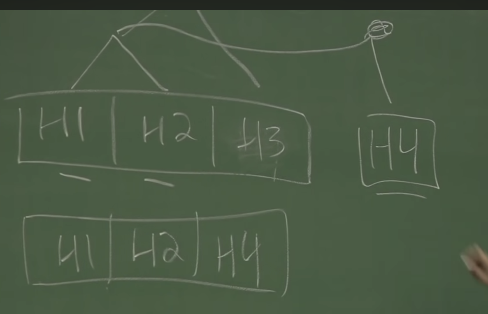

Some libraries for functional programming in JS:

+   [Mori][mori library]
+   [Immutable.js][immutable js library]
+   [Underscore][underscore library]
+   [Lodash][lodash library]
+   [Ramda][ramda library]

<!-- Hyperlinks -->

[ideal hash trees paper]: https://lampwww.epfl.ch/papers/idealhashtrees.pdf
[jsconf functional programming]: https://www.youtube.com/watch?v=e-5obm1G_FY
[mori library]: http://swannodette.github.io/mori
[immutable js library]: https://facebook.github.io/immutable-js/
[underscore library]: http://underscorejs.org
[lodash library]: https://lodash.com
[ramda library]: http://ramdajs.com

## What the heck is the event loop anyway? | Philip Roberts | JSConf EU

Source: [What the heck is the event loop anyway?][jsconf event loop]

[](https://www.youtube.com/watch?v=8aGhZQkoFbQ)

+   Transcript: [What the heck is the event loop anyway?][jsconf event loop transcript]
+   LinkedIn: [Philip Roberts][philip roberts linkedin]

(Reminder) You always put things on top of the stack and pop them of the top of the stack.

With JS, function calls are added to the stack and removed from the stack after they `return`.

Callbacks sitting in the callback queue only get back on the call stack when the call stack is 
empty.

JS runtime isn't only the engine (V8), it also has a heap (for memory), a call stack, 
external WebAPIs you can call (or Node APIs in C++ for backend apps), a callback queue, and 
an event loop.

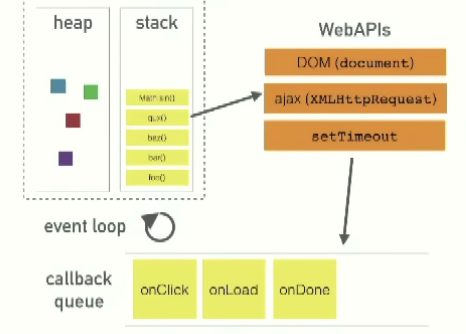

`setTimeout` is not guaranteed to run after the specified time, it is guaranteed to run at least 
after the time specified if the call stack is empty ("it's a minimum delay not maximum delay").
Example with `setTimeout(..., 0)` that only executes when the call stack is empty again and not
after 0ms (immediately).

<!-- Hyperlinks -->

[jsconf event loop]: https://www.youtube.com/watch?v=8aGhZQkoFbQ
[jsconf event loop transcript]: https://2014.jsconf.eu/speakers/philip-roberts-what-the-heck-is-the-event-loop-anyway.html
[philip roberts linkedin]: https://www.linkedin.com/in/--philip-roberts--/?originalSubdomain=uk

## Franziska Hinkelmann: JavaScript engines - how do they even? | JSConf EU

+   Article: [Medium - Understanding V8’s Bytecode][v8 bytecode article]
+   Slides (`.key`): [Presentations/JSConfEU2017.key][jsconf v8 slides]
+   Slides (`.pdf`): [JavaScript Engines - how do they even?][jsconf v8 pdf slides]
+   Video: [JavaScript engines - how do they even? | JSConf EU][jsconf v8 video]

[](https://www.youtube.com/watch?v=p-iiEDtpy6I)

JS is just in time compiled (JIT) which means the code is not first compiled and then run,
but compiled step by step as the execution happens.

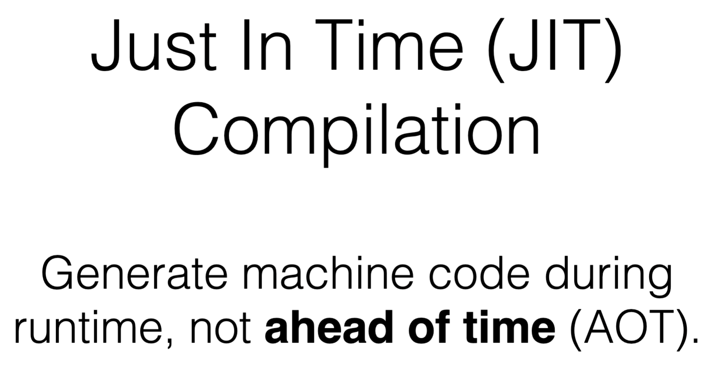

Because JS is dynamically typed, the compiler can't know the types of variables ahead of time,
which is typically required to optimise the code for execution. So instead, JS engines optimise
code that is run often ("hot code") and deoptimise code that is run rarely.

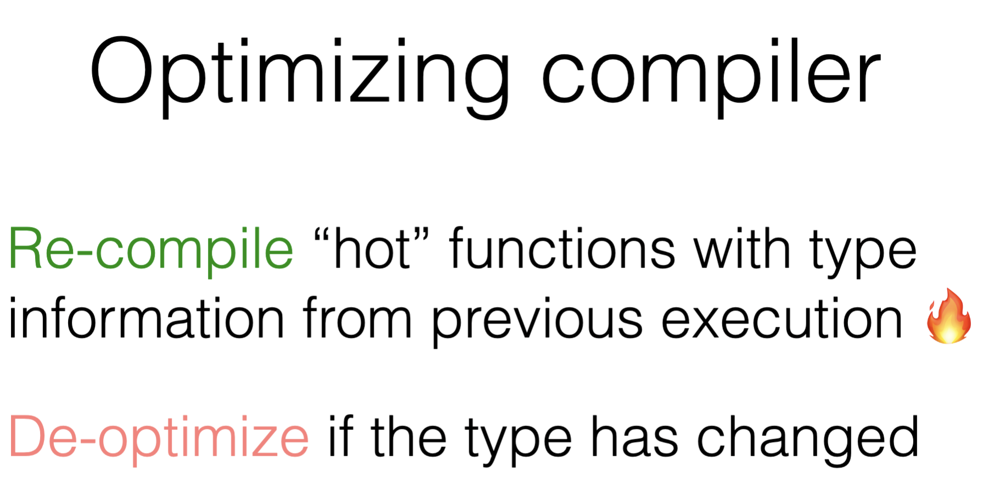

Essentially JS code is (1) parsed, (2) turned into an [abstract syntax tree (AST)][AST wikipedia],
(3) compiled into ("average") assembly machine code (baseline compiler), and (4) optimised into 
more performant machine code (optimising compiler) when the code is run often.


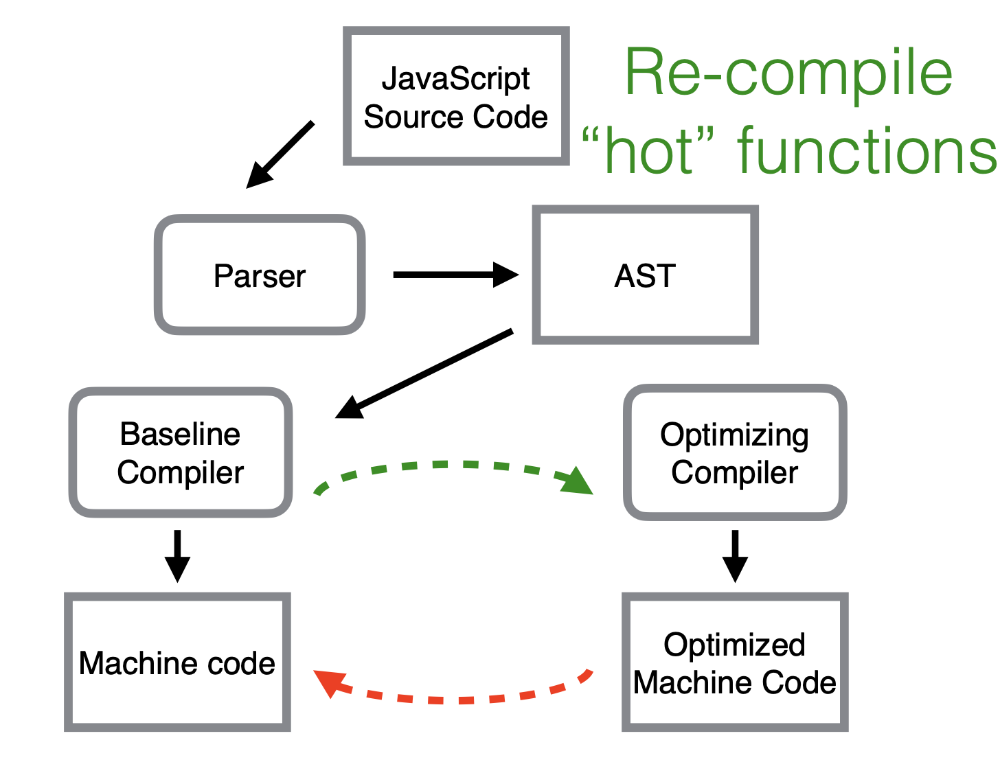

Because of this, changing types often makes it harder for the compiler to optimise code.
So the "optimizing compiler uses previously seen type information - don’t change types!".
To get the best performance out code, consider writing code that looks like statically typed.

Computed names in object literal definitions

+   ES5

    ```js
    function foo() {
        let o = {};
        o[x] = 1;
        return o;
    }
    ```

+   ES6

    ```js
    function foo() {
        return {[x]: 1};
    }
    ```

Inspect compiler code with Node.js or Chrome:

+   `—print-opt-code`: code generated by optimizing compiler
+   `—print-bytecode`: bytecode generated by interpreter
+   `—trace-ic`: different object types a call sites encounters
+   `—trace-opt` and `—trace-deopt`: which functions are (de)optimized

<!-- Hyperlinks -->

[AST wikipedia]: https://en.wikipedia.org/wiki/Abstract_syntax_tree
[v8 bytecode article]: https://medium.com/dailyjs/understanding-v8s-bytecode-317d46c94775
[jsconf v8 slides]: https://github.com/fhinkel/Presentations/blob/main/JSConfEU2017.key
[jsconf v8 pdf slides]: /assets/pdf/JSConfEU2017-v8-fhinkel.pdf
[jsconf v8 video]: https://www.youtube.com/watch?v=p-iiEDtpy6I\

## Adopting Typescript at Scale - Brie Bunge | JSConf Hawaii 2019

+   YouTube: [Adopting Typescript at Scale][jsconf adopting typescript video]

[](https://www.youtube.com/watch?v=P-J9Eg7hJwE)

Parameter types:

```js
function greet(name) {
    return `Hello, ${name}!`;
}
```

```ts
function greet(name: string) {
    return `Hello, ${name}!`;
}

greeter('JSConf Hawaii'); // compiles fine
greeter(['JSConf', 'Hawaii']); // compile error
```

Types of other objects:

```ts
interface Person {
    firstName: string;
    lastName: string;
}

function greet(person: Person) {
    return `Hello, ${person.firstName} ${person.lastName}!`;
}
```

Great editor integrations with autocompletion and typechecking.


At Airbnb they have 2m+ lines of JS code and 100+ internal npm packages.
1300+ engineers of which 200+ are frontend engineers.

Reasons they were interested in TS:

+   Fewer bugs (which stand in the way of helping users)
+   Better developer experience
+   end-to-end type safety (from backend API to frontend app)

Type script declaration files (`.d.ts`) are used to describe the shape of JS code.
This helped Airbnb circumvent the circular dependency problem between JS and TS code, 
e.g. the repo depending on npm packages that are written in JS (i.e. without type safety).

```ts
// .d.ts file
export default function greeter(name: string): string;
```

```js
// .js file
export default function greeter(name) {
    return `Hello, ${name}!`;
}
```

Declaration files are handy because they can be shared across multiple repos. 
This is how types for React (`@types/react`) and others (`@types/*`) come about. 
They are maintained by a community on Github [`DefinitelyTyped/DefinitelyTyped`][types repo github].

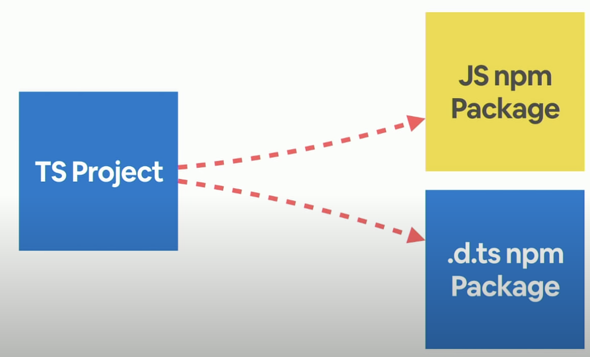

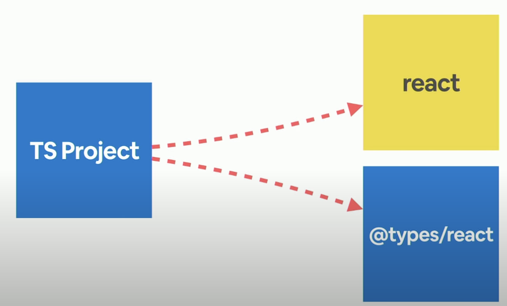

This works well for public npm packages, for internal npm packages they mirrored the 
DefinitelyTyped pattern and saved all internal types at `@airbnb-types/*` 
(see GitHub repo: [brieb/types-starter][types starter github repo]).

Brie read tons of postmortems to see if JavaScript related problems could have been prevented
with TypeScript. Examples:

+   Missing parameters in function calls can be prevented with "Expected 1 argument, but got 0"
+   Strict null-checking 
    +   "Object is possibly 'null' or 'undefined'"
    +   "Cannot invoke an object which is possibly 'null' or 'undefined'"
+   Type mismatches "Type '...' is not assignable to type '...'"

Brie found that 38% of Airbnb bugs were preventable with TypeScript according to postmortems.

[ASTExplorer.net][AST explorer js to ts] for exploring ASTs of JS and TS code.

Some tips on large migrations:

+   gather evidence and support
+   gradually introduce change
+   provide a migration path

<!-- Hyperlinks -->

[AST explorer js to ts]: https://astexplorer.net/
[types starter github repo]: https://github.com/brieb/types-starter
[types repo github]: https://github.com/DefinitelyTyped/DefinitelyTyped
[jsconf adopting typescript video]: https://www.youtube.com/watch?v=P-J9Eg7hJwE

## Some things to learn

Must have:

+   Basic Jest testing framework
+   Basic JS programming patterns (e.g. closures, promises, async/await)
+   TypeScript typing function parameters and return types
+   Basic Express.js
+   Basic MongoDB (mongoose)

Nice to have:

+   New programming patterns (differences between ES5 vs ES6)
+   Understand what event loop looks like and how it works (browser and node)
+   Basic React

## How I Learned To Stop Worrying And Trust The Compiler - Felix Rieseberg - Node Summit

+   YouTube: [How I Learned To Stop Worrying And Trust The Compiler][TS Node Sumit Felix Slack]

[](https://www.youtube.com/watch?v=mgTenYbX2Kw)

`tsc -init` to initialise a typescript project. This simply creates a `tsconfig.json` file.

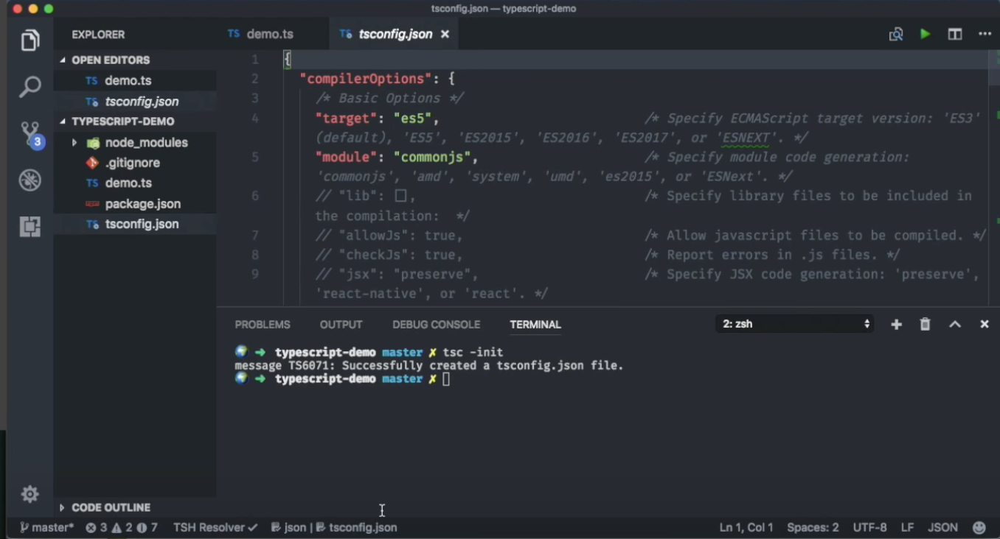

`tsc -w` to watch for changes and compile TS to JS automatically (so you can see changes as you go).

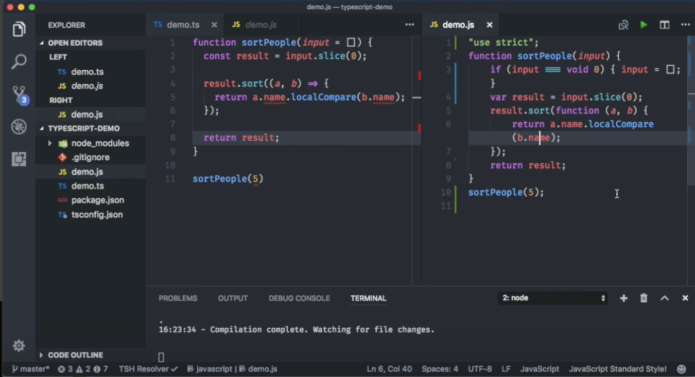

Example used in the talk:

```ts
// demo.ts
interface Person {
    name: string;
    age: number;
}

class PersonManager {
    hello: string;

    constructor() {
        this.hello = 'foo';
    }
}

function sortPeople(input = Person[] = []) {
    const result = input.slice(0);

    result.sort((a, b) => {
        return a.name.localeCompare(b.name);
    });

    return result;
}

sortPeople(5); // Error: Argument of type '5' is not assignable to parameter of type 'any []'
```

TypeScript has a very neat built-in definition feature ("peek definition") for vanilla JS functions 
so you don't have to look up the JS documentation in the browser.

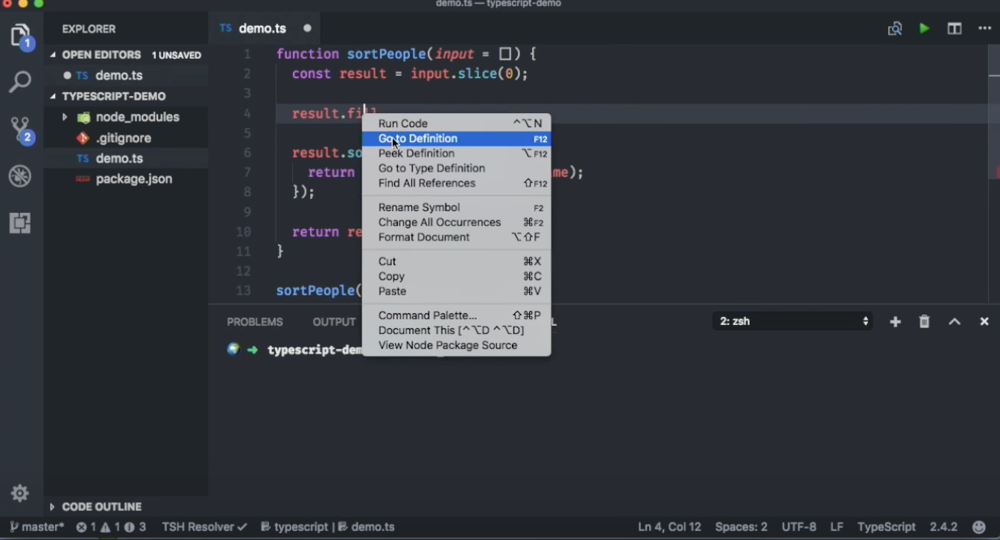

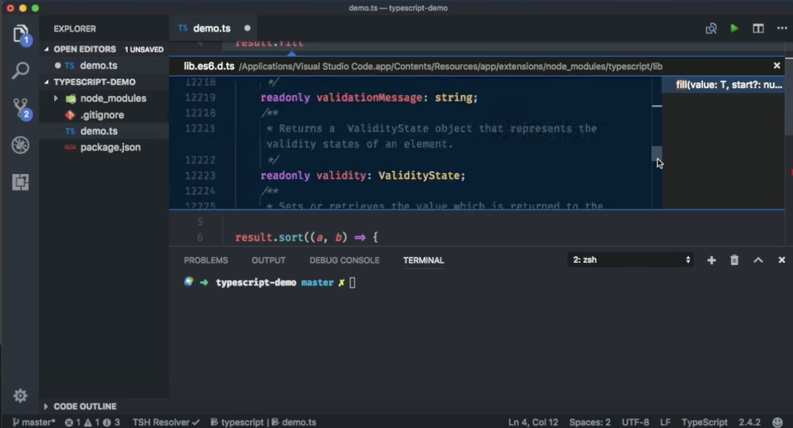

<!-- Hyperlinks -->

[TS Node Sumit Felix Slack]: https://www.youtube.com/watch?v=mgTenYbX2Kw

## Airbnb JavaScript Style Guide

Source: [Github `airbnb/javascript`][airbnb javascript style guide]

Below is a selection of stylistic rules to highlight.

### References

  <a name="references--prefer-const"></a><a name="2.1"></a>
  - [2.1](#references--prefer-const) Use `const` for all of your references; avoid using `var`. eslint: [`prefer-const`](https://eslint.org/docs/rules/prefer-const), [`no-const-assign`](https://eslint.org/docs/rules/no-const-assign)

    > Why? This ensures that you can’t reassign your references, which can lead to bugs and difficult to comprehend code.

    ```javascript
    // bad
    var a = 1;
    var b = 2;

    // good
    const a = 1;
    const b = 2;
    ```

  <a name="references--disallow-var"></a><a name="2.2"></a>
  - [2.2](#references--disallow-var) If you must reassign references, use `let` instead of `var`. eslint: [`no-var`](https://eslint.org/docs/rules/no-var)

    > Why? `let` is block-scoped rather than function-scoped like `var`.

    ```javascript
    // bad
    var count = 1;
    if (true) {
      count += 1;
    }

    // good, use the let.
    let count = 1;
    if (true) {
      count += 1;
    }
    ```

  <a name="references--block-scope"></a><a name="2.3"></a>
  - [2.3](#references--block-scope) Note that both `let` and `const` are block-scoped, whereas `var` is function-scoped.

    ```javascript
    // const and let only exist in the blocks they are defined in.
    {
      let a = 1;
      const b = 1;
      var c = 1;
    }
    console.log(a); // ReferenceError
    console.log(b); // ReferenceError
    console.log(c); // Prints 1
    ```

    In the above code, you can see that referencing `a` and `b` will produce a ReferenceError, while `c` contains the number. This is because `a` and `b` are block scoped, while `c` is scoped to the containing function.

### Objects

  <a name="objects--no-new"></a><a name="3.1"></a>
  - [3.1](#objects--no-new) Use the literal syntax for object creation. eslint: [`no-new-object`](https://eslint.org/docs/rules/no-new-object)

    ```javascript
    // bad
    const item = new Object();

    // good
    const item = {};
    ```

    <a name="es6-computed-properties"></a><a name="3.4"></a>
  - [3.2](#es6-computed-properties) Use computed property names when creating objects with dynamic property names.

    > Why? They allow you to define all the properties of an object in one place.

    ```javascript

    function getKey(k) {
      return `a key named ${k}`;
    }

    // bad
    const obj = {
      id: 5,
      name: 'San Francisco',
    };
    obj[getKey('enabled')] = true;

    // good
    const obj = {
      id: 5,
      name: 'San Francisco',
      [getKey('enabled')]: true,
    };
    ```

    <a name="es6-object-concise"></a><a name="3.6"></a>
  - [3.4](#es6-object-concise) Use property value shorthand. eslint: [`object-shorthand`](https://eslint.org/docs/rules/object-shorthand)

    > Why? It is shorter and descriptive.

    ```javascript
    const lukeSkywalker = 'Luke Skywalker';

    // bad
    const obj = {
      lukeSkywalker: lukeSkywalker,
    };

    // good
    const obj = {
      lukeSkywalker,
    };
    ```
    <a name="objects--grouped-shorthand"></a><a name="3.7"></a>
  - [3.5](#objects--grouped-shorthand) Group your shorthand properties at the beginning of your object declaration.

    > Why? It’s easier to tell which properties are using the shorthand.

    ```javascript
    const anakinSkywalker = 'Anakin Skywalker';
    const lukeSkywalker = 'Luke Skywalker';

    // bad
    const obj = {
      episodeOne: 1,
      twoJediWalkIntoACantina: 2,
      lukeSkywalker,
      episodeThree: 3,
      mayTheFourth: 4,
      anakinSkywalker,
    };

    // good
    const obj = {
      lukeSkywalker,
      anakinSkywalker,
      episodeOne: 1,
      twoJediWalkIntoACantina: 2,
      episodeThree: 3,
      mayTheFourth: 4,
    };
    ```
    <a name="objects--quoted-props"></a><a name="3.8"></a>
  - [3.6](#objects--quoted-props) Only quote properties that are invalid identifiers. eslint: [`quote-props`](https://eslint.org/docs/rules/quote-props)

    > Why? In general we consider it subjectively easier to read. It improves syntax highlighting, and is also more easily optimized by many JS engines.

    ```javascript
    // bad
    const bad = {
      'foo': 3,
      'bar': 4,
      'data-blah': 5,
    };

    // good
    const good = {
      foo: 3,
      bar: 4,
      'data-blah': 5,
    };
    ```

### Arrays

  <a name="arrays--literals"></a><a name="4.1"></a>
  - [4.1](#arrays--literals) Use the literal syntax for array creation. eslint: [`no-array-constructor`](https://eslint.org/docs/rules/no-array-constructor)

    ```javascript
    // bad
    const items = new Array();

    // good
    const items = [];
    ```

  <a name="arrays--push"></a><a name="4.2"></a>
  - [4.2](#arrays--push) Use [Array#push](https://developer.mozilla.org/en/docs/Web/JavaScript/Reference/Global_Objects/Array/push) instead of direct assignment to add items to an array.

    ```javascript
    const someStack = [];

    // bad
    someStack[someStack.length] = 'abracadabra';

    // good
    someStack.push('abracadabra');
    ```

  <a name="es6-array-spreads"></a><a name="4.3"></a>
  - [4.3](#es6-array-spreads) Use array spreads `...` to copy arrays.

    ```javascript
    // bad
    const len = items.length;
    const itemsCopy = [];
    let i;

    for (i = 0; i < len; i += 1) {
      itemsCopy[i] = items[i];
    }

    // good
    const itemsCopy = [...items];
    ```

    <a name="arrays--callback-return"></a><a name="4.5"></a>
  - [4.7](#arrays--callback-return) Use return statements in array method callbacks. It’s ok to omit the return if the function body consists of a single statement returning an expression without side effects, following [8.2](#arrows--implicit-return). eslint: [`array-callback-return`](https://eslint.org/docs/rules/array-callback-return)

    ```javascript
    // good
    [1, 2, 3].map((x) => {
      const y = x + 1;
      return x * y;
    });

    // good
    [1, 2, 3].map((x) => x + 1);

    // bad - no returned value means `acc` becomes undefined after the first iteration
    [[0, 1], [2, 3], [4, 5]].reduce((acc, item, index) => {
      const flatten = acc.concat(item);
    });

    // good
    [[0, 1], [2, 3], [4, 5]].reduce((acc, item, index) => {
      const flatten = acc.concat(item);
      return flatten;
    });

    // bad
    inbox.filter((msg) => {
      const { subject, author } = msg;
      if (subject === 'Mockingbird') {
        return author === 'Harper Lee';
      } else {
        return false;
      }
    });

    // good
    inbox.filter((msg) => {
      const { subject, author } = msg;
      if (subject === 'Mockingbird') {
        return author === 'Harper Lee';
      }

      return false;
    });
    ```

  <a name="arrays--bracket-newline"></a>
  - [4.8](#arrays--bracket-newline) Use line breaks after opening array brackets and before closing array brackets, if an array has multiple lines

    ```javascript
    // bad
    const arr = [
      [0, 1], [2, 3], [4, 5],
    ];

    const objectInArray = [{
      id: 1,
    }, {
      id: 2,
    }];

    const numberInArray = [
      1, 2,
    ];

    // good
    const arr = [[0, 1], [2, 3], [4, 5]];

    const objectInArray = [
      {
        id: 1,
      },
      {
        id: 2,
      },
    ];

    const numberInArray = [
      1,
      2,
    ];
    ```

### Strings

  <a name="strings--quotes"></a><a name="6.1"></a>
  - [6.1](#strings--quotes) Use single quotes `''` for strings. eslint: [`quotes`](https://eslint.org/docs/rules/quotes)

    ```javascript
    // bad
    const name = "Capt. Janeway";

    // bad - template literals should contain interpolation or newlines
    const name = `Capt. Janeway`;

    // good
    const name = 'Capt. Janeway';
    ```

  <a name="es6-template-literals"></a><a name="6.4"></a>
  - [6.3](#es6-template-literals) When programmatically building up strings, use template strings instead of concatenation. eslint: [`prefer-template`](https://eslint.org/docs/rules/prefer-template) [`template-curly-spacing`](https://eslint.org/docs/rules/template-curly-spacing)

    > Why? Template strings give you a readable, concise syntax with proper newlines and string interpolation features.

    ```javascript
    // bad
    function sayHi(name) {
      return 'How are you, ' + name + '?';
    }

    // bad
    function sayHi(name) {
      return ['How are you, ', name, '?'].join();
    }

    // bad
    function sayHi(name) {
      return `How are you, ${ name }?`;
    }

    // good
    function sayHi(name) {
      return `How are you, ${name}?`;
    }
    ```

### Functions

  <a name="functions--declarations"></a><a name="7.1"></a>
  - [7.1](#functions--declarations) Use named function expressions instead of function declarations. eslint: [`func-style`](https://eslint.org/docs/rules/func-style), [`func-names`](https://eslint.org/docs/latest/rules/func-names)

    > Why? Function declarations are hoisted, which means that it’s easy - too easy - to reference the function before it is defined in the file. This harms readability and maintainability. If you find that a function’s definition is large or complex enough that it is interfering with understanding the rest of the file, then perhaps it’s time to extract it to its own module! Don’t forget to explicitly name the expression, regardless of whether or not the name is inferred from the containing variable (which is often the case in modern browsers or when using compilers such as Babel). This eliminates any assumptions made about the Error’s call stack. ([Discussion](https://github.com/airbnb/javascript/issues/794))

    ```javascript
    // bad
    function foo() {
      // ...
    }

    // bad
    const foo = function () {
      // ...
    };

    // good
    // lexical name distinguished from the variable-referenced invocation(s)
    const short = function longUniqueMoreDescriptiveLexicalFoo() {
      // ...
    };
    ```

    <a name="es6-default-parameters"></a><a name="7.7"></a>
  - [7.7](#es6-default-parameters) Use default parameter syntax rather than mutating function arguments.

    ```javascript
    // really bad
    function handleThings(opts) {
      // No! We shouldn’t mutate function arguments.
      // Double bad: if opts is falsy it'll be set to an object which may
      // be what you want but it can introduce subtle bugs.
      opts = opts || {};
      // ...
    }

    // still bad
    function handleThings(opts) {
      if (opts === void 0) {
        opts = {};
      }
      // ...
    }

    // good
    function handleThings(opts = {}) {
      // ...
    }
    ```

  <a name="functions--default-side-effects"></a><a name="7.8"></a>
  - [7.8](#functions--default-side-effects) Avoid side effects with default parameters.

    > Why? They are confusing to reason about.

    ```javascript
    let b = 1;
    // bad
    function count(a = b++) {
      console.log(a);
    }
    count();  // 1
    count();  // 2
    count(3); // 3
    count();  // 3
    ```

  <a name="functions--defaults-last"></a><a name="7.9"></a>
  - [7.9](#functions--defaults-last) Always put default parameters last. eslint: [`default-param-last`](https://eslint.org/docs/rules/default-param-last)

    ```javascript
    // bad
    function handleThings(opts = {}, name) {
      // ...
    }

    // good
    function handleThings(name, opts = {}) {
      // ...
    }
    ```

    <a name="functions--signature-spacing"></a><a name="7.11"></a>
  - [7.11](#functions--signature-spacing) Spacing in a function signature. eslint: [`space-before-function-paren`](https://eslint.org/docs/rules/space-before-function-paren) [`space-before-blocks`](https://eslint.org/docs/rules/space-before-blocks)

    > Why? Consistency is good, and you shouldn’t have to add or remove a space when adding or removing a name.

    ```javascript
    // bad
    const f = function(){};
    const g = function (){};
    const h = function() {};

    // good
    const x = function () {};
    const y = function a() {};
    ```

    <a name="functions--mutate-params"></a><a name="7.12"></a>
  - [7.12](#functions--mutate-params) Never mutate parameters. eslint: [`no-param-reassign`](https://eslint.org/docs/rules/no-param-reassign)

    > Why? Manipulating objects passed in as parameters can cause unwanted variable side effects in the original caller.

    ```javascript
    // bad
    function f1(obj) {
      obj.key = 1;
    }

    // good
    function f2(obj) {
      const key = Object.prototype.hasOwnProperty.call(obj, 'key') ? obj.key : 1;
    }
    ```

    <a name="functions--signature-invocation-indentation"></a>
  - [7.15](#functions--signature-invocation-indentation) Functions with multiline signatures, or invocations, should be indented just like every other multiline list in this guide: with each item on a line by itself, with a trailing comma on the last item. eslint: [`function-paren-newline`](https://eslint.org/docs/rules/function-paren-newline)

    ```javascript
    // bad
    function foo(bar,
                 baz,
                 quux) {
      // ...
    }

    // good
    function foo(
      bar,
      baz,
      quux,
    ) {
      // ...
    }

    // bad
    console.log(foo,
      bar,
      baz);

    // good
    console.log(
      foo,
      bar,
      baz,
    );
    ```

### Arrow Functions

  <a name="arrows--use-them"></a><a name="8.1"></a>
  - [8.1](#arrows--use-them) When you must use an anonymous function (as when passing an inline callback), use arrow function notation. eslint: [`prefer-arrow-callback`](https://eslint.org/docs/rules/prefer-arrow-callback), [`arrow-spacing`](https://eslint.org/docs/rules/arrow-spacing)

    > Why? It creates a version of the function that executes in the context of `this`, which is usually what you want, and is a more concise syntax.

    > Why not? If you have a fairly complicated function, you might move that logic out into its own named function expression.

    ```javascript
    // bad
    [1, 2, 3].map(function (x) {
      const y = x + 1;
      return x * y;
    });

    // good
    [1, 2, 3].map((x) => {
      const y = x + 1;
      return x * y;
    });
    ```

    <a name="arrows--one-arg-parens"></a><a name="8.4"></a>
  - [8.4](#arrows--one-arg-parens) Always include parentheses around arguments for clarity and consistency. eslint: [`arrow-parens`](https://eslint.org/docs/rules/arrow-parens)

    > Why? Minimizes diff churn when adding or removing arguments.

    ```javascript
    // bad
    [1, 2, 3].map(x => x * x);

    // good
    [1, 2, 3].map((x) => x * x);

    // bad
    [1, 2, 3].map(number => (
      `A long string with the ${number}. It’s so long that we don’t want it to take up space on the .map line!`
    ));

    // good
    [1, 2, 3].map((number) => (
      `A long string with the ${number}. It’s so long that we don’t want it to take up space on the .map line!`
    ));

    // bad
    [1, 2, 3].map(x => {
      const y = x + 1;
      return x * y;
    });

    // good
    [1, 2, 3].map((x) => {
      const y = x + 1;
      return x * y;
    });
    ```

### Classes & Constructors

  <a name="constructors--use-class"></a><a name="9.1"></a>
  - [9.1](#constructors--use-class) Always use `class`. Avoid manipulating `prototype` directly.

    > Why? `class` syntax is more concise and easier to reason about.

    ```javascript
    // bad
    function Queue(contents = []) {
      this.queue = [...contents];
    }
    Queue.prototype.pop = function () {
      const value = this.queue[0];
      this.queue.splice(0, 1);
      return value;
    };

    // good
    class Queue {
      constructor(contents = []) {
        this.queue = [...contents];
      }
      pop() {
        const value = this.queue[0];
        this.queue.splice(0, 1);
        return value;
      }
    }
    ```

  <a name="constructors--extends"></a><a name="9.2"></a>
  - [9.2](#constructors--extends) Use `extends` for inheritance.

    > Why? It is a built-in way to inherit prototype functionality without breaking `instanceof`.

    ```javascript
    // bad
    const inherits = require('inherits');
    function PeekableQueue(contents) {
      Queue.apply(this, contents);
    }
    inherits(PeekableQueue, Queue);
    PeekableQueue.prototype.peek = function () {
      return this.queue[0];
    };

    // good
    class PeekableQueue extends Queue {
      peek() {
        return this.queue[0];
      }
    }
    ```

    <a name="constructors--no-useless"></a><a name="9.5"></a>
  - [9.5](#constructors--no-useless) Classes have a default constructor if one is not specified. An empty constructor function or one that just delegates to a parent class is unnecessary. eslint: [`no-useless-constructor`](https://eslint.org/docs/rules/no-useless-constructor)

    ```javascript
    // bad
    class Jedi {
      constructor() {}

      getName() {
        return this.name;
      }
    }

    // bad
    class Rey extends Jedi {
      constructor(...args) {
        super(...args);
      }
    }

    // good
    class Rey extends Jedi {
      constructor(...args) {
        super(...args);
        this.name = 'Rey';
      }
    }
    ```

    <a name="classes--methods-use-this"></a>
  - [9.7](#classes--methods-use-this) Class methods should use `this` or be made into a static method unless an external library or framework requires using specific non-static methods. Being an instance method should indicate that it behaves differently based on properties of the receiver. eslint: [`class-methods-use-this`](https://eslint.org/docs/rules/class-methods-use-this)

    ```javascript
    // bad
    class Foo {
      bar() {
        console.log('bar');
      }
    }

    // good - this is used
    class Foo {
      bar() {
        console.log(this.bar);
      }
    }

    // good - constructor is exempt
    class Foo {
      constructor() {
        // ...
      }
    }

    // good - static methods aren't expected to use this
    class Foo {
      static bar() {
        console.log('bar');
      }
    }
    ```

### Modules

  <a name="modules--use-them"></a><a name="10.1"></a>
  - [10.1](#modules--use-them) Always use modules (`import`/`export`) over a non-standard module system. You can always transpile to your preferred module system.

    > Why? Modules are the future, let’s start using the future now.

    ```javascript
    // bad
    const AirbnbStyleGuide = require('./AirbnbStyleGuide');
    module.exports = AirbnbStyleGuide.es6;

    // ok
    import AirbnbStyleGuide from './AirbnbStyleGuide';
    export default AirbnbStyleGuide.es6;

    // best
    import { es6 } from './AirbnbStyleGuide';
    export default es6;
    ```

  <a name="modules--no-wildcard"></a><a name="10.2"></a>
  - [10.2](#modules--no-wildcard) Do not use wildcard imports.

    > Why? This makes sure you have a single default export.

    ```javascript
    // bad
    import * as AirbnbStyleGuide from './AirbnbStyleGuide';

    // good
    import AirbnbStyleGuide from './AirbnbStyleGuide';
    ```

  <a name="modules--no-export-from-import"></a><a name="10.3"></a>
  - [10.3](#modules--no-export-from-import) And do not export directly from an import.

    > Why? Although the one-liner is concise, having one clear way to import and one clear way to export makes things consistent.

    ```javascript
    // bad
    // filename es6.js
    export { es6 as default } from './AirbnbStyleGuide';

    // good
    // filename es6.js
    import { es6 } from './AirbnbStyleGuide';
    export default es6;
    ```

  <a name="modules--no-duplicate-imports"></a>
  - [10.4](#modules--no-duplicate-imports) Only import from a path in one place.
 eslint: [`no-duplicate-imports`](https://eslint.org/docs/rules/no-duplicate-imports)
    > Why? Having multiple lines that import from the same path can make code harder to maintain.

    ```javascript
    // bad
    import foo from 'foo';
    // … some other imports … //
    import { named1, named2 } from 'foo';

    // good
    import foo, { named1, named2 } from 'foo';

    // good
    import foo, {
      named1,
      named2,
    } from 'foo';
    ```

    <a name="modules--multiline-imports-over-newlines"></a>
  - [10.8](#modules--multiline-imports-over-newlines) Multiline imports should be indented just like multiline array and object literals.
 eslint: [`object-curly-newline`](https://eslint.org/docs/rules/object-curly-newline)

    > Why? The curly braces follow the same indentation rules as every other curly brace block in the style guide, as do the trailing commas.

    ```javascript
    // bad
    import {longNameA, longNameB, longNameC, longNameD, longNameE} from 'path';

    // good
    import {
      longNameA,
      longNameB,
      longNameC,
      longNameD,
      longNameE,
    } from 'path';
    ```

    <a name="modules--import-extensions"></a>
  - [10.10](#modules--import-extensions) Do not include JavaScript filename extensions
 eslint: [`import/extensions`](https://github.com/import-js/eslint-plugin-import/blob/master/docs/rules/extensions.md)
    > Why? Including extensions inhibits refactoring, and inappropriately hardcodes implementation details of the module you're importing in every consumer.

    ```javascript
    // bad
    import foo from './foo.js';
    import bar from './bar.jsx';
    import baz from './baz/index.jsx';

    // good
    import foo from './foo';
    import bar from './bar';
    import baz from './baz';
    ```

### Iterators

  <a name="iterators--nope"></a><a name="11.1"></a>
  - [11.1](#iterators--nope) Don’t use iterators. Prefer JavaScript’s higher-order functions instead of loops like `for-in` or `for-of`. eslint: [`no-iterator`](https://eslint.org/docs/rules/no-iterator) [`no-restricted-syntax`](https://eslint.org/docs/rules/no-restricted-syntax)

    > Why? This enforces our immutable rule. Dealing with pure functions that return values is easier to reason about than side effects.

    > Use `map()` / `every()` / `filter()` / `find()` / `findIndex()` / `reduce()` / `some()` / ... to iterate over arrays, and `Object.keys()` / `Object.values()` / `Object.entries()` to produce arrays so you can iterate over objects.

    ```javascript
    const numbers = [1, 2, 3, 4, 5];

    // bad
    let sum = 0;
    for (let num of numbers) {
      sum += num;
    }
    sum === 15;

    // good
    let sum = 0;
    numbers.forEach((num) => {
      sum += num;
    });
    sum === 15;

    // best (use the functional force)
    const sum = numbers.reduce((total, num) => total + num, 0);
    sum === 15;

    // bad
    const increasedByOne = [];
    for (let i = 0; i < numbers.length; i++) {
      increasedByOne.push(numbers[i] + 1);
    }

    // good
    const increasedByOne = [];
    numbers.forEach((num) => {
      increasedByOne.push(num + 1);
    });

    // best (keeping it functional)
    const increasedByOne = numbers.map((num) => num + 1);
    ```

### Properties

  <a name="properties--dot"></a><a name="12.1"></a>
  - [12.1](#properties--dot) Use dot notation when accessing properties. eslint: [`dot-notation`](https://eslint.org/docs/rules/dot-notation)

    ```javascript
    const luke = {
      jedi: true,
      age: 28,
    };

    // bad
    const isJedi = luke['jedi'];

    // good
    const isJedi = luke.jedi;
    ```

  <a name="properties--bracket"></a><a name="12.2"></a>
  - [12.2](#properties--bracket) Use bracket notation `[]` when accessing properties with a variable.

    ```javascript
    const luke = {
      jedi: true,
      age: 28,
    };

    function getProp(prop) {
      return luke[prop];
    }

    const isJedi = getProp('jedi');
    ```

## Variables

  <a name="variables--const"></a><a name="13.1"></a>
  - [13.1](#variables--const) Always use `const` or `let` to declare variables. Not doing so will result in global variables. We want to avoid polluting the global namespace. Captain Planet warned us of that. eslint: [`no-undef`](https://eslint.org/docs/rules/no-undef) [`prefer-const`](https://eslint.org/docs/rules/prefer-const)

    ```javascript
    // bad
    superPower = new SuperPower();

    // good
    const superPower = new SuperPower();
    ```

  <a name="variables--one-const"></a><a name="13.2"></a>
  - [13.2](#variables--one-const) Use one `const` or `let` declaration per variable or assignment. eslint: [`one-var`](https://eslint.org/docs/rules/one-var)

    > Why? It’s easier to add new variable declarations this way, and you never have to worry about swapping out a `;` for a `,` or introducing punctuation-only diffs. You can also step through each declaration with the debugger, instead of jumping through all of them at once.

    ```javascript
    // bad
    const items = getItems(),
        goSportsTeam = true,
        dragonball = 'z';

    // bad
    // (compare to above, and try to spot the mistake)
    const items = getItems(),
        goSportsTeam = true;
        dragonball = 'z';

    // good
    const items = getItems();
    const goSportsTeam = true;
    const dragonball = 'z';
    ```

  <a name="variables--const-let-group"></a><a name="13.3"></a>
  - [13.3](#variables--const-let-group) Group all your `const`s and then group all your `let`s.

    > Why? This is helpful when later on you might need to assign a variable depending on one of the previously assigned variables.

    ```javascript
    // bad
    let i, len, dragonball,
        items = getItems(),
        goSportsTeam = true;

    // bad
    let i;
    const items = getItems();
    let dragonball;
    const goSportsTeam = true;
    let len;

    // good
    const goSportsTeam = true;
    const items = getItems();
    let dragonball;
    let i;
    let length;
    ```

  <a name="variables--define-where-used"></a><a name="13.4"></a>
  - [13.4](#variables--define-where-used) Assign variables where you need them, but place them in a reasonable place.

    > Why? `let` and `const` are block scoped and not function scoped.

    ```javascript
    // bad - unnecessary function call
    function checkName(hasName) {
      const name = getName();

      if (hasName === 'test') {
        return false;
      }

      if (name === 'test') {
        this.setName('');
        return false;
      }

      return name;
    }

    // good
    function checkName(hasName) {
      if (hasName === 'test') {
        return false;
      }

      const name = getName();

      if (name === 'test') {
        this.setName('');
        return false;
      }

      return name;
    }
    ```

  <a name="variables--no-chain-assignment"></a><a name="13.5"></a>
  - [13.5](#variables--no-chain-assignment) Don’t chain variable assignments. eslint: [`no-multi-assign`](https://eslint.org/docs/rules/no-multi-assign)

    > Why? Chaining variable assignments creates implicit global variables.

    ```javascript
    // bad
    (function example() {
      // JavaScript interprets this as
      // let a = ( b = ( c = 1 ) );
      // The let keyword only applies to variable a; variables b and c become
      // global variables.
      let a = b = c = 1;
    }());

    console.log(a); // throws ReferenceError
    console.log(b); // 1
    console.log(c); // 1

    // good
    (function example() {
      let a = 1;
      let b = a;
      let c = a;
    }());

    console.log(a); // throws ReferenceError
    console.log(b); // throws ReferenceError
    console.log(c); // throws ReferenceError

    // the same applies for `const`
    ```

  <a name="variables--unary-increment-decrement"></a><a name="13.6"></a>
  - [13.6](#variables--unary-increment-decrement) Avoid using unary increments and decrements (`++`, `--`). eslint [`no-plusplus`](https://eslint.org/docs/rules/no-plusplus)

    > Why? Per the eslint documentation, unary increment and decrement statements are subject to automatic semicolon insertion and can cause silent errors with incrementing or decrementing values within an application. It is also more expressive to mutate your values with statements like `num += 1` instead of `num++` or `num ++`. Disallowing unary increment and decrement statements also prevents you from pre-incrementing/pre-decrementing values unintentionally which can also cause unexpected behavior in your programs.

    ```javascript
    // bad

    const array = [1, 2, 3];
    let num = 1;
    num++;
    --num;

    let sum = 0;
    let truthyCount = 0;
    for (let i = 0; i < array.length; i++) {
      let value = array[i];
      sum += value;
      if (value) {
        truthyCount++;
      }
    }

    // good

    const array = [1, 2, 3];
    let num = 1;
    num += 1;
    num -= 1;

    const sum = array.reduce((a, b) => a + b, 0);
    const truthyCount = array.filter(Boolean).length;
    ```

<a name="variables--linebreak"></a>
  - [13.7](#variables--linebreak) Avoid linebreaks before or after `=` in an assignment. If your assignment violates [`max-len`](https://eslint.org/docs/rules/max-len), surround the value in parens. eslint [`operator-linebreak`](https://eslint.org/docs/rules/operator-linebreak).

    > Why? Linebreaks surrounding `=` can obfuscate the value of an assignment.

    ```javascript
    // bad
    const foo =
      superLongLongLongLongLongLongLongLongFunctionName();

    // bad
    const foo
      = 'superLongLongLongLongLongLongLongLongString';

    // good
    const foo = (
      superLongLongLongLongLongLongLongLongFunctionName()
    );

    // good
    const foo = 'superLongLongLongLongLongLongLongLongString';
    ```

Testing: [30.2](https://github.com/airbnb/javascript#testing--for-real)

Whenever you fix a bug, write a regression test. A bug fixed without a regression test is almost 
certainly going to break again in the future.

<!-- Hyperlinks -->

[airbnb javascript style guide]: https://github.com/airbnb/javascript

## TypeScript for Java/C# Programmers

Source: [typescriptlang.org](https://www.typescriptlang.org/docs/handbook/typescript-in-5-minutes-oop.html)

TLDR:

+	In Java:

	+	everything belongs to a class or interface

	+	it's meaningful to think of a one-to-one correspondence between runtime types and 
		their compile-time declarations

	+	types are related to their declarations, not their structures.

	+	the type system is (reified) _nominal_.

		> A [type system](https://en.wikipedia.org/wiki/Type_system) is **nominal,** 
		> **nominative,** or **name-based** if compatibility and equivalence of 
		> [data types](https://en.wikipedia.org/wiki/Data_type) is determined by explicit 
		> declarations and/or the name of the types. Nominal systems are used to determine if types 
		> are equivalent, as well as if a type is a subtype of another. 
		> 
		> Nominal type systems contrast with 
		> [structural systems](https://en.wikipedia.org/wiki/Structural_type_system), where 
		> comparisons  are based on the structure of the types in question and do not require
		> explicit declarations.

		Source: [wikipedia.org](https://en.wikipedia.org/wiki/Nominal_type_system)

+	In TypeScript:

	+	_free functions_ (those not associated with a class) working over data without an implied 
		OOP hierarchy are the preferred model for writing programs (in JavaScript more broadly)
	+	types are _sets_ (a particular value can belong to *many* sets or types at the same 
		time)
	+	classes and many common patterns such as  interfaces, inheritance, and static methods
		are supported

> We recommend learning a little bit of JavaScript without types first to understand JavaScript’s 
> runtime behaviors. [...] TypeScript uses the same runtime as JavaScript, so any resources about 
> how to accomplish specific runtime behavior (converting a string to a number, 
> displaying an alert, writing a file to disk, etc.) will always apply equally well to 
> TypeScript programs.

### Rethinking the Class

> C# and Java are what we might call *mandatory OOP* languages. In these languages, the *class* is 
> the basic unit of code organization, and also the basic container of all data *and* behavior at 
> runtime. Forcing all functionality and data to be held in classes can be a good domain model for 
> some problems, but not every domain *needs* to be represented this way.

#### Free Functions and Data

> In JavaScript, functions can live anywhere, and data can be passed around freely without being 
> inside a pre-defined `class` or `struct`. This flexibility is extremely powerful. 
> "Free" functions (those not associated with a class) working over data without an implied OOP 
> hierarchy tends to be the preferred model for writing programs in JavaScript.

#### Static Classes

> Additionally, certain constructs from C# and Java such as singletons and static classes are 
> unnecessary in TypeScript.

### OOP in TypeScript

> That said, you can still use classes if you like! Some problems are well-suited to being solved 
> by a traditional OOP hierarchy, and TypeScript's support for JavaScript classes will make these 
> models even more powerful. TypeScript supports many common patterns such as implementing 
> interfaces, inheritance, and static methods.
> 
> We'll cover classes later in this guide.

### Rethinking Types

> TypeScript's understanding of a *type* is actually quite different from C# or Java's. 
> Let's explore some differences.

#### Nominal Reified Type Systems

> In C# or Java, any given value or object has one exact type - either `null`, a primitive, or a 
> known class type. We can call methods like `value.GetType()` or `value.getClass()` to query the 
> exact type at runtime. The definition of this type will reside in a class somewhere with some 
> name, and we can't use two classes with similar shapes in lieu of each other unless there's an 
> explicit inheritance relationship or commonly-implemented interface.
> 
> These aspects describe a *reified, nominal* type system. The types we wrote in the code are 
> present at runtime, and the types are related via their declarations, not their structures.

#### Types as Sets

> In C# or Java, it's meaningful to think of a one-to-one correspondence between runtime types and 
> their compile-time declarations.
>
> In TypeScript, it's better to think of a type as a *set of values* that share something in 
> common. Because types are just sets, a particular value can belong to *many* sets at the same 
> time.
> 
> Once you start thinking of types as sets, certain operations become very natural. For example, in
> C#, it's awkward to pass around a value that is *either* a `string` or `int`, because there isn't
> a single type that represents this sort of value.
>
> In TypeScript, this becomes very natural once you realize that every type is just a set. How do
> you describe a value that either belongs in the `string` set or the `number` set? It simply 
> belongs to the *union* of those sets: `string | number`.
>
> TypeScript provides a number of mechanisms to work with types in a set-theoretic way, and you'll 
> find them more intuitive if you think of types as sets.

#### Erased Structural Types

> In TypeScript, objects are *not* of a single exact type. For example, if we construct an object 
> that satisfies an interface, we can use that object where that interface is expected even though 
> there was no declarative relationship between the two.

```js
// Example
interface Pointlike {
  x: number;
  y: number;
}
interface Named {
  name: string;
}
 
function logPoint(point: Pointlike) {
  console.log("x = " + point.x + ", y = " + point.y);
}
 
function logName(x: Named) {
  console.log("Hello, " + x.name);
}
 
const obj = {
  x: 0,
  y: 0,
  name: "Origin",
};
 
logPoint(obj);
logName(obj);
```

#### Surpises with TS: Empty types

> We can see that { k: 10 } has all of the properties that Empty does, because Empty has no properties. Therefore, this is a valid call

```js
class Empty {}
 
function fn(arg: Empty) {
  // do something?
}
 
// No error, but this isn't an 'Empty' ?
fn({ k: 10 });
```

## How to Convert a Unix Timestamp to Time in JavaScript

Source: [tutorialrepublic.com](https://www.tutorialrepublic.com/faq/how-to-convert-a-unix-timestamp-to-time-in-javascript.php)

> Simply multiply Unix timestamp by 1000 to convert it to a JavaScript time, because Unix timestamp measures time as a number of seconds, whereas in JavaScript time is fundamentally specified as the number of milliseconds (elapsed since January 1, 1970 at 00:00:00 UTC).

```js
// Timestamp in seconds
var unixTimestamp = 1651822834;

/* Create a new JavaScript Date object based on Unix timestamp.
Multiplied it by 1000 to convert it into milliseconds */
var date = new Date(unixTimestamp * 1000);

// Generate date string
console.log(date.toLocaleDateString("en-US"));   // Prints: 5/6/2022
console.log(date.toLocaleDateString("en-GB"));   // Prints: 06/05/2022
console.log(date.toLocaleDateString("default")); // Prints: 5/6/2022

// Generate time string
console.log(date.toLocaleTimeString("en-US"));   // Prints: 1:10:34 PM
console.log(date.toLocaleTimeString("it-IT"));   // Prints: 13:10:34
console.log(date.toLocaleTimeString("default")); // Prints: 1:10:34 PM
```

## Mozilla - `Date.prototype.toLocaleDateString()`

Source: [developer.mozilla.org](https://developer.mozilla.org/en-US/docs/Web/JavaScript/Reference/Global_Objects/Date/toLocaleDateString#using_options)

Syntax: 
```js
toLocaleDateString()
toLocaleDateString(locales)
toLocaleDateString(locales, options) // prints: "Thursday, December 20, 2012, UTC"
```

`locale`: 

```js
// US English uses month-day-year order
console.log(date.toLocaleDateString("en-US"));
// "12/20/2012"

// British English uses day-month-year order
console.log(date.toLocaleDateString("en-GB"));
// "20/12/2012"

// Korean uses year-month-day order
console.log(date.toLocaleDateString("ko-KR"));
// "2012. 12. 20."
```

`options`: 

```js
const options = {
  weekday: "long",
  year: "numeric",
  month: "long",
  day: "numeric",
};
```

Example: 

```js
const date = new Date(Date.UTC(2012, 11, 20, 3, 0, 0));

// request a weekday along with a long date
const options = {
  weekday: "long",
  year: "numeric",
  month: "long",
  day: "numeric",
};
console.log(date.toLocaleDateString("de-DE", options));
// "Donnerstag, 20. Dezember 2012"

// an application may want to use UTC and make that visible
options.timeZone = "UTC";
options.timeZoneName = "short";
console.log(date.toLocaleDateString("en-US", options));
// "Thursday, December 20, 2012, UTC"
```

## JSON Object v. JavaScript Object

Source: [medium.com](https://medium.com/geekculture/json-object-v-javascript-object-f00ae788cc1f)

TLDR:

+	JavaScript objects

	+	are key-value pairs that can contain strings, numbers, arrays, functions, booleans, and 
		other objects

	```js
	// JavaScript Object
	const jsObj = {
		name: 'Alice',
		age: 30,
	};
	```

+	JSON objects

	+	are text-only (that means both keys and values are `strings`)

		```js
		// JSON Object
		const jsonObj = {
			"name": "Alice",
			"age": "30",
		};
		```
	+	you can validate JSON objects using [jsonlint.com](https://jsonlint.com/)


What is JSON?

> **J**ava**S**cript **O**bject **N**otation. JSON syntax is derived from Javascript objects, but 
> the JSON format is *text only*, meaning a JSON object is quite literally just a string.

When do we use a JSON object?

> JSON is used to read data from a web server and then display that data onto a webpage. When we 
> exchange data between a browser and a server it can only be text, hence we can use JSON for this.

> We want to read a JSON object (essentially our string of data) and convert it into a JavaScript 
> Object. 

Methods to convert JSON:

+	Receiving Data

	> The best way to do this is to use this built-in JavaScript function `JSON.parse()`.
	> `JSON.parse()` will convert text into a JavaScript object.

+	Sending Data

	> `JSON.stringify()` will convert a JavaScript object into a JSON object that can then be sent 
	> to a web server.

What is a JavaScript Object?

> A Javascript object has a similar syntax to JSON, it uses curly braces and key/value pairs.
> The main difference in syntax is that in a JSON object the keys must be a string written with 
> double quotes.
> In JavaScript, a key can be `strings`, `numbers`, or identifier names, and the strings can be 
> written in single or double quotes.

```js
// JavaScript Object
const jsObj = {
	name: 'Alice',
  	age: 30,
};

// JSON Object
const jsonObj = {
	"name": "Alice",
  	"age": "30",
};
```

You validate JSON objects using [jsonlint.com](https://jsonlint.com/).

## The JavaScript language > Objects: the basics

Source: [javascript.info](https://javascript.info/object)

+	[ ] Read more details about JavaScript objects.

## Require vs. Import in JavaScript

Source: [stackdiary.com](https://stackdiary.com/require-vs-import-in-javascript/)

One of the main differences between `require` and `import` is that

+   `require` can only be used to import modules, whereas 
+   `import` can be used to import both modules and individual exports from those modules.

In general, `import` is preferred over require because it is a more modern and flexible syntax, 
and it will eventually replace `require` in the language.

For example, if you have a module named `myModule`, you can use `require` to import the 
entire module like this:

```js
const myModule = require('myModule');
```

To import a specific export from the module, you would need to use the `.` notation like this:

```js
const myFunction = require('myModule').myFunction;
```

Using `import`, you can import the entire module and all of its exports like this:

```js
import * as myModule from 'myModule';
```

Or you can import a specific export like this:

```js
import {myFunction} from 'myModule';
```

## The Difference Between NPM and Yarn

Source: [dev.to](https://dev.to/samithawijesekara/the-difference-between-npm-and-yarn-2j3p)

To see list of commands:
NPM - `npm`
Yarn - `yarn`

Install dependencies from package.json:
NPM - `npm install`
Yarn - `yarn`

Install a package and add to package.json:
NPM - `npm install package --save`
Yarn - `yarn add package`

Install a devDependency:
NPM - `npm install package --save-dev`
Yarn - `yarn add package --dev`

Remove a dependency:
NPM - `npm uninstall package --save`
Yarn - `yarn remove package`

Upgrade a package to its latest version:
NPM - `npm update --save`
Yarn - `yarn upgrade`

Install a package globally:
NPM - `npm install package -g`
Yarn - `yarn global add package`

## TypeScript for JavaScript Programmers

Source: 
[typescriptlang.org](https://www.typescriptlang.org/docs/handbook/typescript-in-5-minutes.html)

### Types by Inference

> TypeScript knows the JavaScript language and will generate types for you in many cases. 
> For example in creating a variable and assigning it to a particular value, TypeScript will use 
> the value as its type.

```ts
let helloWorld = "Hello World";
// let helloWorld: string
```

> By understanding how JavaScript works, TypeScript can build a type-system that accepts JavaScript 
> code but has types. This offers a type-system without needing to add extra characters to make 
> types explicit in your code.

> You may have written JavaScript in Visual Studio Code, and had editor auto-completion. 
> Visual Studio Code uses TypeScript under the hood to make it easier to work with JavaScript.

### Defining Types

> You can use a wide variety of design patterns in JavaScript. However, some design patterns make 
> it difficult for types to be inferred automatically (for example, patterns that use dynamic 
> programming). To cover these cases, TypeScript supports an extension of the JavaScript language, 
> which offers places for you to tell TypeScript what the types should be.

> For example, to create an object with an inferred type which includes `name: string` and 
> `id: number`, you can write:

```ts
const user = {
  name: "Hayes",
  id: 0,
};
```

> You can explicitly describe this object's shape using an `interface` declaration:

```ts
interface User {
  name: string;
  id: number;
}
```

> You can then declare that a JavaScript object conforms to the shape of your new `interface` 
> by using syntax like `: TypeName` after a variable declaration:

```ts
const user: User = {
  name: "Hayes",
  id: 0,
};
```

> If you provide an object that doesn't match the interface you have provided, TypeScript will warn 
> you:

```ts
interface User {
	name: string;
	id: number;
}

const user: User = {
	username: "Hayes",
	id: 0,
};
// Type '{ username: string; id: number; }' is not assignable to type 'User'. 
// Object literal may only specify known properties, and 'username' does not exist in type 'User'.
```

> Since JavaScript supports classes and object-oriented programming, so does TypeScript. 
> You can use an interface declaration with classes:

```ts
interface User {
  name: string;
  id: number;
}
 
class UserAccount {
  name: string;
  id: number;
 
  constructor(name: string, id: number) {
    this.name = name;
    this.id = id;
  }
}
 
const user: User = new UserAccount("Murphy", 1);
```

You can use interfaces to annotate parameters and return values to functions:

```ts
function deleteUser(user: User) {
  // ...
}
 
function getAdminUser(): User {
  //...
}
```

> There is already a small set of primitive types available in JavaScript: `boolean`, `bigint`, 
> `null`, `number`, `string`, `symbol`, and `undefined`, which you can use in an interface. 
> TypeScript extends this list with a few more, such as `any` (allow anything), 
> [`unknown`](https://www.typescriptlang.org/play#example/unknown-and-never) (ensure someone using 
> this type declares what the type is), 
> [`never`](https://www.typescriptlang.org/play#example/unknown-and-never) (it's not possible that 
> this type could happen), and `void` (a function which returns `undefined` or has no return value).

> You'll see that there are two syntaxes for building types: 
> [Interfaces and Types](https://www.typescriptlang.org/play/?e=83#example/types-vs-interfaces). 
> You should prefer `interface`. Use `type` when you need specific features.

### Composing Types

> With TypeScript, you can create complex types by combining simple ones. There are two popular ways 
> to do so: with unions, and with generics.

#### Unions

> With a union, you can declare that a type could be one of many types. For example, you can describe a `boolean` type > as being either `true` or `false`:

```ts
`type MyBool = true | false;
```

> *Note:* If you hover over `MyBool` above, you'll see that it is classed as `boolean`. 
> That's a property of the Structural Type System. More on this below.

> A popular use-case for union types is to describe the set of `string` or `number` 
> [literals](https://www.typescriptlang.org/docs/handbook/2/everyday-types.html#literal-types) 
> that a value is allowed to be:

```ts
type WindowStates = "open" | "closed" | "minimized";
type LockStates = "locked" | "unlocked";
type PositiveOddNumbersUnderTen = 1 | 3 | 5 | 7 | 9;
```

> Unions provide a way to handle different types too. For example, you may have a function that 
> takes an `array` or a `string`:

```ts
function getLength(obj: string | string[]) {
  return obj.length;
}
```

> To learn the type of a variable, use `typeof`:

| Type | Predicate |
| --- |  --- |
| string | `typeof s === "string"` |
| number | `typeof n === "number"` |
| boolean | `typeof b === "boolean"` |
| undefined | `typeof undefined === "undefined"` |
| function | `typeof f === "function"` |
| array | `Array.isArray(a)` |

For example, you can make a function return different values depending on whether it is passed a 
string or an array:

```ts
function wrapInArray(obj: string | string[]) {
  if (typeof obj === "string") {
    return [obj];
	// (parameter) obj: string
  }
  return obj;
}
```

#### Generics

> Generics provide variables to types. A common example is an array. An array without generics 
> could contain anything. An array with generics can describe the values that the array contains.

```ts
type StringArray = Array<string>;
type NumberArray = Array<number>;
type ObjectWithNameArray = Array<{ name: string }>;
```

> You can declare your own types that use generics:

```ts
interface Backpack<Type> {
  add: (obj: Type) => void;
  get: () => Type;
}

// This line is a shortcut to tell TypeScript there is a
// constant called `backpack`, and to not worry about where it came from.
declare const backpack: Backpack<string>;

// object is a string, because we declared it above as the variable part of Backpack.
const object = backpack.get();

// Since the backpack variable is a string, you can't pass a number to the add function.
backpack.add(23);
// Argument of type 'number' is not assignable to parameter of type 'string'.
```

### Structural Type System

> One of TypeScript's core principles is that type checking focuses on the *shape* that values have. 
> This is sometimes called "duck typing" or "structural typing".

> In a structural type system, if two objects have the same shape, they are considered to be of the 
> same type.

```ts
interface Point {
  x: number;
  y: number;
}

function logPoint(p: Point) {
  console.log(`${p.x}, ${p.y}`);
}

// logs "12, 26"
const point = { x: 12, y: 26 };
logPoint(point);
```

> The `point` variable is never declared to be a `Point` type. However, TypeScript compares the 
> shape of `point` to the shape of `Point` in the type-check. They have the same shape, so the code passes.

> The shape-matching only requires a subset of the object's fields to match.

```ts
const point3 = { x: 12, y: 26, z: 89 };
logPoint(point3); // logs "12, 26"

const rect = { x: 33, y: 3, width: 30, height: 80 };
logPoint(rect); // logs "33, 3"

const color = { hex: "#187ABF" };
logPoint(color);
// Argument of type '{ hex: string; }' is not assignable to parameter of type 'Point'. 
// Type '{ hex: string; }' is missing the following properties from type 'Point': x, y
```

> There is no difference between how classes and objects conform to shapes:

```ts
class VirtualPoint {
  x: number;
  y: number;

  constructor(x: number, y: number) {
    this.x = x;
    this.y = y;
  }
}

const newVPoint = new VirtualPoint(13, 56);
logPoint(newVPoint); // logs "13, 56"
```

> If the object or class has all the required properties, TypeScript will say they match, 
> regardless of the implementation details.

## What is a `tsconfig.json`

Source: [typescriptlang.org](https://www.typescriptlang.org/docs/handbook/tsconfig-json.html)

> The presence of a `tsconfig.json` file in a directory indicates that the directory is the root of 
> a TypeScript project. The `tsconfig.json` file specifies the root files and the compiler options 
> required to compile the project.

> A project is compiled in one of the following ways using`tsconfig.json`or`jsconfig.json`:
> 
> +   By invoking tsc with no input files, in which case the compiler searches for the 
> 	`tsconfig.json` file starting in the current directory and continuing up the 
> 	parent directory chain.
> 
> +   By invoking tsc with no input files and a `--project` (or just `-p`) command line option that 
> 	specifies the path of a directory containing a `tsconfig.json` file, or a path to a valid 
> 	`.json` file containing the configurations.

Example `tsconfig.json` files:

+   Using the [`files`](https://www.typescriptlang.org/tsconfig#files) property

    ```json
	{
	"compilerOptions": {
		"module": "commonjs",
		"noImplicitAny": true,
		"removeComments": true,
		"preserveConstEnums": true,
		"sourceMap": true
	},
	"files": [
		"core.ts",
		"sys.ts",
		"types.ts",
		"scanner.ts",
		"parser.ts",
		"utilities.ts",
		"binder.ts",
		"checker.ts",
		"emitter.ts",
		"program.ts",
		"commandLineParser.ts",
		"tsc.ts",
		"diagnosticInformationMap.generated.ts"
	]
	}
    ```

+	Using the [`include`](https://www.typescriptlang.org/tsconfig#include) and 
	[`exclude`](https://www.typescriptlang.org/tsconfig#exclude) properties

	```json
	{
	"compilerOptions": {
		"module": "system",
		"noImplicitAny": true,
		"removeComments": true,
		"preserveConstEnums": true,
		"outFile": "../../built/local/tsc.js",
		"sourceMap": true
	},
	"include": ["src/**/*"],
	"exclude": ["**/*.spec.ts"]
	}
	```

### TSConfig Bases

> Depending on the JavaScript runtime environment which you intend to run your code in, there may be 
> a base configuration which you can use at 
> [github.com/tsconfig/bases](https://github.com/tsconfig/bases/). These are `tsconfig.json` files 
> which your project extends from which simplifies your `tsconfig.json` by handling the runtime 
> support.
> 
> For example, if you were writing a project which uses Node.js version 12 and above, then you 
> could use the npm module [`@tsconfig/node12`](https://www.npmjs.com/package/@tsconfig/node12):

```json
{
  "extends": "@tsconfig/node12/tsconfig.json",
  "compilerOptions": {
    "preserveConstEnums": true
  },
  "include": ["src/**/*"],
  "exclude": ["**/*.spec.ts"]
}
```

> This lets your `tsconfig.json` focus on the unique choices for your project, and not all of the 
> runtime mechanics. There are a few tsconfig bases already, and we're hoping the community can 
> add more for different environments.

## tsc CLI Options

### Using the CLI

> Running `tsc` locally will compile the closest project defined by a `tsconfig.json`, or you can 
> compile a set of TypeScript files by passing in a glob of files you want. When input files are 
> specified on the command line, `tsconfig.json` files are ignored.

```bash
# Run a compile based on a backwards look through the fs for a tsconfig.json
tsc

# Emit JS for just the index.ts with the compiler defaults
tsc index.ts

# Emit JS for any .ts files in the folder src, with the default settings
tsc src/*.ts

# Emit files referenced in with the compiler settings from tsconfig.production.json
tsc --project tsconfig.production.json

# Emit d.ts files for a js file with showing compiler options which are booleans
tsc index.js --declaration --emitDeclarationOnly

# Emit a single .js file from two files via compiler options which take string arguments
tsc app.ts util.ts --target esnext --outfile index.js
```

## TypeScript - Integrating with Build Tool

Source: [typescriptlang.org](https://www.typescriptlang.org/docs/handbook/integrating-with-build-tools.html)

### Babel

#### Install

```bash
npm install @babel/cli @babel/core @babel/preset-typescript --save-dev
```

#### `.babelrc`

```json
{
  "presets": ["@babel/preset-typescript"]
}
```

#### Using Command Line Interface

```bash
./node_modules/.bin/babel --out-file bundle.js src/index.ts
```

### `package.json`

```json
{
  "scripts": {
    "build": "babel --out-file bundle.js main.ts"
  },
}
```

#### Execute Babel from the command line

```bash
npm run build
```

## Setting up eslint, prettier, airbnb-base and typescript

Source: [medium.com](https://medium.com/@ErikKyleNielsen/setting-up-eslint-prettier-airbnb-base-and-typescript-27b3f9538f0d)

Create Config Files

[tsconfig.json](https://github.com/nielse63/eslint-airbnb-base-prettier-typescript-example/blob/main/tsconfig.json)

```json
{
  "compilerOptions": {
    "target": "es2016",
    "module": "commonjs",
    "baseUrl": "./",
    "paths": {
      "\*": \["./src/\*"\]
    },
    "outDir": "./dist",
    "esModuleInterop": true,
    "forceConsistentCasingInFileNames": true,
    "strict": true,
    "skipLibCheck": true
  },
  "include": \["src"\],
  "exclude": \["node\_modules", "dist"\]
}
```

## TypeScript - Type Declarations

Source: [typescriptlang.org](https://www.typescriptlang.org/docs/handbook/2/type-declarations.html)

> Throughout the sections you've read so far, we've been demonstrating basic TypeScript concepts 
> using the built-in functions present in all JavaScript runtimes. However, almost all JavaScript 
> today includes many libraries to accomplish common tasks. Having types for the parts of your 
> application that *aren't* your code will greatly improve your TypeScript experience. Where do 
> these types come from?

### What Do Type Declarations Look Like?

Let's say you write some code like this:

```ts
const k = Math.max(5, 6);
const j = Math.mix(7, 8);
// Property 'mix' does not exist on type 'Math'.Property 'mix' does not exist on type 'Math'.
```

> How did TypeScript know that `max` was present but not `mix`, even though `Math`'s implementation 
> wasn't part of your code?

> The answer is that there are *declaration files* describing these built-in objects. A declaration 
> file provides a way to *declare* the existence of some types or values without actually providing 
> implementations for those values.

### `.d.ts`files

> TypeScript has two main kinds of files. `.ts` files are *implementation* files that contain types 
> and executable code. These are the files that produce `.js` outputs, and are where you'd 
> normally write your code.

> `.d.ts` files are *declaration* files that contain *only* type information. These files don't 
> produce `.js` outputs; they are only used for typechecking. We'll learn more about how to write 
> our own declaration files later.

### Built-in Type Definitions

> TypeScript includes declaration files for all of the standardized built-in APIs available in 
> JavaScript runtimes. This includes things like methods and properties of built-in types like 
> `string` or `function`, top-level names like `Math` and `Object`, and their associated types. 
> By default, TypeScript also includes types for things available when running inside the browser, 
> such as `window` and `document`; these are collectively referred to as the DOM APIs.

> TypeScript names these declaration files with the pattern `lib.[something].d.ts`. If you navigate 
> into a file with that name, you can know that you're dealing with some built-in part of the 
> platform, not user code.

### External Definitions

> For non-built-in APIs, there are a variety of ways you can get declaration files. How you do 
> this depends on exactly which library you're getting types for.

#### Bundled Types

> If a library you're using is published as an npm package, it may include type declaration files 
> as part of its distribution already. You can read the project's documentation to find out, 
> or simply try importing the package and see if TypeScript is able to automatically resolve the 
> types for you.

> If you're a package author considering bundling type definitions with your package, you can read 
> our guide on 
> [bundling type definitions](https://www.typescriptlang.org/docs/handbook/declaration-files/publishing.html#including-declarations-in-your-npm-package).

#### DefinitelyTyped /`@types`

> The [DefinitelyTyped repository](https://github.com/DefinitelyTyped/DefinitelyTyped/) is a 
> centralized repo storing declaration files for thousands of libraries. The vast majority of 
> commonly-used libraries have declaration files available on DefinitelyTyped.

> Definitions on DefinitelyTyped are also automatically published to npm under the `@types` scope. 
> The name of the types package is always the same as the name of the underlying package itself. 
> For example, if you installed the `react` npm package, you can install its corresponding types 
> by running

```bash
npm install --save-dev @types/react
```

> TypeScript automatically finds type definitions under `node_modules/@types`, so there's no 
> other step needed to get these types available in your program.

#### Your Own Definitions

> In the uncommon event that a library didn't bundle its own types and didn't have a definition on 
> DefinitelyTyped, you can write a declaration file yourself. See the appendix 
> [Writing Declaration Files](https://www.typescriptlang.org/docs/handbook/declaration-files/introduction.html) 
> for a guide.

> If you want to silence warnings about a particular module without writing a declaration file, 
> you can also quick declare the module as type `any` by putting an empty declaration for it in a 
> `.d.ts` file in your project. For example, if you wanted to use a module named 
> `some-untyped-module` without having definitions for it, you would write:

```ts
declare module "some-untyped-module";
```
